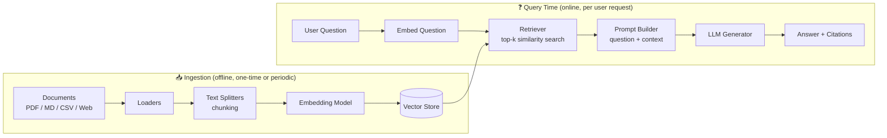
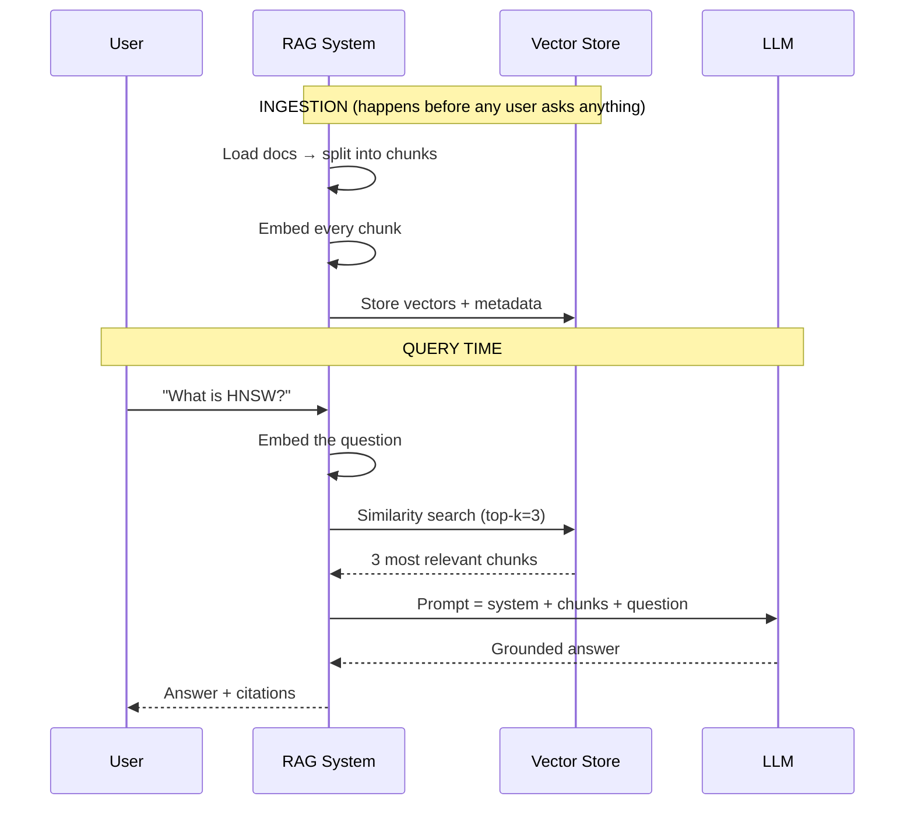
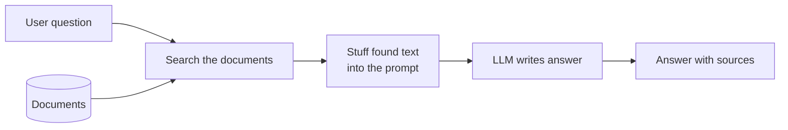
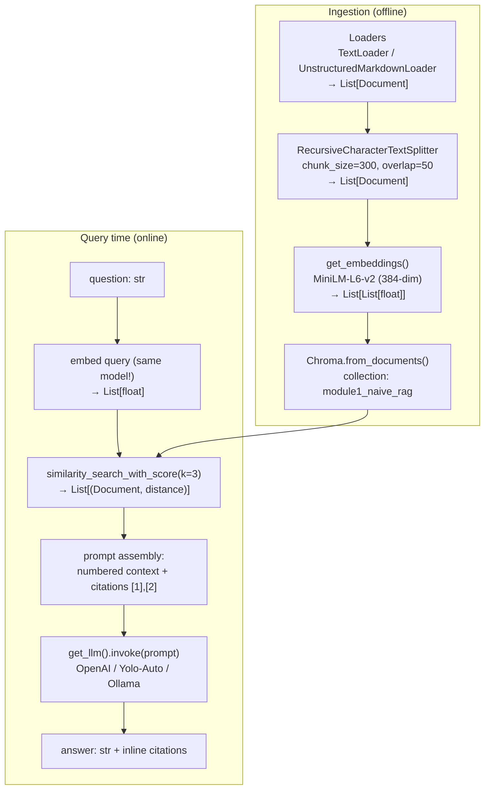
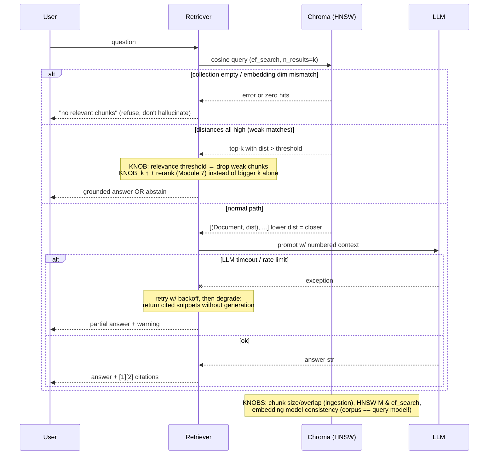

# 📖 Module 1 Learning — RAG Fundamentals & Architecture

## 1. Why is RAG Important?

Large Language Models have three fundamental limitations:

| Problem | What happens | RAG's answer |
|---------|-------------|--------------|
| **Hallucination** | Model invents plausible-sounding facts | Ground answers in retrieved evidence; model must use provided context |
| **Knowledge cutoff** | Training data ends at a date; world keeps changing | Knowledge base is updated by re-indexing docs — no retraining |
| **Private data** | Your company's PDFs were never in training data | Index your own corpus; answers cite your documents |

**Industry reality:** almost every enterprise LLM product (support bots, internal search, legal/medical assistants) is RAG-based, not fine-tuned. RAG gives you *controllable, auditable, updatable* knowledge.

## 2. What is RAG?

**Retrieval-Augmented Generation** = an information-retrieval system bolted onto a generator:

1. **Retrieval**: find the most relevant passages from an external knowledge base for the user's question.
2. **Augmentation**: inject those passages into the prompt as context.
3. **Generation**: the LLM answers *using the context*, ideally citing sources.

The key insight: **shift the burden of "knowing" from model weights to a searchable index.** Weights stay frozen; knowledge becomes a swappable dataset.

## 3. How RAG Works — Architecture

### Diagram A: RAG Data Flow

**Diagram explanation:** There are two completely separate phases. *Ingestion* (left) happens offline: documents are loaded, split into chunks, converted to vectors by an embedding model, and stored in a vector database. *Query time* (right) happens on every user request: the question is embedded with the **same** embedding model, the retriever finds the k most similar chunks, they're stuffed into a prompt, and the LLM generates a grounded answer. Notice the vector store is the only bridge between the two phases — which is why embedding-model consistency matters (you cannot embed questions with a different model than the one used for the corpus).

### Diagram B: Ingestion vs Query-Time Sequence

**Diagram explanation:** This sequence view makes the timing explicit. Ingestion is a batch job (run once, then re-run when documents change). Query time is a strict 5-step chain: embed → retrieve → build prompt → generate → respond. Every advanced technique in this course (hybrid search, reranking, agentic loops, CRAG) is a modification of *this* query-time chain.

## 4. RAG vs Fine-Tuning vs Prompt Engineering

| Dimension | Prompt Engineering | RAG | Fine-Tuning |
|-----------|-------------------|-----|-------------|
| What changes | The prompt text | External knowledge base | Model weights |
| Cost | ~Free | Low–Medium (infra) | High (GPU training) |
| Update speed | Instant | Minutes (re-index) | Days (retrain) |
| Best for | Formatting, tone, simple instructions | **Facts, private data, up-to-date info** | Behavior, style, domain language patterns |
| Hallucination control | Weak | Strong (grounded + citable) | Medium |
| Auditability | High | High (citations) | Low (knowledge baked in) |
| Scales to large corpora? | No (context window limit) | **Yes** | No |

**Rule of thumb (industry standard):**
- Need the model to *know* things → **RAG**
- Need the model to *behave* differently (format, tone, specialized reasoning style) → **Fine-tuning**
- Need quick output shaping → **Prompt engineering**
- Production systems often combine all three (fine-tuned base + RAG grounding + careful prompts).

## 5. Naive RAG vs Production RAG

What we build in this module is **naive RAG**: single dense retriever, fixed top-k, no reranking, no evaluation, no guardrails.

Production RAG adds (each covered in later modules):

| Gap | Fix | Module |
|-----|-----|--------|
| Dense-only retrieval misses keywords | Hybrid BM25 + dense + RRF | 5 |
| Top-k includes near-duplicates | MMR diversity | 5 |
| Retrieved docs contain irrelevant sentences | Contextual compression | 6 |
| Ranking order is wrong | Cross-encoder reranking | 7 / 10 |
| No idea if answers are correct | RAGAS evaluation | 9 |
| Fixed pipeline can't adapt | Agentic RAG (LangGraph) | 8 |
| Malicious inputs / PII leaks | Guardrails | 11 |
| Slow & expensive | Caching, cost routing | 11 |

## 6. Real-World Use Cases
- **Enterprise support bot** — answers from product docs, cites article IDs
- **Legal research assistant** — retrieves case law, grounds opinions
- **Codebase Q&A** — "why does this function retry?" answered from repo docs
- **Medical decision support** — guidelines-grounded answers with citations (high-stakes → needs eval + guardrails)

## 7. Common Mistakes
1. **Chunking too big** → chunks mix topics → retrieval pulls in noise
2. **Different embedding models for corpus vs query** → garbage similarity scores
3. **No citations** → users can't verify; trust collapses
4. **Trusting top-k blindly** → always consider a relevance threshold (return nothing rather than hallucinate)
5. **Never evaluating** → you can't tell if a change helped or hurt

## 📊 Diagrams: Noob → Expert

### Level 1 — Noob: the core idea in one picture

*Next level adds: the two-phase split (offline ingestion vs online query) and the real components — embedding model, vector store, top-k similarity search.*

### Level 2 — Practitioner: real components and data types

*Next level adds: failure modes, score semantics, and the performance knobs you actually tune in production.*

### Level 3 — Expert: edge cases, failure modes, knobs

