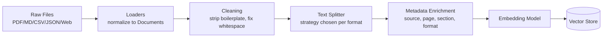
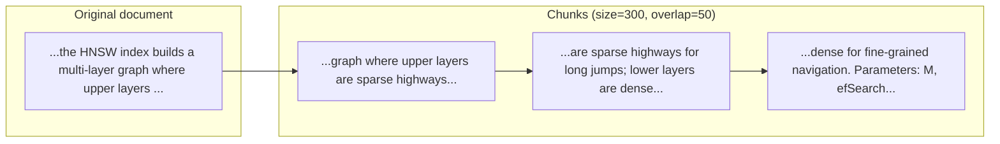
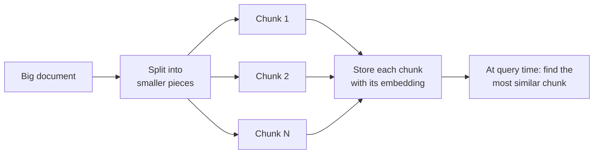

# 📖 Module 2 Learning — Document Processing & Chunking

Ingestion quality is the ceiling of your RAG system: **garbage in → garbage out.** No amount of fancy retrieval fixes badly chunked documents.

## 1. Document Loaders — What & How

A **loader** converts a raw file (or URL) into LangChain `Document` objects:
```python
Document(page_content="...text...", metadata={"source": "file.pdf", "page": 3})
```
Loaders handle format-specific parsing so the rest of the pipeline only sees uniform text + metadata.

| Loader | Format | Notes / gotchas |
|--------|--------|-----------------|
| `TextLoader` | .txt | Simplest; specify encoding |
| `CSVLoader` | .csv | One row per document by default; great for tabular Q&A |
| `JSONLoader` | .json | Use `jq` expressions to flatten nested structures |
| `PyPDFLoader` | .pdf | Scanned PDFs need OCR first (e.g., `unstructured` with hi_res strategy) |
| `UnstructuredMarkdownLoader` | .md | Preserves header structure in metadata |
| `WebBaseLoader` | URL | Single page; use `RequestsWrapper` for headers/auth |
| `RecursiveUrlLoader` | URL tree | Crawls linked pages up to `max_depth` — beware scope creep |

**Industry practice:** centralize loading in one ingestion service/module, log parse failures per-file (never let one bad PDF kill the batch), and keep the *original* file reference in metadata for citation UIs.

## 2. Why Chunk at All?

- Embeddings represent *passages*, not books — a 50-page PDF as one vector is meaningless mush
- LLM context windows are finite; you retrieve *some* chunks, not everything
- Small focused chunks → precise similarity matches
- But too-small chunks lose context ("it" refers to what?) → hence **overlap** and **parent documents** (Module 6)

## 3. Splitting Strategies Compared

### Diagram A: Ingestion Pipeline



**Diagram explanation:** Loading and splitting are separate stages on purpose. Cleaning (removing headers/footers/TOC from PDFs) happens *before* splitting so junk doesn't pollute chunks. Metadata enrichment happens *after* splitting so every chunk independently carries its provenance — this is what makes filtered retrieval and citations possible later.

### Diagram B: Chunk Overlap Concept



**Diagram explanation:** Each chunk shares its last ~50 characters with the next. If a key sentence straddles a boundary, it appears (at least partially) in both chunks, so retrieval can still find it. Overlap of 10–20% of chunk size is the standard sweet spot; more overlap wastes storage and creates near-duplicate retrieval results.

### Strategy table

| Strategy | How it splits | Best for | Risk |
|----------|---------------|----------|------|
| `CharacterTextSplitter` | Every N chars, hard cut | Homogeneous logs/text | Cuts mid-sentence/mid-word |
| `RecursiveCharacterTextSplitter` | Tries separators in order: `\n\n` → `\n` → `. ` → ` ` → `` | **General purpose default** | Still character-based, not semantic |
| `MarkdownHeaderTextSplitter` | On `#`, `##`, `###` headers; headers stored as metadata | Structured docs, wikis, notebooks | Long sections still need a second pass (chain with Recursive) |
| Length/token-based | By token count via tokenizer | When you must respect model token limits | Ignores structure |
| Semantic chunking | Embed sentences, split where embedding similarity drops | Narrative prose, research papers | Slow (embeds everything twice), overkill for structured docs |

**Industry-standard recipe:** format-aware pipeline — Markdown → header split then recursive fallback; PDF → page-aware recursive; code → AST-based splitter; tables → keep rows intact.

## 4. Chunking Best Practices (the numbers that matter)

| Parameter | Common range | Guidance |
|-----------|--------------|----------|
| Chunk size | 256–1024 tokens (~300–1500 chars) | Start ~500 tokens; smaller for FAQ-style, larger for narrative |
| Overlap | 10–20% of chunk size | Prevents boundary cuts; don't exceed 20% (duplicate noise) |
| Granularity test | Can a chunk answer a question *standalone*? | If it starts with "It..." or "This..." → too small or bad boundary |
| One topic per chunk | Yes | A chunk about HNSW should not also discuss billing policy |

## 5. Metadata Management

Metadata is the superpower of production RAG. Attach at ingestion:
- `source` (file path/URL) — citations
- `format` (pdf/md/csv/json) — filtered retrieval ("search only in contracts")
- `page` / `row` / `section` — precise location
- `created_at` / `version` — staleness filtering
- Business fields (tenant_id, department, access_level) — multi-tenant RBAC (Module 11)

**Rule:** metadata must be *predictable* — downstream filters (`where={"format": "pdf"}`) break silently if keys are inconsistent. Define a schema and enforce it.

## 6. Real-World Use Cases
- **Contract review bot** — PDF loader + page metadata → "show me indemnity clauses" with page cites
- **Product catalog QA** — CSV loader, one row per doc → "which products ship to EMEA?"
- **Internal wiki assistant** — Markdown header split → answers carry section names
- **Competitor monitoring** — RecursiveWebLoader over target sites, re-ingest nightly

## 7. Common Mistakes
1. **One global chunk size for all formats** — code, tables, and prose need different treatment
2. **Dropping metadata** — no source = no citations = no trust
3. **Ignoring PDF layout** — merged header/footer text across pages poisons chunks
4. **No deduplication** — same content ingested twice doubles retrieval noise
5. **Re-chunking without re-embedding** — old vectors remain in the store; always drop & rebuild the collection when chunking changes

## 📊 Diagrams: Noob → Expert

### Level 1 — Noob: what chunking is



*Next level adds: the real libraries, data types, and where metadata enters the pipeline.*

### Level 2 — Practitioner: components & data types

```mermaid
flowchart TB
    subgraph Ingest
        L1[TextLoader / CSVLoader /<br/>JSONLoader / UnstructuredMarkdownLoader<br/>langchain_community.document_loaders]
        L2["Document(page_content: str,<br/>metadata: dict) — langchain_core.documents"]
        S1[RecursiveCharacterTextSplitter<br/>chunk_size / chunk_overlap]
        S2[MarkdownHeaderTextSplitter<br/>h1/h2 → metadata]
        S3[LanguageTextSplitter /<br/>PythonCodeTextSplitter — code seams]
        S4[Semantic chunking (from scratch):<br/>sentences → get_embeddings() →<br/>numpy cosine sim → cut on dip]
    end
    subgraph Store
        V[(Vector store collection:<br/>embedding: list[float],<br/>document: str, metadata: dict)]
    end
    Q[Query string] --> QE[get_embeddings()<br/>→ list[float]]
    QE --> R[Retriever.invoke(query, filters)]
    V --> R
    R --> OUT["list[Document] top-k"]
    L1 --> L2
    L2 --> S1 & S2 & S3 & S4
    S1 & S2 & S3 & S4 --> V
```

*Next level adds: failure modes, boundary edge cases, and the performance knobs you tune in production.*

### Level 3 — Expert: edge cases, failure modes, tuning knobs

```mermaid
sequenceDiagram
    participant P as Pipeline
    participant SP as Splitter
    participant EM as Embedder
    participant VS as Vector store

    P->>SP: split(doc)
    alt chunk_size too small
        SP-->>P: chunks start mid-sentence ("It was...")
        Note over P: retrieval finds fragments that<br/>can't answer standalone → raise size<br/>or use structure-aware splitter
    else code doc + character splitter
        SP-->>P: function cut in half → syntax-broken chunk
        Note over P: use LanguageTextSplitter /<br/>tree-sitter; overlap=0 for code
    else long section > chunk_size
        SP-->>P: header splitter emits oversized section
        Note over P: cascade: header split →<br/>recursive fallback per section
    end
    P->>EM: embed_documents(chunks)
    alt embedder model changed
        EM-->>P: new vectors, old vectors stale
        Note over P: FAILURE MODE — vectors not portable<br/>across models: drop & rebuild collection
    else batch > context limit
        EM-->>P: truncation or error
        Note over P: knob: max_seq_length / batch size
    end
    EM-->>VS: upsert(embeddings, metadatas)
    Note over VS: knobs: HNSW M / efConstruction<br/>(build), efSearch (query);<br/>overlap 10–20% trades storage vs<br/>boundary safety; dedupe before upsert
```
