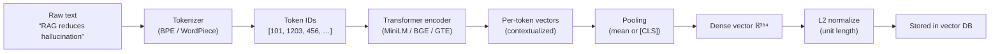
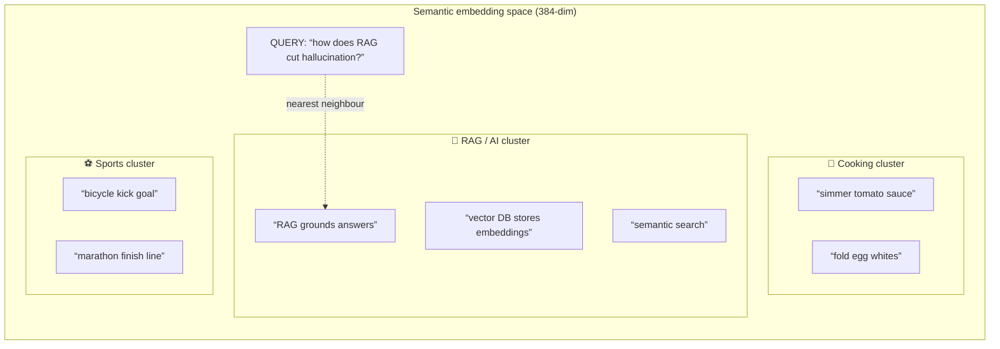

# 📖 Module 3 — Embeddings & Vector Representations

> Theory behind turning text into numbers that a vector database can search.
> Read this before running `code/main.py` — the lab makes every concept below concrete.

---

## 1. Why do we need embeddings?

A Large Language Model can't compare two documents by counting matching words —
"the car broke down" and "my automobile stopped working" share almost no vocabulary yet mean
the same thing. **Embeddings** solve this by mapping each piece of text to a point in a
high-dimensional numerical space where **meaning becomes geometry**: similar meanings land
close together, unrelated meanings land far apart. That is what makes *semantic* search possible.

An embedding is simply a fixed-length list of floating-point numbers (a **dense vector**),
e.g. a 384-element array. Every sentence, chunk, or query gets one such vector from the same
model, so any two can be compared with a distance metric.

---

## 2. How an embedding is produced

The journey from raw text to a searchable vector has five stages:

1. **Tokenization** — the text is split into sub-word tokens (BPE / WordPiece), e.g.
   `"hallucination"` → `["hallu", "ci", "nation"]`, and each token maps to an integer ID.
2. **Embedding lookup** — each token ID is turned into a dense vector via a learned embedding table.
3. **Transformer encoder** — stacked attention layers mix information across all tokens so each
   token's vector reflects its *context* (this is what makes the model "understand" meaning).
4. **Pooling** — the many per-token vectors are collapsed into **one** sentence vector, usually by
   **mean-pooling** all tokens or reading the special `[CLS]` token.
5. **(Optional) Normalization** — the vector is scaled to unit length (L2-norm = 1) so that a plain
   dot product equals cosine similarity. Many pipelines do this automatically.



**Why similar meanings cluster.** During training, the model is pushed (via contrastive or
supervised objectives) to place paraphrases near each other and push dissimilar texts apart.
The result is a **semantic space**: a smooth landscape where moving a little in vector space
corresponds to a small change in meaning. This is why `"car"` and `"automobile"` sit close even
though they never co-occur in training data.

---

## 3. Embedding-space geometry

Think of the space as having invisible "axes" that capture latent concepts (topic, sentiment,
formality, domain…). Sentences about the same topic occupy a **cluster**; a query lands near the
cluster it belongs to, and nearest-neighbour search returns the closest points.



In this picture, the query's nearest neighbour is `a1` because it lives inside the RAG/AI
cluster. Distance to the cooking and sports clusters is much larger, so they rank lower. Real
spaces are 384+ dimensional (you can't draw them), but the clustering intuition holds exactly.

---

## 4. Distance metrics — deep dive

Given two vectors **a** and **b**, there are three workhorses. Know each formula cold.

### 4.1 Cosine similarity (direction only)

Measures the **angle** between two vectors, ignoring their length.

```
cos(a, b) = (a · b) / (‖a‖ · ‖b‖)
          = Σ aᵢbᵢ / (√(Σ aᵢ²) · √(Σ bᵢ²))
```

- Range: **[-1, 1]**. `1` = same direction, `0` = orthogonal/unrelated, `-1` = opposite.
- **Use for:** text embeddings (the default). Robust to document length — a long paragraph and a
  short phrase about the same topic still align in direction.

### 4.2 L2 / Euclidean distance (magnitude matters)

Straight-line distance between two points.

```
L2(a, b) = ‖a − b‖ = √( Σ (aᵢ − bᵢ)² )
```

- Range: **[0, ∞)**. `0` = identical, larger = more different.
- **Use for:** when magnitude carries meaning (e.g. image features, or non-normalized vectors).
- **Key relationship:** if vectors are **unit-normalized**, L2 distance and cosine similarity are
  monotonically related: `‖a−b‖² = 2 − 2·cos(a,b)`. So ranking by either gives the same order.

### 4.3 Inner product / dot product (raw alignment)

```
a · b = Σ aᵢbᵢ
```

- Range: **unbounded**. Larger = more aligned, but it also grows with vector magnitude.
- **Use for:** fast scoring when vectors are already normalized (then it *is* cosine). Some ANN
  engines expose it as the `ip` / `inner-product` metric.

### 4.4 When to use which?

| Situation | Best metric | Why |
|-----------|-------------|-----|
| Text / sentence embeddings (normalized) | **Cosine** (or IP after norm) | Direction = meaning; length is noise |
| Non-normalized vectors where size matters | **L2** | Captures magnitude differences |
| Speed-critical, pre-normalized data | **Inner product** | Cheapest; equals cosine when unit-length |
| Image / pixel-feature embeddings | **L2** | Magnitude often meaningful |

### 4.5 Normalization subtleties ⚠️

This is the single most common source of confusion, and the lab proves it numerically:

- **Cosine divides out length.** Two vectors pointing the same way but with very different norms
  still score `cos ≈ 1`.
- **Inner product does NOT divide out length.** A longer (larger-norm) vector inflates the dot
  product even if directions match. So raw IP can misrank.
- **The fix:** L2-normalize every vector to unit length. Then `‖a‖=‖b‖=1`, so
  `cos(a,b) = (a·b)/(1·1) = a·b`. **Cosine and inner product become identical.**
- Most production pipelines normalize at ingest time, store unit vectors, and use a plain dot
  product at query time for maximum speed. ChromaDB's default space is `l2`; set
  `hnsw:space = "cosine"` (or `"ip"`) to match your intent.

---

## 5. Dimensionality: 384 vs 768 vs 1536

More dimensions = more capacity to encode nuance, but more memory, slower search, higher cost.

| Dims | Typical models | Pros | Cons |
|------|----------------|------|------|
| **384** | MiniLM-L6-v2 | Tiny, fast, cheap, great for CPU/local | Coarser semantics; weaker on hard retrieval |
| **768** | BERT-base, some BGE/E5 variants | Good balance of quality & speed | Heavier than 384 |
| **1024** | BGE-large, E5-large, GTE-large, Cohere v3 | Strong open-source quality | More RAM; slower than 384 |
| **1536** | OpenAI text-embedding-3-small | Excellent cloud quality | Cloud cost; large storage |
| **3072** | OpenAI text-embedding-3-large | Top-tier; supports Matryoshka truncation | Costliest; biggest storage |

**Rule of thumb:** start with a fast local 384–1024-dim model; move up only if evaluation
(RAGAS / MTEB-style recall) shows you're leaving accuracy on the table. Storage scales linearly
with dims: 1M vectors × 1536 dims × 4 bytes ≈ **6 GB** vs ~1.5 GB at 384 dims.

---

## 6. Proprietary vs open-source models

Scores below are **approximate MTEB-style averages** (illustrative, not a live benchmark run) to
give you a feel for the quality/cost/latency trade-off.

| Model | Provider | Dims | License / Access | Approx. MTEB avg | Cost | Latency | Notes |
|-------|----------|------|------------------|------------------|------|---------|-------|
| all-MiniLM-L6-v2 | Open (sentence-transformers) | 384 | Apache-2.0, local | ~55–60 | Free | Very fast (CPU) | Course default; great starter |
| BGE-large-en-v1.5 | Open (BAAI) | 1024 | MIT, local | ~64–66 | Free | Fast | Strong open-source English |
| E5-large-v2 | Open (Intfloat) | 1024 | MIT, local | ~65–67 | Free | Fast | Great retrieval; needs prefixes |
| GTE-large-en-v1.5 | Open (Alibaba) | 1024 | MIT, local | ~65–66 | Free | Fast | Strong multilingual option |
| text-embedding-3-small | OpenAI | 1536 | Proprietary, cloud | ~63–64 | ~$0.02 / 1M tok | Network RTT | Cheap cloud baseline |
| text-embedding-3-large | OpenAI | 3072 | Proprietary, cloud | ~66–67 | ~$0.13 / 1M tok | Network RTT | Top cloud quality; Matryoshka |
| embed-v3 | Cohere | 1024 | Proprietary, cloud | ~64–66 | Tiered pricing | Network RTT | Multilingual + input types |

**Takeaways:**
- **Open-source** wins on privacy, offline use, zero per-token cost, and fine-tunability.
- **Proprietary** wins on out-of-the-box quality and convenience (no GPU/model management).
- Latency: local models avoid network round-trips but need a decent CPU/GPU; cloud adds RTT but
  scales without your hardware.

---

## 7. Choosing the right model

Ask four questions in order:

1. **Budget & privacy?** Must stay on-prem / no per-token cost → open-source (BGE/E5/GTE/MiniLM).
   Fine to send data to a cloud and want max quality → OpenAI/Cohere.
2. **Language?** English-only → MiniLM/BGE-en. Multilingual → GTE-multilingual, Cohere embed-v3,
   or a multilingual open model.
3. **Scale & latency?** Millions of docs + tight p95 → favor lower dims (384–768) + a good ANN index.
   Small KB + quality-first → go 1024–3072 dims.
4. **Domain?** General web text → off-the-shelf. Highly specialized (legal, medical, code) →
   consider **domain adaptation / fine-tuning** an open model on your own labeled pairs, or use a
   domain-tuned release. Fine-tuning is only worth it when evaluation proves the gap.

> **Practical default for this course:** local `all-MiniLM-L6-v2` (384-dim) — free, fast, private.
> Swap to a stronger model later by changing `.env` (`EMBEDDING_PROVIDER` / `LOCAL_EMBEDDING_MODEL`)
> — **but rebuild your vector store**, since vectors are not portable across models.

---

## 8. Industry standards & real-world use cases

- **Standard stack:** sentence-transformers (local) or OpenAI/Cohere (cloud) for embeddings;
  HNSW-indexed vector DB (Chroma/Qdrant/pgvector/Milvus) for storage; cosine or normalized-IP metric.
- **Use cases:** semantic search, RAG context retrieval, deduplication, recommendation,
  clustering/topic discovery, anomaly detection, and as the input to a reranker.
- **Best practice:** always evaluate (recall@k, MRR, or RAGAS faithfulness/context-recall) before
  swapping models — intuition about "better model" is often wrong for *your* data.

---

## 9. Common mistakes

1. **Mixing metrics** — storing with `l2` but reasoning about cosine. Pick one and be consistent.
2. **Forgetting to normalize** when using inner product → magnitude dominates the score.
3. **Changing the embedding model** without rebuilding the index → old vectors are meaningless.
4. **Embedding queries with a different model/prompt** than documents (e.g. E5 needs
   `query:` / `passage:` prefixes) → silent quality collapse.
5. **Assuming more dims = better** — past a point you pay in cost/latency for negligible gain.
6. **Using an LLM to "improve" embeddings** — embeddings come from a dedicated encoder, not the chat model.

---

## 📊 Diagrams: Noob → Expert

### Level 1 — Noob: what happens to your text

```mermaid
flowchart LR
    A["Your text<br/>(a sentence or chunk)"] --> B["Embedding model<br/>(e.g. MiniLM)"
    B --> C["Vector of numbers<br/>(384 floats)"]
    C --> D["Vector database"]
    E["Your question"] --> B
    B --> F["Question vector"]
    F --> G{"Compare vectors:<br/>cosine similarity"}
    D --> G
    G --> H["Most similar chunks<br/>= retrieved context"]
```

*Next level adds: the real libraries, data types, and where each piece lives in a pipeline.*

### Level 2 — Practitioner: components, libraries & data types

```mermaid
flowchart TB
    subgraph Ingest["Ingestion (offline)"]
        DOC["Documents<br/>(txt / md / pdf)"] --> CHK["Chunker<br/>(RecursiveCharacterTextSplitter)"
        CHK --> DOCS["list[Document]<br/>(page_content: str, metadata: dict)"]
        DOCS --> ENC["Embeddings encoder<br/>HuggingFaceEmbeddings (local MiniLM)<br/>or OpenAIEmbeddings (cloud)"]
        ENC --> VEC["np.ndarray float32<br/>(N x 384 or N x 1536)"]
        VEC --> DB[("Chroma collection<br/>HNSW index, cosine metric")]
    end
    subgraph Query["Query time (online)"]
        Q["query: str"] --> ENC2["embed_query() -> np.ndarray (1 x D)"]
        ENC2 --> SEARCH["collection.query(<br/>query_embeddings, n_results=k)"]
        DB --> SEARCH
        SEARCH --> RES["list of {ids, documents,<br/>metadatas, distances}"]
        RES --> LLM["LLM prompt with top-k context"]
    end
```

*Next level adds: failure modes, edge cases, and the performance knobs you tune in production.*

### Level 3 — Expert: failure modes & performance knobs

```mermaid
sequenceDiagram
    participant App as App
    participant Enc as Encoder (MiniLM / OpenAI)
    participant DB as Chroma (HNSW)
    Note over App,DB: Ingestion path
    App->>Enc: embed_documents(chunks) [batched]
    alt model not cached locally
        Enc-->>App: HF download (~90 MB) — first run only; fail => retry/offline cache
    end
    Enc-->>App: float32 vectors (N x D)
    App->>DB: add(ids, embeddings, metadatas)
    Note over DB: HNSW builds graph in background;<br/>early queries may be slower (m/efConstruction knobs)
    Note over App,DB: Query path
    App->>Enc: embed_query(q)
    alt cloud provider: timeout / rate limit / bad key
        Enc-->>App: error => degrade: retry w/ backoff, fall back to local model, or serve stale index
    end
    Enc-->>App: query vector (1 x D)
    App->>DB: query(n_results=k, where=filter)
    Note over DB: ef_search knob: higher = better recall, more latency;<br/>metadata filter applied pre/post ANN depending on selectivity
    DB-->>App: k neighbours + distances
    Note over App: Edge cases: empty collection, duplicate ids (overwrite vs error),<br/>model swap => MUST rebuild index (vectors not portable),<br/>unnormalized vectors + inner-product metric => magnitude bias
```

