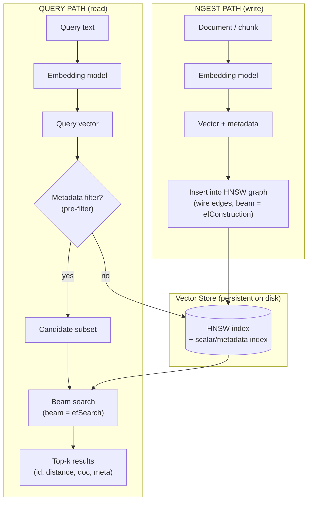
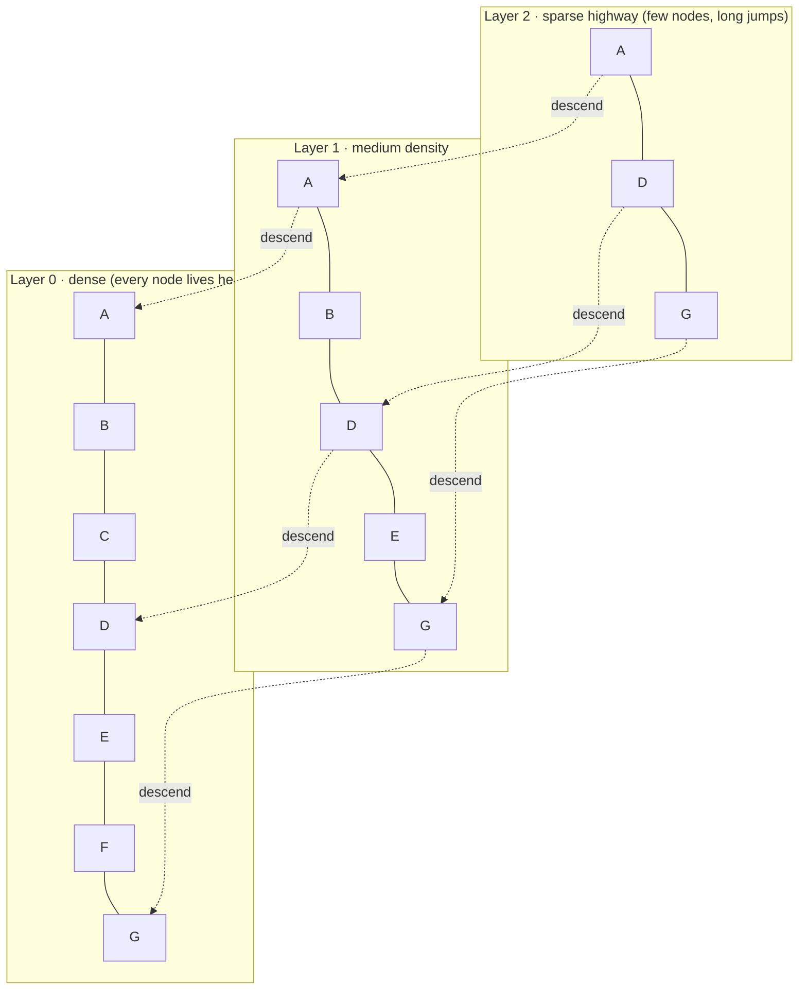
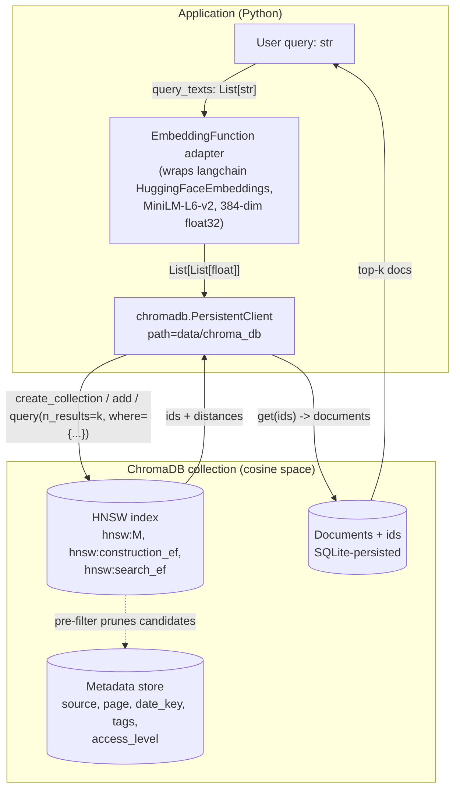

# 📖 Module 4 — Vector Stores

> Theory behind storing and searching millions of vectors fast. Read this before running
> `code/main.py` — the lab exercises every concept below in real ChromaDB.

---

## 1. What is a vector store — and why not just brute force?

A **vector store** (vector database) is a database purpose-built to hold high-dimensional vectors
and answer *"give me the k closest vectors to this query"* quickly. The naive way to do that is
**brute force / Flat**: compute the distance from the query to *every* stored vector and sort.
That's **O(n)** per query — fine for a few thousand vectors, impossible for tens of millions.

Dedicated vector DBs solve this with **Approximate Nearest Neighbour (ANN)** indexes: they build a
data structure so you only examine a small, promising subset of vectors, trading a tiny amount of
*exactness* for a huge amount of *speed*. You get **recall** (e.g. 95–99% of the true nearest
neighbours) at **sub-millisecond** latency.



Two separate paths share one index: **ingest** embeds and inserts; **query** embeds, optionally
pre-filters, beam-searches the graph, and returns top-k. Both paths go through the same ANN index.

---

## 2. ANN indexing strategies

### 2.1 Flat (Brute Force)
- Computes distance to **every** vector. **Exact** results, O(n) per query.
- **Use when:** n ≲ 100k, or you need guaranteed exactness, or you're prototyping.
- No tuning parameters. Simple and predictable.

### 2.2 IVF — Inverted File Index
- **Build:** cluster all vectors into `nlist` Voronoi cells via k-means (each cell has a centroid).
- **Query:** find the `nprobe` nearest centroids, then brute-force search *only inside those cells*.
- **Tuning:**
  - `nlist` ≈ `sqrt(N)` is a common starting point (number of clusters).
  - `nprobe` = how many cells to search. **More probes → higher recall, slower.** Start ~10, raise
    toward `nlist` for near-exact results.
- **Trade-off:** fast queries, but recall depends heavily on good clustering; less ideal for very
  dynamic (frequently changing) data since centroids are fixed at build time.

### 2.3 HNSW — Hierarchical Navigable Small World (the default in most engines)
- Builds a **multi-layer graph**:
  - **Layer 0** contains *all* nodes (dense, fine-grained).
  - **Upper layers** contain progressively *fewer* nodes (sparse "highways") for long jumps.
- **Query:** enter at the top layer, greedily hop toward the query, descend a layer, repeat until
  layer 0, then do a local beam search. This gives **logarithmic-ish** search cost.
- **Tuning:**
  - `M` (max edges per node): default **16**. Higher → better recall, more memory & slower build.
  - `efConstruction` (build-time beam width): default **100–200**. Higher → better index quality,
    slower build. Set once at creation.
  - `efSearch` (query-time beam width): default **~10–50**, set per query. Higher → better recall,
    slower query. This is your main runtime knob.
- **Why it wins:** typically **>95% recall at sub-millisecond latency**; handles dynamic inserts
  well; the default choice in ChromaDB, Qdrant, pgvector, Milvus.



A query starts at the sparse top (big jumps), descends as it gets closer, and finishes with a
dense local search at layer 0. Fewer hops than scanning everything → fast.

---

## 3. Distance metric selection

Pick the metric to match your data (see Module 3 §4 for formulas):

| Metric | When | ChromaDB `hnsw:space` |
|--------|------|----------------------|
| **Cosine** | Normalized text embeddings (default for RAG) | `"cosine"` |
| **L2** | Magnitude matters / non-normalized vectors | `"l2"` (Chroma default) |
| **Inner product** | Pre-normalized vectors, max speed | `"ip"` |

> Consistency rule: the metric you **store** with must be the one you **query** with. Mixing them
> silently corrupts rankings. For text RAG, cosine (or normalized IP) is the safe default.

---

## 4. CRUD operations

Every vector store supports the same four verbs:

- **Create** — create a named **collection** (an isolated namespace with its own index + schema).
- **Read** — `query` (similarity search, returns top-k with distances) and `get` (fetch by id/filter).
- **Update** — `upsert`: insert new ids, or **replace** existing ids' vector + metadata in place.
- **Delete** — remove by explicit `ids` or by a `where` filter.

Under the hood, an **upsert** of an existing id re-embeds the new text and rewires that node's
edges in the HNSW graph; a **delete** marks the node removed (engines compact lazily).

---

## 5. Persistence

An **in-memory** client forgets everything on exit. A **persistent** client writes the index +
vectors + metadata to disk (e.g. Chroma's `PersistentClient(path=...)`). Re-open the same path
later and your collections are still there.

⚠️ **Vectors are not portable across embedding models.** If you change the embedding model, old
vectors are meaningless in the new space — **rebuild the collection** from scratch.

---

## 6. Metadata filtering: pre-filter vs post-filter

You can attach structured **metadata** (JSON) to each vector and filter on it (`category == "X"`,
`price > 100`, etc.). Two execution strategies:

- **Pre-filter:** apply the predicate *first*, then run ANN search only over the surviving subset.
  Faster and more accurate when the filter is **selective** (few matches).
- **Post-filter:** run ANN search over everything, then drop non-matching results. Can be faster
  when the filter is **non-selective** (most rows match), but may return fewer than k results if
  too many top-k hits get filtered out.

Most engines auto-pick, but understanding the trade-off lets you reason about empty/partial result
sets. In ChromaDB, `where={...}` on `query`/`get`/`delete` expresses these filters.

---

## 7. ChromaDB specifics

- **Collections** are the unit of isolation — each has its own HNSW index and metadata.
- **`PersistentClient(path=...)`** persists to a directory (this course uses `CHROMA_DIR` =
  `./data/chroma_db`). `EphemeralClient()` keeps everything in RAM.
- **HNSW defaults:** Chroma builds an HNSW index automatically; the default space is `l2`. Set
  `metadata={"hnsw:space": "cosine"}` at creation to use cosine.
- **Embedding function:** pass your own `embedding_function` so add/query use *your* model
  consistently (the lab wraps the shared LangChain embeddings in a tiny adapter).
- **API surface:** `add`, `upsert`, `query`, `get`, `delete`, `count`, plus
  `create_collection` / `get_collection` / `list_collections` / `delete_collection`.

---

## 8. Production alternatives — when to pick which

| Engine | Type | Standout strength | Pick it when… |
|--------|------|-------------------|---------------|
| **ChromaDB** | Embedded (Python) | Zero-config, in-process, great DX | Prototyping, small/mid KBs, local dev (this course) |
| **Qdrant** | Dedicated server (Rust) | Fast, rich filters, payload indexes, quantization | Production RAG needing strong filtering + scale |
| **pgvector** | Postgres extension | SQL + vectors in one DB, ACID, familiar ops | You already run Postgres; want one system |
| **Milvus** | Distributed (GPU-capable) | Billion-scale, sharding, multiple index types | Very large / multi-tenant, GPU-accelerated search |
| **Weaviate** | Dedicated server (Go) | Built-in modules (vectorize, rerank), GraphQL | Want batteries-included ML features + hybrid search |
| **Pinecone** | Managed cloud SaaS | Fully managed, serverless, autoscaling | Want zero infra ops; pay for convenience |

**Rule of thumb:** start on **ChromaDB** locally; graduate to **Qdrant** or **pgvector** for
production (pgvector if you live in Postgres, Qdrant for dedicated high-performance search), and
reach for **Milvus/Pinecone** only at very large scale or when you want fully managed.

---

## 9. Industry standards & real-world use cases

- **Standard stack:** HNSW-indexed store (Chroma/Qdrant/pgvector/Milvus) + cosine/normalized-IP
  metric + persistent storage + metadata filters + a reranker on top.
- **Use cases:** RAG retrieval, semantic search, recommendation, dedup, clustering, multi-tenant
  knowledge bases (shard/partition by tenant), hybrid (dense + BM25) search.
- **Best practice:** persist indexes, shard by tenant for SaaS, combine dense search with scalar
  filters, and always measure **recall@k** after any index/model change.

---

## 10. Common mistakes

1. **Brute-forcing at scale** — no ANN index → queries crawl past ~100k vectors.
2. **Metric mismatch** — store with `l2`, query expecting cosine (or vice-versa).
3. **Changing the embedding model** without rebuilding → garbage vectors.
4. **Post-filtering a selective predicate** → returns fewer than k (or zero) results.
5. **Tuning `efSearch` too low** → fast but poor recall; raise it when quality matters.
6. **One giant collection for multi-tenant SaaS** → cross-tenant leakage risk; partition/shard.
7. **Assuming in-memory = persistent** → data vanishes on restart; use a persistent client.

---

## 📊 Diagrams: Noob → Expert

### 1. Noob level — what happens when you search


*Next level adds:* the real libraries and data types behind each box — who calls whom, and what crosses each boundary.

### 2. Practitioner level — components, libraries, data types



*Next level adds:* the failure modes and performance knobs you only discover in production — build vs query beam widths, recall measurement, and version-specific filter gotchas.

### 3. Expert level — tuning loop, edge cases, failure modes

```mermaid
sequenceDiagram
    participant T as Tuning harness
    participant C as Chroma collection
    participant N as numpy brute force (ground truth)

    T->>C: create_collection(hnsw:M, hnsw:construction_ef, hnsw:search_ef)
    T->>C: add(500 pre-embedded vectors)  %% timed: insert cost
    Note over C: graph built with beam width = construction_ef;
    higher M/efC => denser graph => better recall, slower inserts
    loop per query (timed)
        T->>C: query(embedding, n_results=k)
        C-->>T: ANN top-k (beam width = search_ef)
    end
    T->>N: exact cosine top-k over all vectors
    N-->>T: ground-truth top-k
    T->>T: recall@k = |ANN ∩ exact| / k
    alt recall below target (e.g. 0.9)
        T->>C: raise hnsw:search_ef (or rebuild with higher M/efC)
        Note over T,C: trade-off: query latency goes UP as recall goes up
    else selective where-filter
        Note over C: pre-filtering prunes the graph walk;<br/>but chromadb 1.5 gotchas:<br/>$not removed (use $ne/$nin),<br/>string range ops rejected (store dates as int),<br/>$in on list-valued metadata matches nothing (use scalar field)
    end
    Note over T: other failure modes: embedding model changed without rebuild => garbage distances;<br/>metric mismatch (l2 vs cosine) => wrong rankings; ef too low => silent quality loss
```

