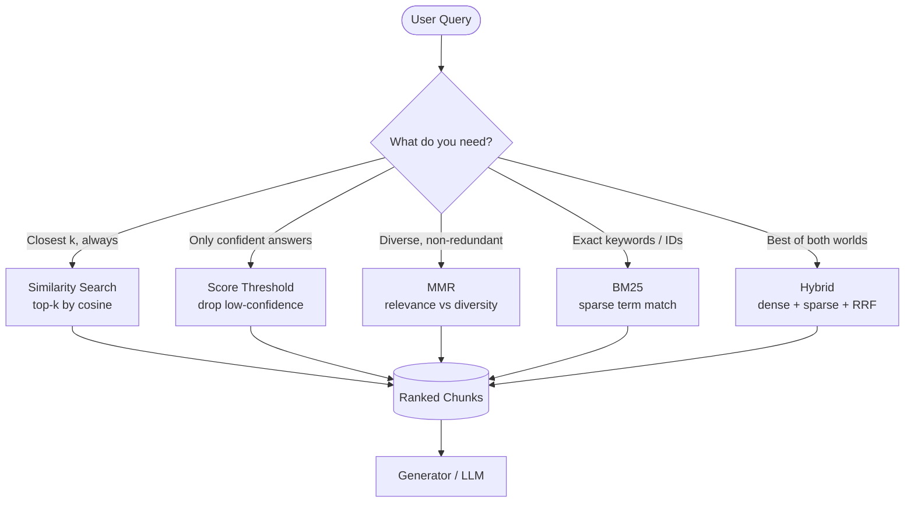
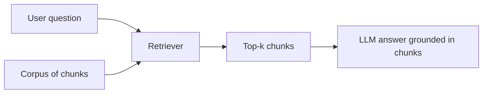

# 📖 Module 5 — Basic Retrieval Techniques (Learning)

Retrieval is the part of RAG that decides **what the LLM is allowed to see**. Get it wrong
and the best model in the world still hallucinates, because it was never shown the right evidence.
This module covers the five retriever families you will reach for in almost every production RAG.

---

## 1. What is a *retriever*?

A **retriever** is any component that maps a **query → a ranked list of documents/chunks**.
LangChain wraps this behind a single interface so you can swap strategies without touching the
rest of your pipeline:

```python
retriever.invoke("your question")      # -> list[Document]
```

Under the hood a retriever is usually a thin wrapper around a **vector store** plus a
**scoring/ranking policy**. The policy is what makes each retriever different:

| Retriever | Policy | Returns |
|-----------|--------|---------|
| Similarity Search | top-k by cosine similarity | always k docs |
| Score Threshold | top-k **filtered** by min score | 0..k docs |
| MMR | greedy relevance − redundancy | always k docs |
| BM25 | keyword term-frequency × IDF | always k docs |
| Hybrid / Ensemble | fuse two+ ranked lists | always k docs |

> **Key idea:** the *store* holds the data; the *retriever* decides the selection rule.
> Treat them separately and you can experiment freely.

### Diagram (a) — Retriever decision flowchart



**Reading the diagram.** Every path starts at the same query and ends at the same place — a
ranked list handed to the generator. The branching node is a *design decision*, not a technical
one: ask yourself what failure mode you're defending against. Want guaranteed coverage? Pick
plain similarity. Afraid of confabulation? Add a threshold. Tired of three near-duplicate
paragraphs? Use MMR. Searching for a ticket ID or error code? Reach for BM25. In practice you
often **combine** them (the Hybrid path), which is the industry default for serious systems.

---

## 2. Similarity Search (top-k)

The baseline. Embed the query, find the k nearest vectors by cosine similarity, return them.

- **Score:** cosine similarity in `[−1, 1]` (Chroma reports *distance* = `1 − similarity`, so
  smaller is better; we flip it in the code for readability).
- **Always returns k** — even if everything is garbage. That's the weakness we fix next.

## 3. Similarity Score Threshold (anti-hallucination gate)

Add a floor: **only return chunks whose similarity ≥ `min_score`**. If nothing clears the bar,
return **nothing**.

- **Why return nothing?** An empty context lets the downstream LLM say *"I don't know"* instead
  of inventing an answer. This is the single cheapest anti-hallucination lever you have.
- **Tuning `min_score`:** too low → noise slips through; too high → you starve the model of
  context. Sweep it (e.g. `0.30 … 0.60`) on a labeled set of good/bad queries.
- ⚠️ **Gotcha:** thresholds are **model-dependent**. A score of `0.45` on MiniLM means nothing on
  OpenAI embeddings. Always recalibrate when you swap the embedding model.

## 4. Maximal Marginal Relevance (MMR)

Plain top-k often returns **near-duplicates** (three paragraphs saying the same thing). MMR fixes
this by picking each next chunk to maximize:

```
MMR(d) = λ · sim(q, d)  −  (1 − λ) · max_{d' in selected} sim(d, d')
```

- First term: **relevance** to the query.
- Second term: **redundancy** with what you already picked (penalize it).
- **`lambda_mult` (λ) is the dial:**
  - `λ = 1.0` → pure relevance (identical to top-k).
  - `λ = 0.0` → pure diversity (ignore the query, just spread out).
  - `λ ≈ 0.5` → balanced (the usual starting point).
- You fetch a larger pool (`fetch_k`, e.g. 20) then greedily select `k` (e.g. 3).

**When to use:** summarization, "give me an overview," or any time redundant context wastes
tokens and dilutes attention.

## 5. BM25 — sparse retrieval

Dense vectors capture *meaning*; **BM25 captures exact words**. It scores a document by how well
its **term frequencies** match the query, down-weighting words that appear everywhere via
**inverse document frequency (IDF)**:

```
score(q, d) = Σ_{t in q}  IDF(t) ·  tf(t, d) · (k1 + 1) / (tf(t, d) + k1·(1 − b + b·|d|/avgdl))
```

- **IDF** makes rare, specific terms powerful and common words ("the", "is") weak.
- **Why keywords still matter:** proper nouns, product names, SKU/error codes, acronyms
  (`HNSW`, `efSearch`, `ERR-4042`) have **no semantic neighborhood** — a dense model may not
  "understand" them, but BM25 matches them exactly. This is why hybrid search exists.

## 6. Hybrid Search + Reciprocal Rank Fusion (RRF)

Combine the strengths: run **dense** and **sparse** independently, then **fuse the two ranked
lists** with RRF. RRF is beloved because it needs **no score calibration** — it only uses ranks:

```
RRF_score(d) = Σ_{list L}  1 / (k + rank_L(d))        with k = 60
```

- A doc that ranks high in **both** lists accumulates a big score and wins.
- `k = 60` (the canonical value from the original RRF paper) softens the gap between rank 1 and
  rank 2 so one list doesn't dominate.
- Because it's rank-based, you can fuse **any number** of retrievers — which is exactly what an
  **Ensemble** does.

### Diagram (b) — Hybrid search fusion pipeline

```mermaid
flowchart LR
    Q([Query]) --> E[Embed query]
    Q --> TK[Tokenize query]
    E --> DV[Dense ANN search<br/>top-10 vectors]
    TK --> SV[Sparse BM25 search<br/>top-10 terms]
    DV --> R1[Ranked list A<br/>by similarity]
    SV --> R2[Ranked list B<br/>by BM25 score]
    R1 --> F[Reciprocal Rank Fusion<br/>score = SUM 1/(k + rank), k=60]
    R2 --> F
    F --> OUT[(Fused top-k)]
```

**Reading the diagram.** The query fans out into **two parallel branches**: a dense branch
(vector ANN) and a sparse branch (BM25). Each branch produces its own ordered list. Crucially, the
two branches never compare *scores* to each other (they live on incompatible scales) — instead the
**fusion node** merges them purely by *rank* using RRF. The output is a single, more robust
ranking than either branch alone. This "retrieve many, fuse by rank" pattern scales to ensembles
of three, four, or more retrievers.

## 7. Ensemble Retriever

An **ensemble** runs several retrievers and merges their outputs. Two common merge strategies:

- **RRF** (rank-based, no calibration) — robust, the default.
- **Weighted linear merge** (score-based) — normalize each branch's scores to `[0,1]`, then
  `final = w₁·dense + w₂·sparse`. More expressive (you can bias toward one signal) but you must
  tune the weights and the normalization.

Use an ensemble when you have **heterogeneous signals** (semantic + lexical + recency + metadata)
and want one unified ranking.

---

## 🏭 Industry standards & real-world use cases

- **Hybrid + RRF is the default** in enterprise search (Elasticsearch/OpenSearch, Azure AI Search,
  Vespa, Qdrant, pgvector all ship hybrid/RRF). Pure-dense-only is increasingly considered a
  mistake for anything with identifiers.
- **Threshold gating** powers "abstention" features in customer-support bots: *"I couldn't find
  that in our docs"* beats a confident lie.
- **MMR** is standard in news/article summarization and "related content" widgets to avoid
  repetition.
- **BM25** remains the backbone of web search and is the lexical half of every modern hybrid engine.

## ⚠️ Common mistakes

1. **Hard-coding a threshold** and never recalibrating after changing the embedding model.
2. **Using only dense search** for a domain full of codes/names → silent misses.
3. **Setting `fetch_k == k` in MMR** → no pool to diversify from, MMR degenerates to top-k.
4. **Comparing raw dense and BM25 scores** directly (different scales) instead of fusing by rank.
5. **Returning k results unconditionally** when the honest answer is "nothing relevant found."
6. **Over-tuning λ / weights on one example** instead of a small evaluation set.

---

## 📊 Diagrams: Noob → Expert

### Level 1 — Noob: what retrieval actually does



*Next level adds:* the real components — two scoring branches (dense vectors + BM25) and how their rankings get fused.

### Level 2 — Practitioner: hybrid pipeline with real libraries

```mermaid
flowchart TB
    subgraph Index["Index time (once)"]
        S[data/samples/* txt·csv·json·md] --> SP[RecursiveCharacterTextSplitter<br/>chunk_size=300, overlap=40]
        SP --> CH[(list of Document<br/>page_content + metadata)]
        CH --> EMB[fastembed TextEmbedding<br/>all-MiniLM-L6-v2 → float32[384]]
        EMB --> VEC[(unit-norm chunk vectors<br/>numpy ndarray)]
        CH --> BIDX[rank_bm25.BM25Okapi<br/>tokenized corpus]
    end
    subgraph Query["Query time (per question)"]
        Q2[query string] --> QE[embed query → q_vec]
        Q2 --> QT[tokenize query]
        QE --> COS["cosine = chunk_vecs @ q_vec"]
        QT --> BS["bm25.get_scores(tokens)"]
        COS --> D10[dense top-10 ids]
        BS --> S10[BM25 top-10 ids]
        D10 --> RRF["RRF k=60:<br/>score(id) = Σ 1/(60+rank)"]
        S10 --> RRF
        RRF --> TOP[fused top-5 Documents]
    end
    VEC --> COS
    BIDX --> BS
```

*Next level adds:* failure modes, edge cases, and the performance knobs you tune in production.

### Level 3 — Expert: failure modes & tuning knobs (sequence view)

```mermaid
sequenceDiagram
    participant U as User
    participant P as Pipeline
    participant D as Dense branch
    participant B as BM25 branch
    participant F as RRF fusion

    U->>P: query
    P->>D: embed(query)
    alt embedding model missing / offline
        D-->>P: error → fall back to cached local MiniLM (or abort w/ hint, exit 0)
    else ok
        D-->>P: cosine top-10
    end
    P->>B: tokenize + score
    alt query has zero tokens (e.g. "??")
        B-->>P: all-zero scores → sparse branch contributes nothing; degrade to dense-only
    else ok
        B-->>P: BM25 top-10
    end
    P->>F: fuse([dense_ids, bm25_ids], k=60)
    Note over F: knob: k — small k rewards top ranks hard,<br/>large k flattens lists toward uniform
    alt fused top-1 below similarity threshold
        F-->>P: abstain → "nothing relevant found" (anti-hallucination gate)
    else ok
        F-->>P: fused top-5
    end
    P-->>U: answer + sources
    Note over P: knobs: fetch_k (pool size), λ (MMR), branch weights,<br/>hnsw efSearch/M, min_score recalibration after model swap
```

*This level adds:* the degradation paths (offline embeddings, empty tokenization, threshold abstention) and the concrete knobs — `k`, `fetch_k`, `λ`, HNSW `M`/`efSearch` — that separate a demo from a production retriever.
