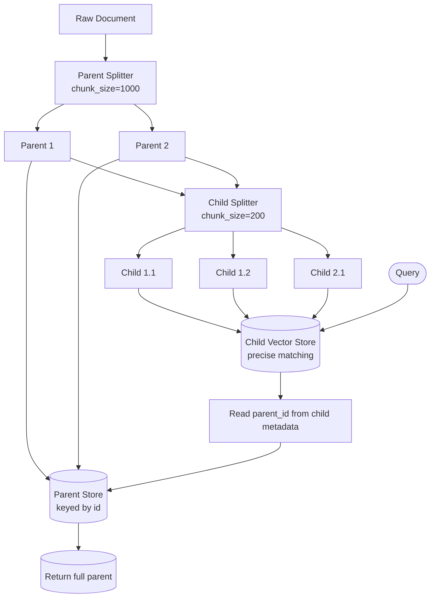
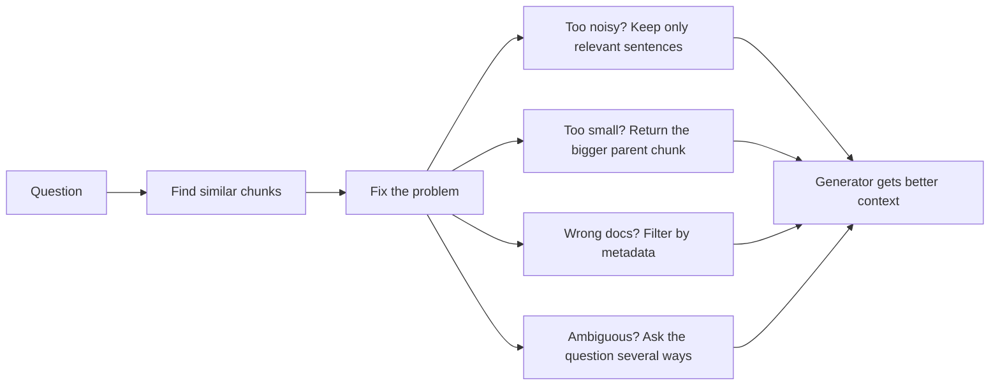
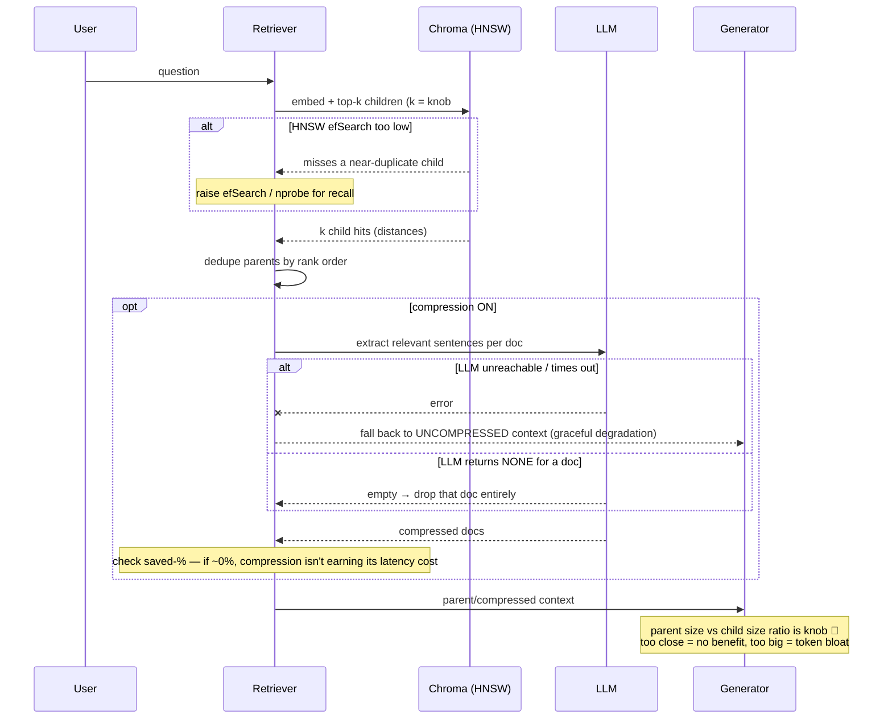

# 📖 Module 6 — Advanced Retrieval Techniques (Learning)

Basic retrieval answers *"which chunks are closest?"*. Advanced retrieval answers harder
questions: *"which chunks are closest **and clean**, with enough **context**, scoped to the right
**documents**, for an **ambiguous** question?"* Each technique below attacks one specific failure
mode of naive top-k.

---

## 1. Contextual Compression Retriever

**Problem:** retrieved chunks are often noisier than they need to be — a 300-char chunk might have
one sentence that matters and two that don't. Feeding all of it wastes tokens and dilutes attention.

**Idea:** retrieve *more* than you need (e.g. k=4), then run an **LLM extractor** over each chunk
that keeps **only the sentences relevant to the query**. The generator sees a tight, high-signal
context.

```
retrieve(k=4)  ->  [chunk1, chunk2, chunk3, chunk4]
                     |  LLM: "keep only sentences answering the question"
                     v
              [sentence_a, sentence_c]   <- compressed context
```

- **Token savings:** often 40–80% fewer tokens reach the generator.
- **Latency cost:** one extra LLM call per chunk (or batched). It's a **quality-for-latency** trade.
- **Best for:** long documents, low-budget LLMs, or when context windows are tight.

## 2. Parent-Document Retriever (small-to-big)

**Problem:** there's a tension between **precision** (small chunks match tightly) and **context**
(large chunks give the model enough surrounding info to answer). You can't have both in one size.

**Idea:** split into **two levels**:

- **Children** (small, e.g. 200 chars) → embedded & indexed for **precise matching**.
- **Parents** (large, e.g. 1000 chars) → stored separately, keyed by id, **returned** as context.

At query time you match on children but hand the generator the whole parent.

### Diagram (a) — Parent-document two-level store



**Reading the diagram.** Ingestion splits each raw document into **parents** (big), stores those
parents in a plain key-value **parent store**, then re-splits each parent into **children** (small)
that get embedded into the **child vector store**. Every child carries a `parent_id` in its
metadata. At query time the flow goes *down* through the child store for a precise hit, reads the
`parent_id`, and jumps back *up* to the parent store to fetch the full surrounding text. The result:
**needle-precision of a small chunk, context-richness of a big one.** If you only stored parents,
matching would be fuzzy (a 1000-char vector averages too much signal); if you only stored children,
answers would lack context.

## 3. Self-Query Retriever

**Problem:** users ask in natural language that mixes *what* they want with *where* it lives:
*"Show me electronics products from the CSV catalog."* A plain vector search ignores the
"from the CSV" part.

**Idea:** use an LLM to **decompose** the question into (a) a semantic **query string** and
(b) structured **metadata filters**. The vector search then runs *with* the filter applied.

This **requires a defined schema** — you tell the retriever which metadata fields exist and what
they mean (via a Pydantic model). Without clean metadata, there's nothing to filter on.

### Diagram (b) — Self-query decomposition flow

```mermaid
flowchart TD
    NL[Natural-language question<br/>\"electronics products from the CSV\"] --> LLM[LLM query constructor]
    SCHEMA[[Pydantic schema:<br/>source, format, topic]] --> LLM
    LLM --> PQ[Parsed query]
    PQ --> QS[query string:<br/>\"electronics products\"]
    PQ --> FL[filters:<br/>format = csv]
    QS --> VS[Vector search]
    FL --> VS
    VS --> RES[(Filtered results)]
```

**Reading the diagram.** The natural-language question and the **Pydantic schema** both feed the
LLM query constructor. The LLM emits a single parsed object with two parts: a free-text **query
string** (the semantic part) and a **filter dict** (the structured part, e.g. `format = "csv"`).
Both are passed to the vector search — the query drives similarity while the filter prunes the
candidate set *before* ranking. The payoff is **precision**: you never waste a top-k slot on a
document from the wrong source/format/topic. The cost is one LLM call per query and a dependency on
well-maintained metadata.

## 4. Multi-Query Retriever

**Problem:** a single phrasing is a single guess. An ambiguous or broad question ("Tell me about
Acme Robotics and its products") may be answered better by several different phrasings.

**Idea:** ask an LLM to generate **N diverse reformulations** of the question (default N=3), run a
retrieval for **each**, then **dedupe and merge** the results.

```
question -> LLM -> [q1, q2, q3]
                 -> retrieve(q1) ∪ retrieve(q2) ∪ retrieve(q3)
                 -> dedupe by content/id -> merged ranked list
```

- **Best for:** ambiguous, multi-faceted, or "give me everything about X" questions.
- **Cost:** N× retrievals + 1 LLM call. Cheap if the base retriever is fast (vector search is).

---

## 🧭 When to use which? (cost/latency implications)

| Retriever | Extra LLM calls | Latency impact | Token impact | Best when… |
|-----------|----------------|----------------|--------------|------------|
| Contextual Compression | 1 (per query, over k chunks) | **Higher** (LLM pass) | **Lower** to generator | Long/noisy docs, tight context budget |
| Parent-Document | 0 | ~Same (extra KV lookup) | Higher (bigger parents) | Answers need surrounding context |
| Self-Query | 1 (query construction) | Slightly higher | Same | Data has rich, reliable metadata |
| Multi-Query | 1 (rewrite) + N retrievals | Higher (N searches) | Higher (more candidates) | Ambiguous / broad questions |

**Rule of thumb:** start with the cheapest thing that fixes your observed failure. Compression and
self-query add **one** LLM call each; multi-query adds **N** searches; parent-document adds almost
nothing at runtime (its cost is at ingestion).

## 🏭 Industry standards & real-world use cases

- **Small-to-big / parent-document** is a canonical pattern in LangChain/LlamaIndex and underpins
  many production RAG stacks (it's essentially "late chunking" done explicitly).
- **Self-query** powers faceted enterprise search ("only PDFs from Legal, last quarter").
- **Multi-query / RAG-Fusion** is used to boost recall on open-domain QA.
- **Compression** mirrors "context distillation" used to fit long evidence into small models.

## ⚠️ Common mistakes

1. **Compressing with a weak/short prompt** → the extractor drops the one sentence you needed.
2. **Parent == child size** → you lose the whole point; make parents clearly larger.
3. **Self-Query with no/empty metadata** → the LLM has nothing to filter on; it silently degrades
   to plain vector search.
4. **Multi-Query with N too high** → latency balloons and you drown in near-duplicates.
5. **Stacking all four at once** → compounding LLM calls; measure whether each layer earns its cost.
6. **Forgetting graceful failure** → if the LLM is down, the whole pipeline should not crash.

---

## 📊 Diagrams: Noob → Expert

### Level 1 — Noob: what "advanced retrieval" actually does



*Next level adds:* the real libraries, data types, and where each step's cost lives.

### Level 2 — Practitioner: components, libraries, data types

```mermaid
flowchart TB
    subgraph Ingest
        D[data/samples/*.<br/>txt · md · csv · json] --> S1[RecursiveCharacterTextSplitter<br/>parents ~1500 chars]
        S1 --> S2[RecursiveCharacterTextSplitter<br/>children ~300 chars]
        S2 --> CH[(ChromaDB collection<br/>ids = child_id<br/>metadata = parent_id)]
        S1 --> PS[(InMemoryStore / dict<br/>parent_id → Document)]
    end
    subgraph Query
        QN[question str] --> E[get_embeddings()<br/>MiniLM 384-dim vector]
        E --> VQ[Chroma query → top-k ChildHits]
        VQ --> MAP{map child_id → parent_id<br/>dedupe, keep rank order}
        MAP --> POUT[list of parent Documents]
    end
    subgraph Compression
        VQ2[top-5 Documents] --> LLM[get_llm() + LLMChainExtractor<br/>keep only relevant sentences]
        LLM --> COUT[compressed Documents<br/>fewer tokens]
    end
    CH -. parent_id .-> MAP
    POUT --> GEN[LLM generator]
    COUT --> GEN
```

*Next level adds:* failure modes, edge cases, and the performance knobs you tune in production.

### Level 3 — Expert: edge cases, failure modes, knobs



*This level adds:* where pipelines silently degrade (LLM down, empty extraction, ANN recall loss) and which knobs (k, efSearch, parent/child size ratio, compression on/off) to turn when quality or latency regresses.
