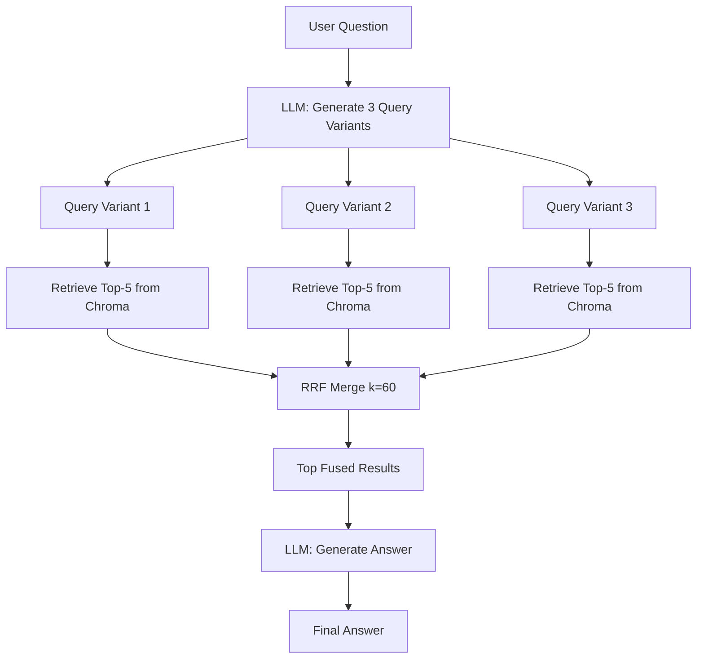
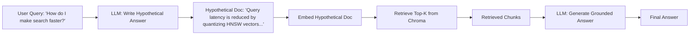
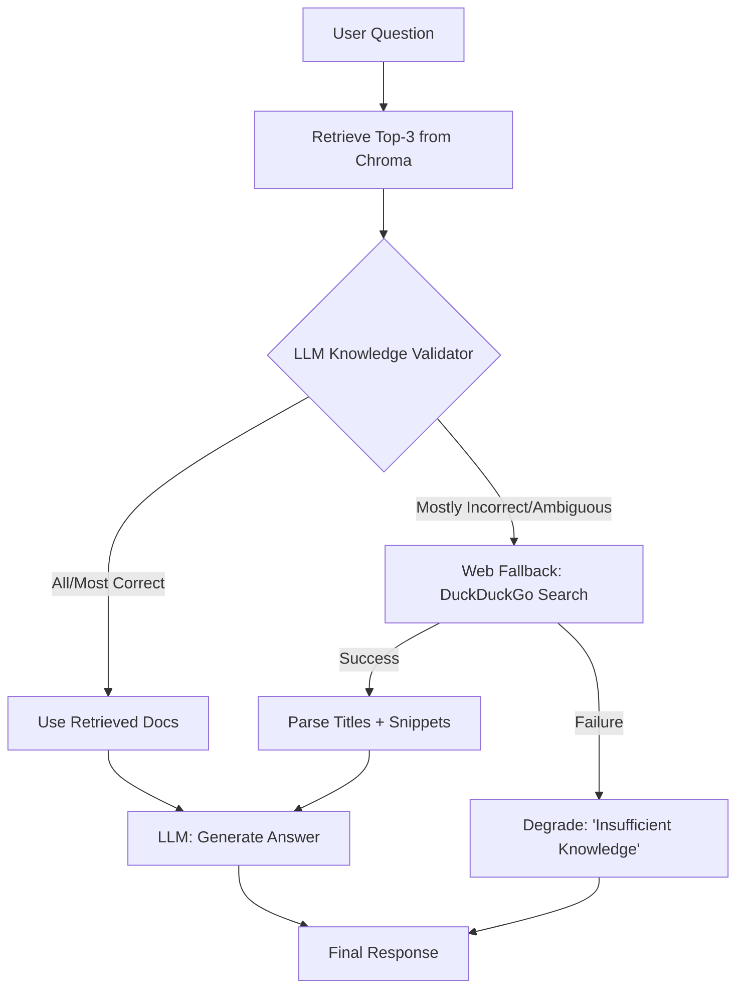
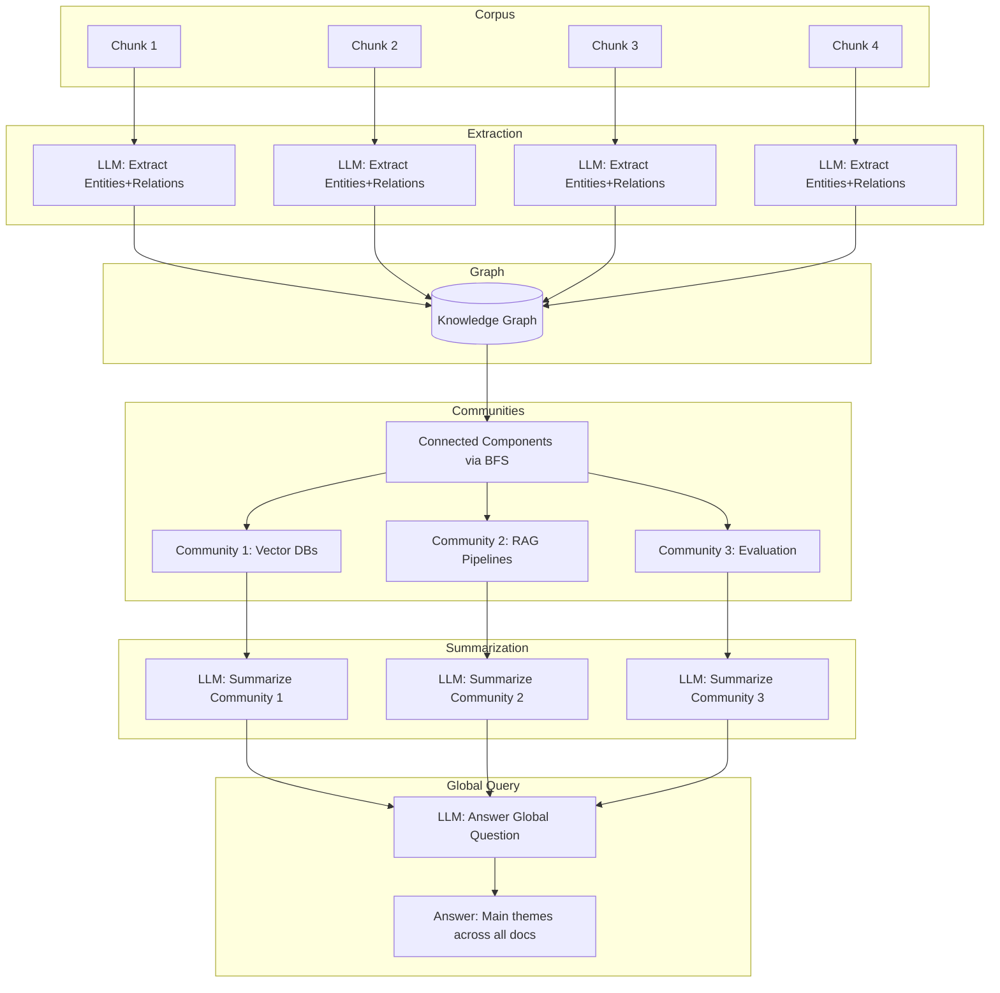
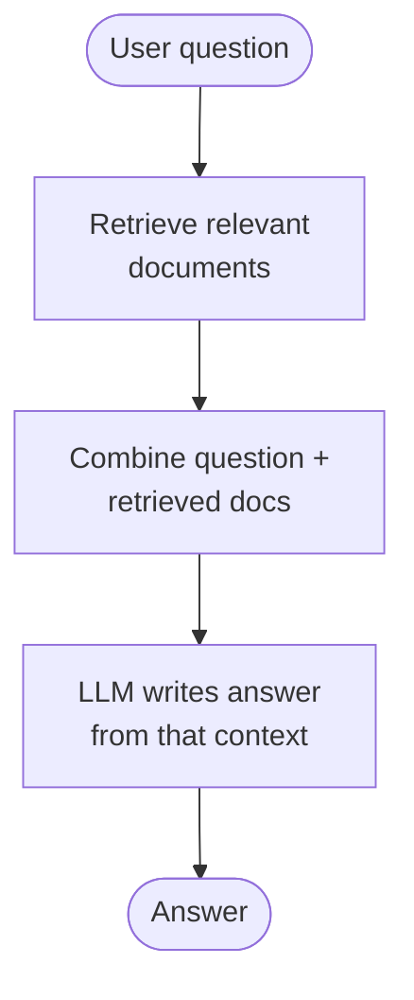

# Module 07: Advanced RAG Patterns — Learning Guide

## Why Basic RAG Is Not Enough

A standard RAG pipeline does: **chunk → embed → retrieve top-k → stuff into prompt → generate**.
This works when:

- The user's query uses the same vocabulary as the documents.
- A single well-phrased query retrieves all relevant chunks.
- The retrieved chunks are actually relevant (no noise).
- The answer is contained in one or two chunks.
- The question is local (about a specific fact), not global (across the whole corpus).
- All information is text.

When any of those assumptions break, you need an **advanced pattern**. Below we cover six.

---

## 1. RAG Fusion + Reciprocal Rank Fusion (RRF)

### Problem Solved

A single query is a **bottleneck**. If the user asks "How does retrieval work?" but the document says "The search mechanism uses vector similarity," a single embedding may miss it. Different phrasings hit different parts of the vector space.

### How It Works

1. Take the user's single question.
2. Ask the LLM to generate **N query variants** (typically 3–5) that rephrase the question from different angles.
3. Retrieve top-k results **independently** for each variant.
4. Merge all result lists using **Reciprocal Rank Fusion**:

   ```
   RRF_score(doc) = Σ  1 / (k + rank_i(doc))
   ```

   where `k` is a constant (usually 60) and `rank_i` is the position of the doc in list `i` (1-indexed; docs absent from a list get no contribution).

5. Take the top fused results and generate the answer.

### Mermaid Diagram: RAG Fusion Multi-Query Fan-Out + RRF Merge



**Explanation:** The diagram shows the fan-out phase where one question becomes three independent retrieval queries, each hitting the vector store separately. The RRF merge node combines the three ranked lists into a single consensus ranking. Documents that appear high in multiple lists get boosted scores, while documents that only appear in one list are down-weighted. This makes the system robust to any single query missing the right vocabulary.

### Pros / Cons

| Pros | Cons |
|------|------|
| Robust to query phrasing | N× more retrieval calls (latency) |
| No retraining needed | 1 extra LLM call for query generation |
| Works with any retriever | Diminishing returns beyond ~5 variants |
| Simple to implement | RRF k-value is a hyperparameter to tune |

### When to Use

- User queries are short/ambiguous and benefit from multiple interpretations.
- You want a quick accuracy boost without changing the retriever model.
- Latency budget allows N parallel retrievals.

---

## 2. HyDE (Hypothetical Document Embeddings)

### Problem Solved

**Vocabulary mismatch.** The user asks "How do I make the search faster?" but the document says "Query latency can be reduced by quantizing the HNSW index." The user's words and the document's words live in different regions of embedding space, so cosine similarity is low.

### How It Works

1. Take the user's question.
2. Ask the LLM to write a **hypothetical answer** — a paragraph that *sounds like* what the real answer would look like, using domain-specific language.
3. Embed that hypothetical answer (NOT the user's question).
4. Use the hypothetical answer's embedding as the query vector to retrieve from Chroma.
5. Generate the real answer from the retrieved chunks.

The key insight: the hypothetical answer uses the **document's vocabulary** (because the LLM knows the domain), so its embedding is much closer to the actual relevant documents than the raw user query would be.

### Mermaid Diagram: HyDE Flow



**Explanation:** Notice that the user's raw query never touches the vector store. Instead, the LLM "translates" the question into a document-like paragraph that mirrors the language of the corpus. That paragraph is embedded and used as the search vector. Because it shares vocabulary with the actual documents, retrieval precision improves dramatically even when the user's phrasing is colloquial or vague.

### Pros / Cons

| Pros | Cons |
|------|------|
| Bridges vocabulary gap | 1 extra LLM call (can be slow) |
| No retraining or fine-tuning | Hypothetical doc may hallucinate wrong terms |
| Works with any embedding model | Adds latency before retrieval |
| Simple to add to existing pipeline | Less effective if LLM doesn't know the domain |

### When to Use

- Users ask in natural/colloquial language; documents use technical jargon.
- Domain-specific corpora where terminology differs from everyday speech.
- You have a capable LLM that can produce plausible domain text.

---

## 3. CRAG (Corrective RAG)

### Problem Solved

Retrieved chunks are **not always relevant**. Basic RAG blindly stuffs whatever comes back into the prompt. If the top-3 results are off-topic, the LLM either hallucinates or gives a poor answer. CRAG adds a **quality gate** between retrieval and generation.

### How It Works

1. Retrieve top-k documents (e.g., top-3).
2. For each document, ask an LLM "knowledge validator" to classify it:
   - **Correct**: directly answers the question.
   - **Incorrect**: unrelated or contradictory.
   - **Ambiguous**: partially relevant, needs more context.
3. Decision logic:
   - If enough Correct docs → generate answer from them.
   - If mostly Incorrect/Ambiguous → trigger **web fallback** (search DuckDuckGo HTML).
   - If web also fails → return "insufficient knowledge" response.
4. Generate final answer from the best available evidence.

### Mermaid Diagram: CRAG Corrective Loop with Web Fallback



**Explanation:** The critical branch point is the validator. It acts as a "circuit breaker" — if the local corpus simply doesn't contain the answer, rather than forcing a bad response, the system escalates to the open web. The web fallback is itself wrapped in error handling: if the network is down or parsing fails, the system degrades gracefully to an honest "I don't know" rather than hallucinating. This three-tier approach (local → web → admit ignorance) makes the system trustworthy.

### Pros / Cons

| Pros | Cons |
|------|------|
| Prevents hallucination from bad retrieval | 1+ extra LLM calls (validation per doc) |
| Web fallback extends knowledge beyond corpus | Web scraping is fragile (HTML changes) |
| Graceful degradation | Higher latency (validation + possible web call) |
| Builds user trust ("I don't know" > wrong answer) | Requires network access for full benefit |

### When to Use

- Corpus may not cover all possible questions.
- Accuracy is critical (medical, legal, financial).
- You can tolerate higher latency for correctness.
- You want the system to admit uncertainty rather than guess.

---

## 4. Self-RAG

### Problem Solved

LLMs can generate **plausible but unsupported** answers. Even with good retrieval, the generated answer might overstate, omit key details, or contradict the evidence. Self-RAG adds a **self-reflection loop** where the model critiques its own output against the retrieved evidence.

### How It Works

1. Retrieve relevant chunks.
2. Generate an initial answer **with citations** (pointing to specific chunks).
3. **Reflection pass**: Ask the LLM to critique the answer:
   - Is each claim **supported** by the cited evidence?
   - Is the answer **relevant** to the question?
   - Is it **complete** (no major omissions)?
4. If the critique identifies problems → **regenerate once** with the critique fed back as additional context.
5. Output the final answer (and optionally the reflection notes).

This is a simplified version of the original Self-RAG paper (Asai et al., 2023), which trains special reflection tokens. Here we approximate it with a second LLM call.

### Pros / Cons

| Pros | Cons |
|------|------|
| Catches unsupported claims | 1–2 extra LLM calls |
| Improves factual grounding | Reflection may be too lenient (same model) |
| Transparent (you see the critique) | Doubles latency in worst case |
| No special training needed | Limited to one regeneration (diminishing returns) |

### When to Use

- High-stakes answers where unsupported claims are dangerous.
- You want auditability (the reflection log is your audit trail).
- The base model tends to overstate or omit details.

---

## 5. GraphRAG (Lightweight)

### Problem Solved

Basic RAG answers **local** questions well ("What does chunk X say about Y?") but fails at **global** questions ("What are the main themes across ALL documents?"). No single chunk contains the global picture. GraphRAG builds a **knowledge graph** from the corpus, finds **communities**, summarizes them, and answers global questions from those summaries.

### How It Works

1. **Entity extraction**: For each chunk, ask the LLM to extract entities (people, concepts, technologies) and relations between them. Build a dict-of-dicts graph: `{entity: {related_entity: relation}}`.
2. **Community detection**: Find connected components in the graph using BFS (pure Python, no networkx). Each connected component is a "community."
3. **Community summarization**: For each community, ask the LLM to write a summary of what that cluster of entities is about.
4. **Global query**: To answer a global question, feed ALL community summaries (not raw chunks) to the LLM and ask it to synthesize an answer.

### Mermaid Diagram: GraphRAG Entity Extraction → Graph → Community Summaries



**Explanation:** The pipeline flows left-to-right through four stages. First, each chunk is independently parsed by the LLM into structured entities and relations. These are merged into a single graph where nodes are entities and edges are relations. Second, a simple BFS traversal groups nodes into connected components — clusters of entities that are related to each other but not to other clusters. Third, each community gets a natural-language summary. Finally, when a global question is asked, the LLM sees only the compact community summaries (much shorter than all raw chunks), enabling it to synthesize a corpus-wide answer that no single chunk could provide.

### Pros / Cons

| Pros | Cons |
|------|------|
| Answers global/synthetic questions | Many LLM calls (extraction per chunk + summarization per community) |
| Structured understanding of corpus | Entity extraction quality depends on LLM |
| Community summaries are reusable | Connected components may be too coarse/fine |
| No external graph DB needed (lightweight) | Not suitable for very large corpora (memory) |

### When to Use

- Questions span the entire corpus ("main themes," "how do X and Y relate across all docs?").
- Corpus is medium-sized (dozens to low hundreds of chunks).
- You need interpretable structure (the graph itself is a deliverable).

---

## 6. Multi-Modal RAG

### Problem Solved

Real-world data is **not just text**. Diagrams, screenshots, charts, product photos, and annotated images carry information that text-only RAG cannot access. Multi-Modal RAG extends retrieval to handle **cross-modal** queries: find images with a text query, or find text descriptions with an image query.

### How It Works

1. **Image creation/loading**: In this demo, we generate simple labeled images with PIL. In production, you'd load real images.
2. **Cross-modal embedding**: Use a CLIP model (`clip-ViT-B-32`) to embed both images and text into the **same vector space**. This means a text query can match an image and vice versa.
3. **Unified storage**: Store image embeddings and text chunk embeddings in the same Chroma collection.
4. **Cross-modal retrieval**:
   - Text query → embed text → retrieve matching images.
   - Image query → embed image → retrieve matching text chunks.
5. **Generation**: Feed retrieved multimodal context to the LLM.

> **Production note:** `clip-ViT-B-32` is a small (~600 MB) model for demonstration. Production systems use larger models (CLIP ViT-L/14, SigLIP, BLIP-2) for better cross-modal alignment.

### Pros / Cons

| Pros | Cons |
|------|------|
| Handles non-text data (images, diagrams) | Large model download (~600 MB+) |
| Cross-modal queries (text→image, image→text) | GPU recommended for speed |
| Unified storage in one vector DB | Image preprocessing adds complexity |
| Extensible to video/audio with right models | CLIP alignment isn't perfect for fine-grained tasks |

### When to Use

- Your corpus includes images (product catalogs, medical scans, diagrams).
- Users search with both text and image inputs.
- You need to link visual content to textual explanations.

---

## Master Comparison Table

| Pattern | Problem Solved | Extra LLM Calls | Latency Impact | Best For |
|---------|---------------|-----------------|----------------|----------|
| **RAG Fusion + RRF** | Single-query retrieval misses relevant docs due to phrasing | 1 (query gen) | Moderate (N parallel retrievals) | Ambiguous/short queries; quick accuracy boost |
| **HyDE** | Vocabulary mismatch between user and documents | 1 (hypothetical doc) | Low-Moderate (1 LLM call before retrieval) | Technical corpora, colloquial users |
| **CRAG** | Retrieved docs may be irrelevant/wrong | 1–3 (validation per doc) + optional web | High (validation + possible web fetch) | High-stakes domains; incomplete corpora |
| **Self-RAG** | Generated answer may be unsupported/incomplete | 1–2 (reflection + optional regen) | Moderate-High (sequential LLM calls) | Auditability; reducing hallucination |
| **GraphRAG** | Cannot answer global/cross-document questions | N_chunks (extraction) + N_communities (summaries) + 1 (final) | Very High (many sequential calls) | Global questions; corpus-level synthesis |
| **Multi-Modal RAG** | Non-text data (images) inaccessible to text RAG | 0 extra (embedding-based) | Moderate (model inference) | Visual corpora; cross-modal search |

## Key Takeaways

1. **No single pattern is best.** They solve different failure modes. In production, you often combine them (e.g., RAG Fusion for retrieval + CRAG validation + Self-RAG reflection).
2. **Every pattern trades latency for accuracy.** Budget your LLM calls carefully.
3. **Start simple.** Add complexity only when you've measured that basic RAG fails in a specific way.
4. **The LLM is both tool and bottleneck.** Every extra call adds cost and latency. Design prompts to extract maximum value per call.
5. **Graceful degradation matters.** CRAG's "I don't know" and Multi-Modal's text-only fallback show that a system which admits its limits is more trustworthy than one that guesses.

---

## 📊 Diagrams: Noob → Expert

### Level 1 — Noob: the core idea



*Next level adds: the real components, libraries, and data types behind each box.*

### Level 2 — Practitioner: components, libraries, and data types

```mermaid
flowchart LR
    subgraph Expand["Query expansion (LLM calls)"]
        Q([question: str]) -->|ChatOpenAI / Yolo-Auto qwen3.8-27b| V["3 query variants: list[str]<br/>(RAG Fusion)"]
        Q -->|same LLM, temp=0.3| H["hypothetical doc: str<br/>(HyDE)"]
    end
    subgraph Retrieve["Retrieval (local, cached)"]
        V -->|HuggingFaceEmbeddings MiniLM → list[float] 384-dim| CH[(chromadb collection<br/>dense vectors)]
        H -->|embed_query → np.ndarray| CH
        Q -->|BM25Okapi.get_scores → np.ndarray| BM25[rank_bm25 sparse scores]
        CH --> L1["ranked ids: list[str]"]
        BM25 --> L2["ranked ids: list[str]"]
    end
    subgraph Fuse["Fusion (numpy)"]
        L1 --> RRF["RRF: score = Σ 1/(k+rank), k=60<br/>np.zeros / np.argsort"]
        L2 --> RRF
    end
    RRF --> TOPK["top-k documents: list[str]"]
    TOPK --> GEN["LLM grounded answer: str"]
```

*Next level adds: what goes wrong at runtime and which knobs you turn.*

### Level 3 — Expert: failure modes and performance knobs

```mermaid
sequenceDiagram
    participant U as User
    participant E as Expander (LLM)
    participant V as chromadb (dense)
    participant B as BM25Okapi (sparse)
    participant F as RRF (numpy, k=60)
    participant G as Generator (LLM)

    U->>E: question
    alt LLM timeout / ConnectError
        E-->>U: degrade: heuristic variants (keywords, "explain …") or raw question as HyDE doc
    else success
        E->>V: variant 1..3 embeddings (384-dim)
        E->>V: hypothetical-doc embedding (HyDE)
        V-->>F: ranked id lists (dedupe by id BEFORE fusion!)
        B-->>F: sparse rank list (hybrid only)
    end
    F->>F: k=60 flattens ranks; lower k → top-heavy, higher k → consensus
    alt fused list empty (n_results > corpus size / bad filter)
        F-->>G: no context → prompt must force "I don't know" (no hallucination)
    else top-k ok
        F->>G: top-k docs as context
    end
    G-->>U: answer (or explicit "context insufficient")
    Note over E,G: Knobs: NUM_VARIANTS (cost ×N), TOP_K (context window), RRF_K (rank curve),<br/>temperature (variant diversity vs drift), retrieval-only latency budget (~30–240 ms here)
```

*This level adds: graceful-degradation paths, the dedupe-before-RRF trap, empty-context handling, and the four tuning knobs with their cost/quality trade-offs.*
