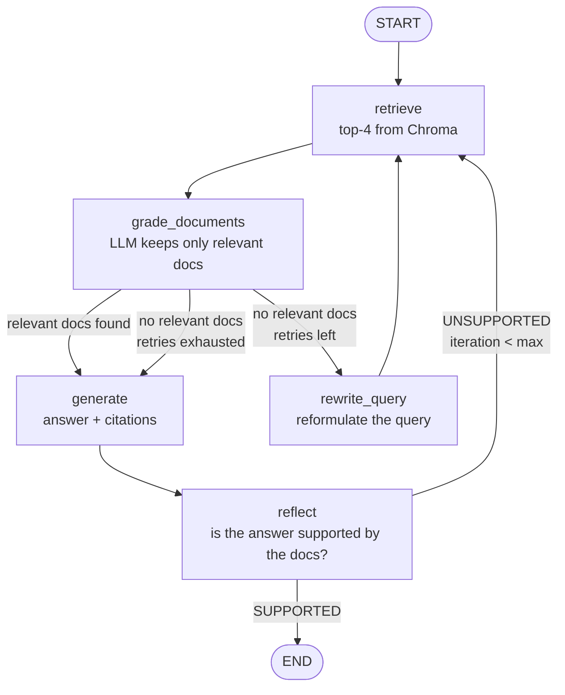
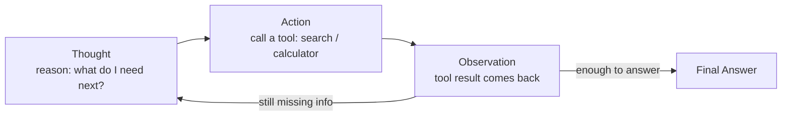
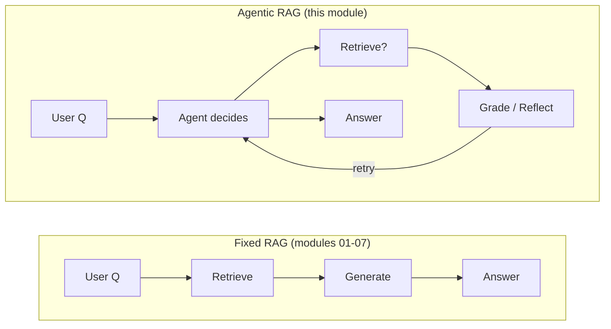
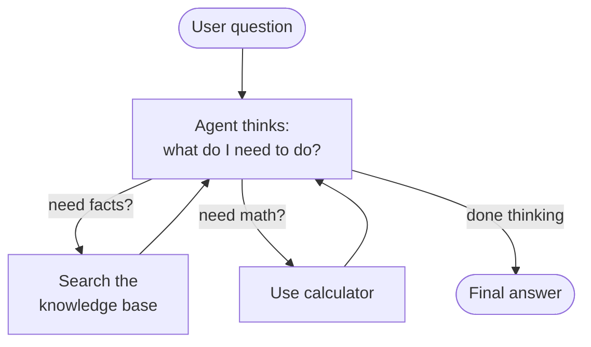
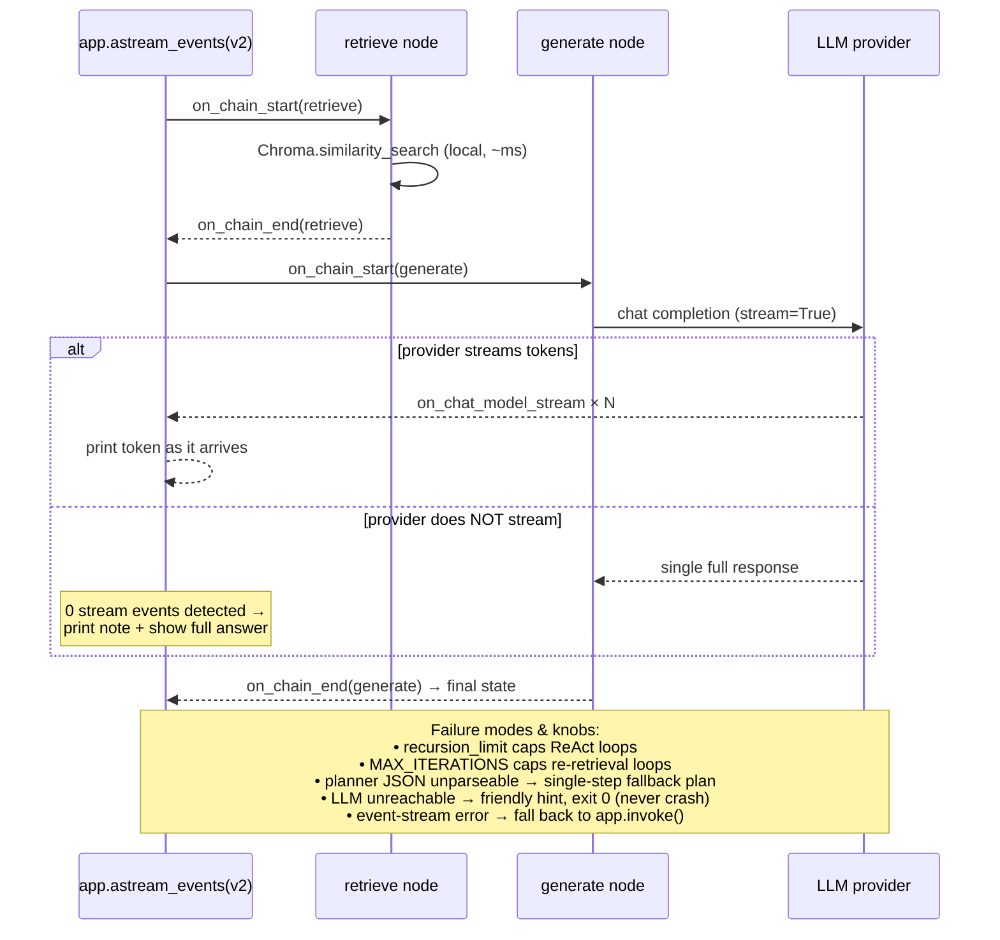

# 📖 Module 08 — Agentic RAG with LangGraph · Learning

> Reading goal: understand *why* we hand control to the LLM, the classic agent
> design patterns, and the LangGraph primitives we'll use to build it.

---

## 1. What Makes RAG "Agentic"?

Classic RAG is a **fixed pipeline**:

```
Question ──► Retrieve(top-k) ──► Stuff into prompt ──► Generate ──► Answer
```

Every question — trivial or impossible — runs the identical path. Problems:

- **Over-retrieval:** easy questions still pay for a vector search.
- **Under-retrieval:** hard questions get the *same* top-k, even when those docs are wrong.
- **No self-check:** the model never asks *"do these docs actually answer this?"* or
  *"is my answer grounded in them?"*

**Agentic RAG** flips this: the **LLM is the controller**. Instead of a static DAG,
you give the model *tools* and/or *decision points* and let it choose:

- **WHEN** to retrieve (skip it for things it already knows; fetch for facts it doesn't).
- **HOW** to retrieve (reformulate the query when the first search misses).
- **WHETHER** the retrieved evidence is relevant (grade & filter docs).
- **WHETHER** its own draft answer is supported (reflect & retry if not).

The unit of control changes from *"a sequence of stages"* to *"a policy the model follows."*
That policy is expressed either as **tools the agent may call** (Approach A) or as
**nodes + conditional edges in a graph** (Approach B).

---

## 2. Agent Design Patterns

Three patterns dominate agentic RAG. Our two implementations combine them.

### 2.1 ReAct — Reason + Act loop
The agent alternates **Thought → Action → Observation** until it can answer.
- **Thought:** "I need the Falcon AMR's payload — I don't know it, so I'll search."
- **Action:** call `search_knowledge_base("Falcon AMR payload")`.
- **Observation:** the tool returns passages.
- Repeat until confident, then emit the **Final Answer**.

ReAct is what `create_react_agent` implements for us. It's the fastest way to get a
working agent and shines when the *number* of steps is unpredictable.

### 2.2 Plan-and-Execute
The agent first writes a **plan** (a list of sub-steps), then executes them one by one,
optionally re-planning after each step. Useful for multi-hop questions
("compare X and Y, then compute the delta"). Heavier than ReAct; we mention it as the
next step up in complexity.

### 2.3 Reflection / Self-Critique
After producing a candidate answer, a (separate) LLM call **critiques** it against the
evidence: *"Is every claim supported? Is anything fabricated?"* If not, the agent
retries with a better query or a corrected answer. This is the heart of **CRAG**
(Corrective RAG) and **Self-RAG** from Module 07 — and it's our `reflect` node.

> **Our Approach B = ReAct-style looping + Reflection.** We retrieve, *grade* (a light
> self-critique of the *evidence*), generate, then *reflect* (a self-critique of the
> *answer*), looping back when either check fails.

---

## 3. RAG-as-a-Tool vs. RAG-as-Graph-Nodes

Two fundamentally different ways to give the LLM control. Pick based on how much
**determinism** you need.

| Dimension | **A — RAG as a Tool** (`create_react_agent`) | **B — RAG as Graph Nodes** (`StateGraph`) |
|-----------|---------------------------------------------|-------------------------------------------|
| Control flow | Emergent — the model freely chains tool calls | Explicit — you draw the edges; model only picks among them |
| Determinism | Lower (path varies run-to-run) | Higher (only your defined branches are possible) |
| Speed to build | Very fast (prebuilt agent) | Slower (you wire every node/edge) |
| Custom stages (grade, reflect, rewrite) | Harder — must be encoded as extra tools/prompts | Natural — each stage is a node |
| Looping / retry | Implicit (model re-calls the tool) | Explicit (conditional edge back to `retrieve`) |
| Observability | Trace = message list (thoughts + tool calls) | Trace = node transitions (very clean) |
| Cost control | Cap via `recursion_limit` | Cap via iteration counters + max edges |
| Best for | Flexible assistants, open-ended Q&A, many tools | Production pipelines needing guaranteed structure & auditability |
| Failure modes | Model may loop or ignore the tool | Model may mis-route, but only along your edges |

**Rule of thumb:** start with **A** to prototype and explore; graduate to **B** when you
need reproducible, auditable, bounded behaviour in production. Many teams ship **both**:
an outer ReAct agent whose *tools* are themselves small graphs.

---

## 4. LangGraph Core Concepts

LangGraph models an agent as a **state machine**: a shared **State** flows through
**Nodes** connected by **Edges**; a **checkpointer** remembers state across turns.

- **State** — a `TypedDict` (or Pydantic model). Every node reads it and returns a
  *partial* update. Fields can declare a **reducer** to control merging, e.g.
  `Annotated[list, operator.add]` *appends* instead of replacing (used for chat history).
- **Nodes** — plain functions `node(state) -> dict`. Side effects (LLM calls, DB queries)
  live here. Keep them pure-ish: compute, then return the state delta.
- **Edges** —
  - *Normal:* `add_edge("a", "b")` — always go `a → b`.
  - *Conditional:* `add_conditional_edges("a", router_fn, {...})` — `router_fn(state)`
    returns the name of the next node (or `END`). This is where the LLM's judgment
    becomes control flow.
- **`START` / `END`** — sentinel nodes marking entry and exit.
- **Checkpointing / memory** — `compile(checkpointer=MemorySaver())` snapshots state after
  every super-step, keyed by `configurable.thread_id`. Same `thread_id` ⇒ the graph
  *resumes* with prior state ⇒ multi-turn memory, resumption, and time-travel debugging.
- **Human-in-the-loop** — `interrupt()` pauses the graph to await external input, then
  `Command(resume=...)` continues. (We build autonomous agents here; this is the escape
  hatch for approval gates in production.)

### 4.1 Diagram (a) — The Agentic RAG State Graph

This is the exact topology of `code/agentic_graph_rag.py`. Note the **two feedback
loops** (the dashed idea of "try again") and the **two exit paths** (a good answer, or a
honest "I don't have enough info").



**Walk-through:**
1. `START → retrieve`: always begin by pulling the top-4 chunks for the (possibly
   rewritten) query.
2. `retrieve → grade_documents`: an LLM grades each chunk *relevant / not* and the node
   filters the list down to the survivors.
3. **Conditional edge after `grade_documents`:**
   - *relevant docs found* → `generate`.
   - *none found, retries left* → `rewrite_query` → back to `retrieve` (a sharper query).
   - *none found, retries exhausted* → `generate`, which emits a candid
     "not enough information" answer (no hallucination).
4. `generate → reflect`: draft an answer with `[n]` citations, then a second LLM call
   checks it against the evidence.
5. **Conditional edge after `reflect`:**
   - *SUPPORTED* → `END`.
   - *UNSUPPORTED and `iteration < max`* → back to `retrieve` (loop, up to the cap).
   - otherwise → `END`.

The **iteration counter** (incremented in `retrieve`) is the safety belt that guarantees
termination — no matter how the model routes, the graph *must* stop.

### 4.2 Diagram (b) — The ReAct Loop Cycle

This is what happens *inside* `create_react_agent` (Approach A). The agent cycles through
Thought → Action → Observation, re-entering the loop while it lacks information, and exits
once it can commit to a Final Answer.



**Walk-through:**
- **Thought** — the model narrates its plan ("I need the laptop price, then I'll add them").
- **Action** — it emits a structured tool call, e.g. `search_knowledge_base("Quantum Laptop Pro 16 price")`.
- **Observation** — the tool's return value is fed back as a `ToolMessage`.
- The loop **repeats** (search → calculate → search again…) until the model stops emitting
  tool calls; that final message is the **Final Answer**.

### 4.3 Bonus Diagram — Fixed Pipeline vs. Agentic



The fixed pipeline is a straight line; the agentic one is a **cycle the model navigates**.

---

## 5. Production Considerations

Agentic systems are powerful *and* expensive/unbounded by default. Productionize with:

- **Max iterations / recursion limits.** Cap loops explicitly (our `MAX_ITERATIONS`) and set
  LangGraph's `recursion_limit` on the agent so a chatty model can't spin forever.
- **Timeouts.** Wrap LLM/tool calls in timeouts; a hung model shouldn't hang the request.
- **Cost control.**
  - Fewer, cheaper calls: grade with a small/fast model, reserve the big model for generation.
  - Cache retrievals and repeated sub-questions (see Module 11).
  - Early-exit: skip retrieval for questions the model can answer parametrically.
- **Guardrails & validation.** Validate tool arguments, sanitize calculator input, and
  reject answers that fail the reflection gate rather than serving them.
- **Observability.** Log every node transition and tool call (we print a full trace); in
  prod, ship spans to LangSmith or OpenTelemetry.
- **Graceful degradation.** If the LLM is unreachable, fail with a helpful message, not a
  stack trace (both our scripts do this).
- **Determinism & auditability.** Prefer Approach B when you need to *prove* the system
  only ever took sanctioned paths.

---

## 6. Key Terms Cheat-Sheet

| Term | Meaning |
|------|---------|
| **ReAct** | Reason + Act: interleave thinking and tool use in a loop. |
| **Plan-and-Execute** | Write a plan, then run it step-by-step (re-planning allowed). |
| **Reflection / Self-critique** | A model judges its own output/evidence and triggers a retry. |
| **CRAG / Self-RAG** | Corrective / self-reflective RAG — grade & fix retrieval/answers. |
| **StateGraph** | LangGraph's directed-graph builder over a shared State. |
| **Conditional edge** | An edge whose target is chosen by a function of the current state. |
| **Reducer** | How a state field merges updates (e.g. `operator.add` appends). |
| **Checkpointer** | Persists state per `thread_id` → memory, resumption, replay. |
| **Human-in-the-loop** | `interrupt()`/resume to pause for a human decision. |

---

## 📊 Diagrams: Noob → Expert

### Level 1 — Noob: what an agentic RAG does



*Next level adds: the real libraries, data types, and where each piece lives.*

### Level 2 — Practitioner: components, libraries, data types

```mermaid
flowchart LR
    subgraph LG["LangGraph runtime"]
        SG[StateGraph over typed State<br/>TypedDict + Annotated reducers]
        CE{conditional edges /<br/>create_react_agent}
        CK[(MemorySaver checkpointer<br/>per thread_id)]
    end
    subgraph LLM["LLM (shared.config.get_llm)"]
        CH[ChatOpenAI / ChatOllama<br/>AIMessage w/ tool_calls]
    end
    subgraph TOOLS["langchain_core.tools"]
        T1[vector_search →<br/>Chroma.similarity_search]
        T2[metadata_filter_search →<br/>Chroma.get(where=...)]
        T3[calculator → safe eval]
    end
    VS[(Chroma vector store<br/>Document chunks,<br/>MiniLM 384-d embeddings)]
    UQ([user question]) --> SG
    SG <--> CE
    CE <--> CH
    CH -->|tool_call| T1 & T2 & T3
    T1 & T2 --> VS
    T1 & T2 & T3 -->|ToolMessage| CH
    CH -->|no more tool_calls| ANS([final AIMessage])
    SG --- CK
```

*Next level adds: failure modes, streaming events, and the knobs that keep it from spinning forever.*

### Level 3 — Expert: streaming, failure modes, and control knobs


