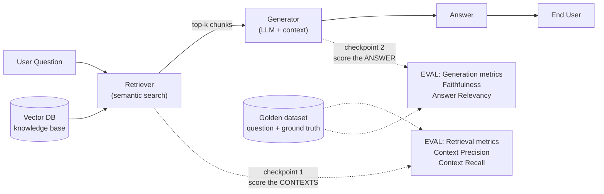
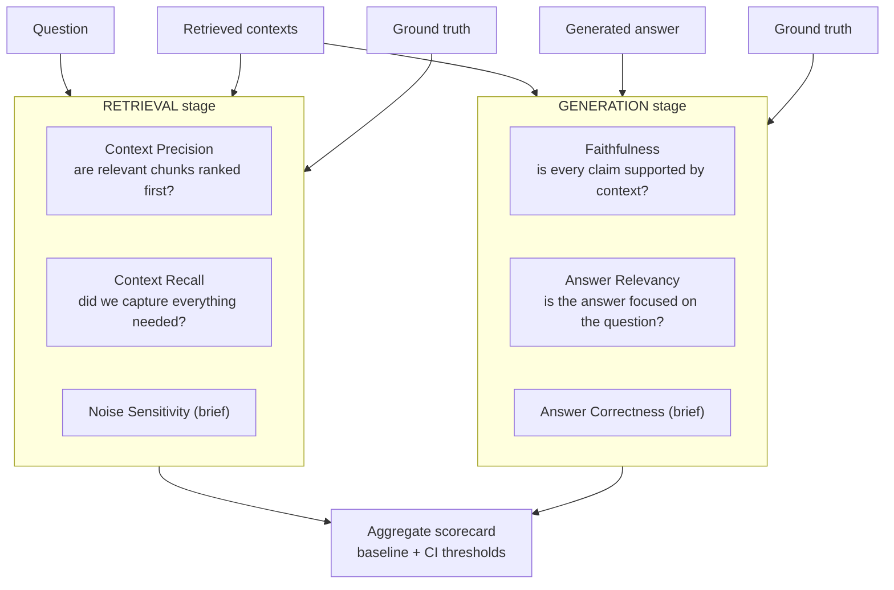
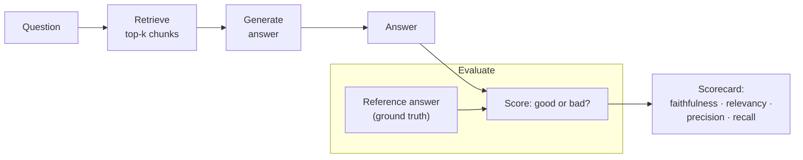
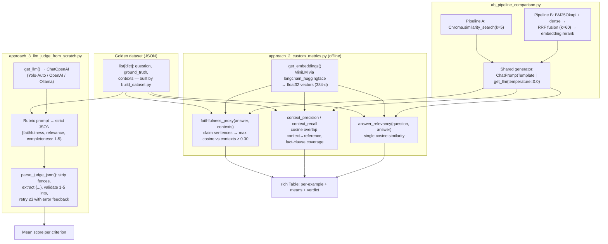

# 📖 Module 09 — Learning: Evaluating RAG with RAGAS

This is the conceptual core of the module. Read it top to bottom; the code in `03-implementation.md` maps 1:1 onto these ideas.

---

## 1. Why evaluation is THE difference between toy and production RAG

A toy RAG demo answers one question you picked because it works. A production RAG system must answer **thousands of questions you haven't seen**, across **documents that change**, on **models that get upgraded**, while **users judge every answer**.

Without evaluation you are flying blind:

- **You can't tell if a change helped or hurt.** You swap the embedding model, tweak the chunk size, or add reranking — but did quality go up or down? "It feels better" is not a metric.
- **You can't catch regressions.** A model upgrade or a prompt edit silently degrades 15% of answers. Without a baseline + threshold, you ship the regression.
- **You can't debug failures.** When an answer is wrong, *where* did it break? Bad retrieval? Bad generation? Evaluation localizes the fault.
- **You can't compare options.** Hybrid vs dense search? k=3 vs k=5? Rerank on vs off? Only numbers let you choose.
- **You can't prove ROI / safety.** Stakeholders and compliance ask "how do we know it's reliable?" A scorecard is the answer.

> **Mental model:** In ML we never ship a model without a test set and accuracy. RAG is no different — except the "test set" is a *golden Q&A dataset* and the "accuracy" is a *family of metrics* covering retrieval and generation separately.

**The single most important idea in this module:** *retrieval and generation are two different systems with two different failure modes, and they must be evaluated independently.* If you only score the final answer, you cannot tell whether the retriever failed (wrong context) or the generator failed (right context, wrong answer). That distinction is what makes RAG tunable.

---

## 2. What parts of the pipeline do we evaluate?

A RAG pipeline has two measurable stages:

1. **Retrieval** — given a question, does the retriever pull the *right* chunks, ranked *well*?
2. **Generation** — given the question + retrieved context, does the LLM produce an answer that is *faithful* to the context, *relevant* to the question, and *correct* against ground truth?

Each stage has its own metrics. The diagram below marks the two **evaluation checkpoints**: after retrieval (score the contexts) and after generation (score the answer).



**How to read this diagram:**

- The solid arrows are the **live data flow**: question → retriever → generator → answer.
- The dashed arrows are **evaluation checkpoints**, not part of serving. At *checkpoint 1* we inspect the retrieved chunks; at *checkpoint 2* we inspect the generated answer.
- Both checkpoints need the **golden dataset** (the question plus a human-written ground truth) as the reference signal. Retrieval metrics compare retrieved chunks to what *should* have been retrieved; generation metrics compare the answer to the context and/or the ground truth.
- Crucially, checkpoint 1 runs **before** the generator, so you can diagnose retrieval problems even when the final answer happens to look fine (and vice-versa).

**Why separate them?** Consider two pipelines that both produce a bad answer:

| Pipeline | Retrieved context | Answer | Diagnosis |
|----------|-------------------|--------|-----------|
| A | Wrong chunks | Confidently wrong | **Retrieval** failure (fix search/chunking/k) |
| B | Correct chunks | Ignores/contradicts them | **Generation** failure (fix prompt/model/constraints) |

Same symptom, opposite fixes. Only stage-separated evaluation tells you which row you're in.

---

## 3. RAGAS framework overview

**RAGAS** (Retrieval Augmented Generation Assessment) is an open-source, **reference-light** evaluation toolkit for RAG. Key properties:

- **LLM-as-judge:** most metrics use an LLM to make semantic judgments (is this claim supported? is this context relevant?). You plug in any LLM via a wrapper — here we use `get_llm()` from `shared.config` (Ollama or OpenAI).
- **Reference-light:** you do *not* need a gold answer for every metric. Faithfulness and Answer Relevancy work with just (question, contexts, answer). Context Precision/Recall and Answer Correctness use the ground truth when available.
- **Composable:** run one metric at a time (great for debugging) or bundle them in `ragas.evaluate()` for a full scorecard.
- **Version-sensitive API:** RAGAS has changed its public API between 0.1.x and 0.2.x. This course targets **`ragas >= 0.2`**:
  ```python
  from ragas import evaluate
  from ragas.metrics import Faithfulness, AnswerRelevancy, ContextPrecision, ContextRecall
  ```
  > ⚠️ If your imports differ, check `uv run python -c "import ragas; print(ragas.__version__)"`. Older 0.1.x used `from ragas import Metrics` and `Metrics.Faithfulness()`.

**The four core metrics we use:**

| Metric | Stage | Needs ground truth? | Question it answers |
|--------|-------|---------------------|---------------------|
| **Faithfulness** | Generation | No | Is every claim in the answer supported by the retrieved context? |
| **Answer Relevancy** | Generation | No | Is the answer focused on the question (no rambling/off-topic)? |
| **Context Precision** | Retrieval | Yes | Are the *relevant* chunks ranked near the top? |
| **Context Recall** | Retrieval | Yes | Did retrieval capture *everything* needed to answer? |

Two more you'll meet briefly: **Noise Sensitivity** (does junk context hurt the answer?) and **Answer Correctness** (how close is the answer to ground truth?).

---

## 4. Deep-dive: the four core metrics

### 4.1 Faithfulness — "Is every claim in the answer supported by the context?"

**Stage:** Generation. **Ground truth needed:** No.

**What it measures:** Whether the generated answer *stays within* what the retrieved context actually says. It penalizes **hallucination** — facts the model invented that aren't in the provided evidence.

**How it works (intuition + formula):**
1. Decompose the answer into atomic **claims** (sentences/facts).
2. For each claim, ask the judge LLM: *"Is this claim entailed by / supported by the retrieved context?"*
3. Score = fraction of claims that are supported.

$$\text{Faithfulness} = \frac{\#\ \text{claims supported by context}}{\#\ \text{total claims in the answer}} \in [0, 1]$$

- **1.0** = every claim is grounded in the context (fully faithful).
- **0.0** = nothing in the answer is supported (pure fabrication).

**Failure example (low faithfulness):**
- Context: *"The Falcon AMR has a payload of 500 kg."*
- Question: *"What is the Falcon AMR's payload?"*
- Bad answer: *"The Falcon AMR carries 500 kg and can also fly short distances to bypass obstacles."*
- The "500 kg" claim is supported, but "can fly" is **not** in the context → ~0.5 faithfulness. The model hallucinated a capability.

**When it's your friend:** It's the primary guard against hallucination and works even with no gold answer — ideal for large-scale monitoring where labeling every question is impossible.

### 4.2 Answer Relevancy — "Is the answer focused on the question?"

**Stage:** Generation. **Ground truth needed:** No. (Uses an embedding model to score similarity.)

**What it measures:** Whether the answer actually *addresses the question* — penalizing rambling, generic filler, and off-topic content. A faithful answer can still be low-relevancy if it's a wall of text that buries the point.

**How it works (intuition + formula):**
1. Use the LLM to generate **N reverse questions** that the answer could be responding to.
2. Embed the original question and each reverse question.
3. Score = average cosine similarity between the original question and the reverse questions.

$$\text{Answer Relevancy} = \frac{1}{N}\sum_{i=1}^{N} \cos\big(q,\ q_i'\big) \in [0, 1]$$

- If the answer is on-topic, the reverse questions look like the original → high similarity → high score.
- If the answer is generic/verbose, the reverse questions drift away from the original → low similarity → low score.

**Failure example (low relevancy):**
- Question: *"What is the Falcon AMR's payload?"*
- Bad answer: *"Robots are transforming many industries. Autonomous mobile robots come in many sizes and configurations, and choosing one depends on your warehouse layout, throughput goals, budget, and team expertise. In general, payload is an important spec."*
- Faithful? Maybe (nothing contradicts context). Relevant? **No** — it never says "500 kg." Reverse questions would be vague ("what factors matter when choosing a robot?"), far from the original → low relevancy.

**Note:** This metric needs an **embedding model** (we pass `get_embeddings()`), which is why `evaluate_pipeline.py` wires both an LLM *and* embeddings into RAGAS.

---

### 4.3 Context Precision — "Are the relevant chunks ranked first?"

**Stage:** Retrieval. **Ground truth needed:** Yes.

**What it measures:** The **ranking quality** of the retrieved list. It asks: of the chunks that are actually *relevant*, how many appear near the **top** of the list? A retriever that finds the right chunk but buries it at rank 5 (after 4 junk chunks) scores poorly — because the generator's context window gets polluted.

**How it works (intuition + formula):**
1. For each position k in the retrieved list, judge whether chunk k is relevant to the question (using the ground truth as signal).
2. Compute precision@k at each position, weighted by relevance, then average over the relevant positions.

$$\text{Context Precision} = \frac{1}{|\text{relevant}|}\sum_{k=1}^{K} \text{Precision@}k \cdot \mathbb{1}[\text{chunk}_k \text{ relevant}] \in [0, 1]$$

- **1.0** = all relevant chunks are at the very top, no junk above them.
- **Low** = relevant chunks exist but are pushed down by irrelevant ones.

**Failure example (low precision):**
- Question: *"What is the Falcon AMR's payload?"*
- Retrieved order: [products.csv row for a lamp, a furniture note, a general RAG paragraph, **Falcon AMR row**].
- The right chunk is present but at rank 4 behind 3 irrelevant chunks → low Context Precision. Fix: better ranking, reranking, or smaller k.

**Precision vs. recall (retrieval):** Precision = "of what I fetched, how much was useful?" Recall = "of what I needed, how much did I fetch?" You want both high.

---

### 4.4 Context Recall — "Did retrieval capture everything needed?"

**Stage:** Retrieval. **Ground truth needed:** Yes.

**What it measures:** Whether the retrieved contexts contain **all the information required** to produce the ground-truth answer. It catches the failure where the right document exists in the corpus but the retriever missed it.

**How it works (intuition + formula):**
1. Decompose the **ground truth** into atomic facts.
2. For each fact, ask the judge: *"Is this fact present in / attributable to the retrieved contexts?"*
3. Score = fraction of ground-truth facts found in the retrieved contexts.

$$\text{Context Recall} = \frac{\#\ \text{ground-truth facts found in retrieved contexts}}{\#\ \text{total ground-truth facts}} \in [0, 1]$$

- **1.0** = everything needed to answer is in the retrieved context.
- **Low** = the retriever missed key evidence (wrong doc, too-small k, bad chunking, embedding mismatch).

**Failure example (low recall):**
- Ground truth: *"Acme offers a 3-year warranty with a 4-hour response time."*
- Retrieved context: only the product specs (payload, battery) — the support-policy chunk was **not** retrieved.
- The "warranty" and "response time" facts are absent from the context → low Context Recall. Even a perfect generator can't answer correctly without the evidence. Fix: increase k, fix chunking, improve embeddings, or add hybrid search.

**The diagnostic power of pairing them:**
- **High recall, low precision** → you fetch enough but with lots of junk (ranking problem).
- **Low recall, high precision** → what you fetch is clean but incomplete (coverage/k problem).
- **Both low** → retrieval is fundamentally missing the material (chunking/embedding/query problem).

---

## 5. Other metrics (brief)

- **Noise Sensitivity** *(retrieval/generation interaction)*: How much does **irrelevant** context degrade the answer? It compares the answer given clean context vs. the answer given context + injected noise. **Lower is better.** High noise sensitivity means your generator is easily derailed by junk — a sign to tighten the prompt ("use ONLY the provided context") or improve retrieval precision.
- **Answer Correctness** *(generation)*: How close is the answer to the **ground truth**? RAGAS blends factual overlap with semantic similarity between answer and reference. **Higher is better.** Use it when you *do* have gold answers and want an end-to-end "is it right?" number. (It's stricter than Faithfulness, which only checks grounding in context, not correctness against truth.)

> Rule of thumb: **Faithfulness + Answer Relevancy** for cheap, always-on monitoring (no labels). **Context Precision/Recall + Answer Correctness** for deeper, labeled tuning sessions.

---

## 6. Building golden test datasets

A **golden dataset** is a small, high-quality set of hand-curated examples that represent the questions your system must answer well. Each example has three parts:

```json
{
  "question": "What is the Falcon AMR's payload?",
  "ground_truth": "The Falcon AMR has a payload capacity of 500 kg.",
  "contexts": ["{ \"name\": \"Falcon AMR\", \"payload_kg\": 500, ... }"]
}
```

| Field | Role | Used by |
|-------|------|---------|
| `question` | The user query (`user_input` in RAGAS) | all metrics |
| `ground_truth` | Human-written correct answer (`reference`) | Context Precision, Context Recall, Answer Correctness |
| `contexts` | The **correct source chunk(s)** a good retriever should return | documents ideal retrieval; manual retrieval-hit checks |

**How to build one well:**
1. **Start from real documents** (here, `data/samples/`). Pull actual sentences/rows so ground truths are verifiable, not invented.
2. **Write the ground truth by hand** — short, factual, and fully supported by the cited context. One or two facts per example keeps recall scoring crisp.
3. **Set `contexts` to the exact source snippet(s)** that contain the answer. This is your "retrieval target."
4. **Cover the whole corpus** — spread questions across every source file and topic so you don't over-fit to one document.
5. **Include hard cases** — multi-hop questions, near-duplicate entities (Falcon vs Heron), and questions where the answer spans two chunks.
6. **Keep it small but representative** — 8–20 examples is plenty to start; quality beats quantity. You can grow it as you see real user queries.
7. **Version it** — treat `eval_dataset.json` like code. When you add examples, re-baseline.

> In this module, `code/build_dataset.py` builds a 10-example golden set from the four sample files, deriving each `contexts` value from the *actual* file content so nothing is fabricated.

---

## 7. LLM-as-judge caveats

RAGAS leans on an LLM to make judgments. That's powerful but not free of problems. Know these before you trust a number:

1. **Bias / self-preference:** A judge LLM tends to rate its *own* outputs (or outputs from the same model family) higher. If your generator and judge are both `llama3.1`, faithfulness may be inflated. **Mitigation:** use a *different*, stronger model as judge than as generator (e.g., generate locally, judge with OpenAI).
2. **Verbosity bias:** Judges often prefer longer, more detailed answers even when brevity is better. This can inflate Answer Relevancy for rambling answers. **Mitigation:** keep prompts tight; sanity-check against human spot-audits.
3. **Non-determinism:** Even at temperature 0, LLM judges can flip a borderline claim between runs, so scores jitter by a few points. **Mitigation:** average over runs, use thresholds with a margin (don't fail CI on a 0.005 drop), and keep the golden set stable.
4. **Cost & latency:** Every metric = one or more LLM calls per example. A full run is expensive and slow on local models. **Mitigation:** cap examples (`EVAL_LIMIT`), cache results, run full evals on a schedule rather than every commit, and use a fast judge for CI smoke tests.
5. **Prompt sensitivity:** Small changes to RAGAS's internal judge prompts (across versions) shift scores. **Mitigation:** pin the RAGAS version; re-baseline when you upgrade.
6. **Judge can be wrong:** An LLM can misjudge entailment (e.g., think a paraphrase is unsupported). **Mitigation:** periodically audit a sample of low-scoring cases by hand to confirm the metric is failing for the right reason.

> **Golden rule:** the evaluator is itself a component that needs testing. Spot-check its verdicts against your own judgment before you build dashboards on top of them.

---

## 8. Setting baselines and regression thresholds in CI

A metric is only useful if you act on it. The workflow:

1. **Establish a baseline.** Run `ragas.evaluate()` on your golden set with a known-good pipeline. Record the mean of each metric. This is your "current truth."
2. **Set thresholds with a margin.** Don't fail on noise. Example policy:
   - Faithfulness ≥ **0.80** (hard floor — hallucination is unacceptable)
   - Answer Relevancy ≥ **0.60**
   - Context Precision ≥ **0.50**
   - Context Recall ≥ **0.70**
   - **Regression rule:** fail the build if any metric drops by more than **0.05** from baseline *or* falls below its floor.
3. **Run in CI.** On every PR that touches retrieval, prompts, chunking, or models: build the dataset → run eval → compare to stored baseline → pass/fail. Keep a fast smoke subset (e.g., 3 examples) for every commit and the full set nightly.
4. **Store & trend the baseline.** Persist scores (JSON/DB) so you can plot trends over time and catch slow drift, not just cliff regressions.
5. **Gate model/prompt changes** behind an eval improvement or at least no-regression.

```text
CI pipeline (conceptual)
  ┌────────────┐   ┌─────────────────┐   ┌──────────────────┐   ┌──────────────┐
  │ build      │ → │ run ragas.eval  │ → │ compare vs       │ → │ PASS / FAIL  │
  │ dataset    │   │ (golden set)    │   │ baseline+floors  │   │ (+ trend log)│
  └────────────┘   └─────────────────┘   └──────────────────┘   └──────────────┘
```

> Start simple: one JSON file of baseline means + a script that exits non-zero on regression. You can graduate to dashboards later.

---

## 9. Metric → pipeline-stage map (cheat sheet)

This flowchart is your debugging compass: pick the stage that's failing, then look only at that stage's metrics.



**How to read this diagram:**

- Inputs feed each stage: the **question**, **retrieved contexts**, and **ground truth** go into the *retrieval* metrics; the **retrieved contexts** and **generated answer** (plus ground truth) go into the *generation* metrics.
- The two subgraphs are the two stages from §2. A low score in the **RETRIEVAL** box points you at search/chunking/k/reranking; a low score in the **GENERATION** box points you at the prompt/model/constraints.
- Both boxes roll up into one **scorecard** that you baseline and gate in CI (§8).

**Debugging decision tree (from the scorecard):**

1. **Context Recall low?** → Retrieval is missing evidence. Increase k, fix chunking, improve embeddings, add hybrid/BM25.
2. **Context Precision low (recall OK)?** → Ranking problem. Add a reranker, tune k, filter metadata.
3. **Faithfulness low?** → Generator hallucinating. Tighten prompt ("use ONLY context"), lower temperature, stronger model.
4. **Answer Relevancy low?** → Answer off-topic/verbose. Sharpen the prompt, cap length, force direct answers.
5. **All good but users unhappy?** → Your golden set may not cover their real questions. Expand it.

---

## Key takeaways

- **Evaluate retrieval and generation separately** — same symptom, different fixes.
- **Four core metrics:** Faithfulness (grounded?), Answer Relevancy (focused?), Context Precision (ranked well?), Context Recall (complete?).
- **Golden datasets** are small, hand-written, corpus-derived, and versioned like code.
- **LLM judges have biases** (self-preference, verbosity, non-determinism) — use a different judge than generator, and spot-audit.
- **Baseline + threshold + CI** turns metrics into decisions.

Next: `03-implementation.md` walks through building all of this, step by step.


---

## 📊 Diagrams: Noob → Expert

### 1. Noob level — what evaluation is, in one picture



*Next level adds:* the actual libraries, data types, and where each metric plugs into the pipeline.

### 2. Practitioner level — components, libraries, data types



*Next level adds:* failure modes, retry loops, and the knobs you tune when scores misbehave.

### 3. Expert level — failure modes, retries, and tuning knobs

```mermaid
sequenceDiagram
    participant CLI as main()
    participant EMB as Embeddings (local MiniLM)
    participant RET as Retriever A/B
    participant LLM as Generator/Judge (cloud)
    participant MET as Custom metrics

    CLI->>EMB: get_embeddings() + warmup embed_query
    alt model load fails (no cache / no net)
        CLI-->>CLI: print actionable hint, exit 0 (never crash)
    end
    CLI->>RET: retrieve(question)
    Note over RET: A: dense top-k only<br/>B: BM25Okapi + dense → RRF(1/(60+rank)) → rerank by cosine
    CLI->>LLM: generate(q, contexts)
    alt network/API error
        CLI-->>CLI: skip that pipeline row, continue others
    end
    LLM-->>CLI: answer string
    CLI->>MET: score_example(q, answer, ctxs, reference)
    Note over MET: Knobs: CLAIM_SUPPORT_THRESHOLD=0.30,<br/>FACT_COVERAGE_THRESHOLD=0.30, TOP_K=5,<br/>HYBRID_K=10, RRF_K=60
    opt LLM judge path (approach_3)
        CLI->>LLM: rubric prompt (strict JSON)
        loop up to 3 attempts on malformed JSON
            LLM-->>CLI: raw text
            Note over CLI: strip ```fences```, slice outermost {...},<br/>validate keys are ints in 1..5; feed parse error back
        end
    end
    MET-->>CLI: 4 metric floats per example
    Note over CLI: Edge cases: empty contexts → 0.0 (no div-by-zero);<br/>short facts ("India") under-scored by cosine proxies;<br/>5-question runs are smoke tests, not statistics
```

*What each level adds:* Noob = the idea; Practitioner = the real code surface (`EmbedCache`, `BM25Okapi`, `parse_judge_json`, thresholds); Expert = where it breaks (malformed judge JSON, missing model cache, tiny eval sets) and which knob fixes it.
