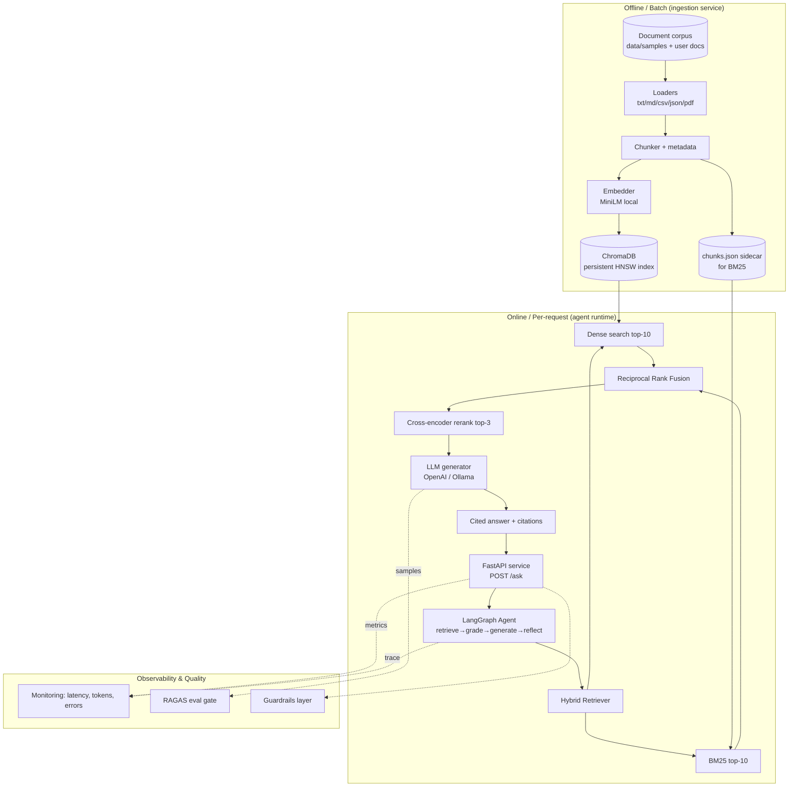
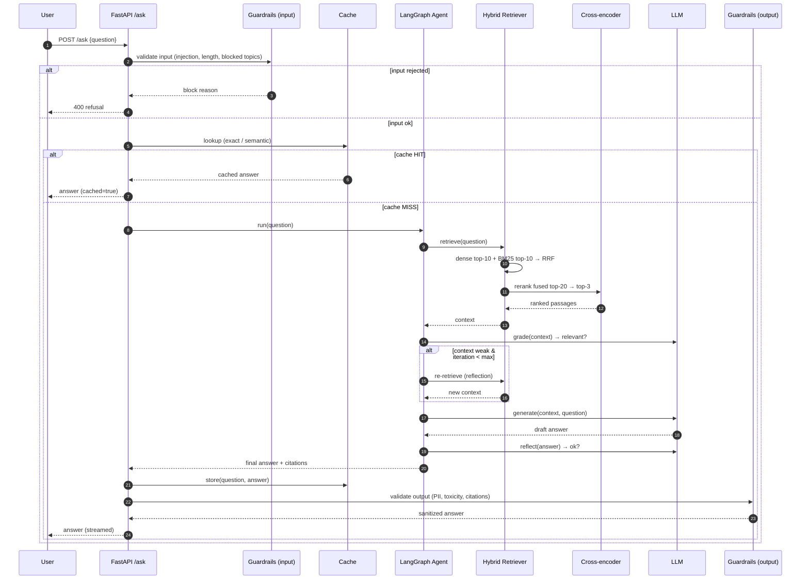
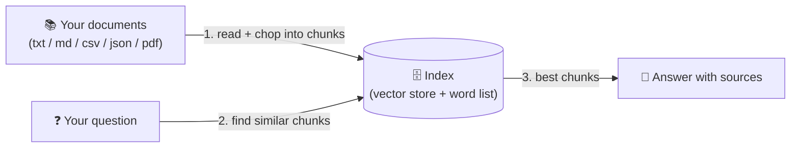
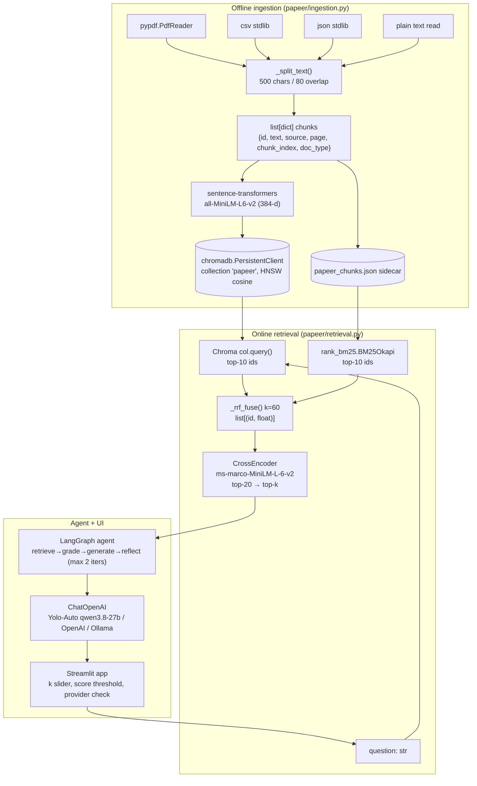
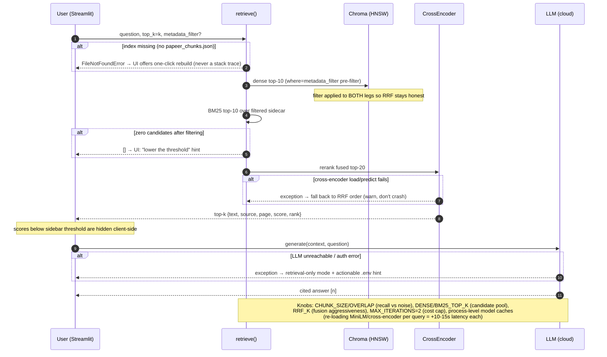

# 📖 Module 10 — Learning: Production RAG System Design

This module turns the *parts* you've learned into a *system*. The mental shift: a demo is a
sequence of function calls; a **production system** is a set of services with clear
boundaries, an index lifecycle, an agent runtime, an API surface, and observability.

---

## 1. End-to-End Papeer Architecture

Papeer has five logical layers. Ingestion runs **offline** (a batch job); everything else is
**online** (per request). Keeping ingestion out of the request path is the single most
important production decision — you never want a user waiting for documents to be embedded.



### Explanation
- **Ingestion service (offline):** loads every supported format, chunks with metadata
  (`source`, `page`, `chunk_index`), embeds, and persists to Chroma. It also writes a JSON
  sidecar so BM25 can run without re-reading raw files. This is a *batch* concern — in real
  systems it's a worker/queue that watches a document store and rebuilds indexes on change.
- **Hybrid index:** two complementary views of the same corpus — a dense vector index
  (semantic) and a sparse BM25 index (lexical). Hybrid consistently beats either alone because
  dense misses exact terms (part numbers, acronyms) while BM25 misses paraphrases.
- **Agent runtime:** LangGraph gives explicit, inspectable control flow. The agent can *grade*
  retrieved context and *reflect* on its answer, re-retrieving up to once when quality is low.
- **API layer:** FastAPI exposes `POST /ask`. It's streaming-ready so you can later emit tokens
  as they arrive instead of blocking until the full answer exists.
- **Monitoring / eval / guardrails:** cross-cutting concerns that make it *production*, not a
  demo. Metrics flow to monitoring; sampled answers feed the RAGAS eval gate; guardrails sit at
  the API boundary (detailed in Module 11).

---

## 2. Request Lifecycle (Sequence Diagram)

This is what happens for a single user query, including the guardrail and cache hooks that a
production system adds around the core RAG path.



### Explanation
1. **Input guardrails first.** Before spending any compute, reject prompt-injection attempts,
   over-long inputs, and off-topic queries. Cheap failures should fail fast.
2. **Cache check.** An exact-match or semantic cache can short-circuit the entire pipeline —
   the biggest latency/cost win available (Module 11).
3. **Agent loop.** On a miss, the agent retrieves, *grades* the context, and only generates if
   it's relevant; otherwise it reflects and re-retrieves (bounded to avoid runaway loops).
4. **Hybrid retrieve + rerank.** Dense + sparse are fused by RRF, then a cross-encoder scores
   the small fused set precisely. Reranking is where most retrieval-quality gains come from.
5. **Output guardrails.** Sanitize PII, check toxicity, verify citations exist before returning.
6. **Respond (streamed).** Tokens stream back; the answer is also written to cache for next time.

---

## 3. Multi-Document Ingestion Strategy

Industry practice treats ingestion as a **pipeline with idempotency**, not a one-off script:

- **Format-aware loaders.** Each file type has its own loader (PDF→`PyPDFLoader`, CSV→
  `CSVLoader`, JSON→`JSONLoader`, MD/TXT→`TextLoader`). Normalizing to LangChain `Document`s
  early means the rest of the pipeline is format-agnostic.
- **Metadata is your friend.** Every chunk carries `source` (filename), `page` (if applicable),
  `chunk_index`, and `doc_type`. Metadata powers citations, filtering, and later RBAC.
- **Chunking trade-off.** Smaller chunks = precise retrieval but less context; larger = more
  context but noisier matches. We use ~500 chars with ~80 overlap as a sane default and keep
  the strategy swappable.
- **Idempotent upserts.** Re-running ingestion must not duplicate vectors. We key each chunk by
  a stable hash of `(source, chunk_index)` so re-ingestion overwrites rather than appends.
- **Sidecar for sparse search.** Chroma stores embeddings; BM25 needs raw text. Writing a JSON
  sidecar keeps the two indexes in sync from a single source of truth.

---

## 4. Hybrid Retrieval + Cross-Encoder Reranking (the rationale)

**Why hybrid?** Dense retrieval captures *meaning*; BM25 captures *exact terms*. Research
corpora are full of exact tokens (model names, error codes, product SKUs) that dense models
blur. Fusing both is the standard production pattern.

**Why Reciprocal Rank Fusion?** RRF combines ranked lists without needing to normalize scores
across two different scales (cosine similarity vs. BM25 score). It's simple, robust, and the
default in most hybrid stacks:

```
RRF_score(d) = Σ  1 / (k + rank_i(d))     k = 60
```

**Why a cross-encoder reranker?** Bi-encoders (embeddings) score query and passage *independently*
— fast but imprecise. A cross-encoder scores the *pair* jointly — slower but far more accurate.
The trick: only run it on the small fused candidate set (top-20 → top-3). That's the classic
**two-stage retrieve-then-rerank** architecture used in Elasticsearch, Vespa, Qdrant, etc.

| Stage | Model | Set size | Cost | Purpose |
|-------|-------|----------|------|---------|
| Recall | bi-encoder (dense) + BM25 | whole corpus | cheap | cast a wide net |
| Precision | cross-encoder | top-20 → top-3 | moderate | pick the truly best |

---

## 5. Agentic Workflow Choice

We chose a **bounded reflection loop** over a free-form ReAct agent because research-assistant
answers benefit from *self-checking* more than from arbitrary tool use:

- **retrieve** — get hybrid context.
- **grade** — ask the LLM: "does this context actually answer the question?" (relevant / not).
- **generate** — produce a grounded, cited answer.
- **reflect** — ask the LLM: "is this answer complete and faithful?" If not, and we haven't hit
  the iteration cap, loop back to retrieve.

Bounding to **max 2 iterations** prevents cost/latency blowups and infinite loops — a hard
requirement in production. Each node records its wall-clock time so the CLI can show where time
goes (feeding directly into Module 11's latency budget).

---

## 6. Evaluation-in-the-Loop

Evaluation is not a one-time test; it's a **gate** in the loop:

- A small **golden set** (question, ground-truth answer, expected source) ships with the code.
- `evaluate.py` runs RAGAS metrics: **faithfulness** (answer supported by context), **answer
  relevancy**, **context precision/recall**.
- In CI or before a model/index change, you run the eval and *block* if faithfulness drops below
  threshold. This is how teams catch regressions from a new embedding model or a bad chunk size.

---

## 7. Deployment Options

| Option | When | Trade-offs |
|--------|------|-----------|
| **FastAPI + Docker** (our default) | Most teams | Full control, easy streaming, stateless workers; you manage scaling |
| **Serverless** (Lambda/Cloud Run) | Spiky, low baseline traffic | Cold starts hurt p95; Chroma must be external (Qdrant/pgvector); per-request billing |
| **On-prem / bare metal** | Data residency, air-gapped | You own ops; pairs well with local Ollama + local embeddings (zero egress) |

Key production notes:
- Make the **index external** (Qdrant/pgvector) so API workers stay stateless and horizontally
  scalable. Chroma's persistent client is fine for a single node / dev.
- Keep **ingestion decoupled** (queue/worker) so index rebuilds never block requests.
- Pin model versions; a silent embedding-model upgrade silently invalidates your index.

---

## 8. Observability Stack

- **Tracing:** wrap each stage (retrieve/rerank/generate) with timing + token counts. LangSmith
  (optional) gives a visual trace tree per request.
- **Metrics:** latency (p50/p95), token usage & cost, cache hit rate, retrieval hit rate, error
  rate, feedback scores (👍/👎). Alert on p95 latency and error-rate thresholds.
- **Logging:** structured logs with a request ID correlating all stages of one query.
- **Eval sampling:** periodically route a sample of live Q&A through RAGAS to catch drift.

(All of this is implemented concretely in Module 11.)

---

## 📊 Diagrams: Noob → Expert

### Level 1 — Noob: the core idea in one picture



*Next level adds: the real libraries and data types that make each box work.*

### Level 2 — Practitioner: components, libraries, data types



*Next level adds: what happens when things break — fallbacks, caps, and the knobs you tune.*

### Level 3 — Expert: failure modes, edge cases, performance knobs



*This is the operational view: every arrow has a defined behavior when its target fails, and every magic number is a named knob in `papeer/config.py`.*
