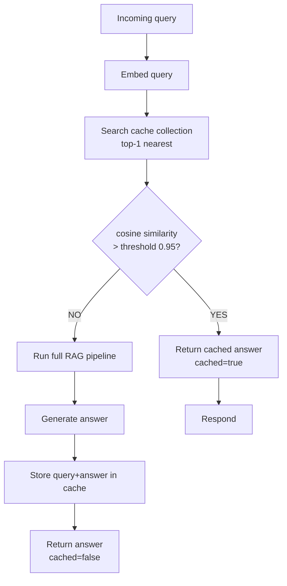
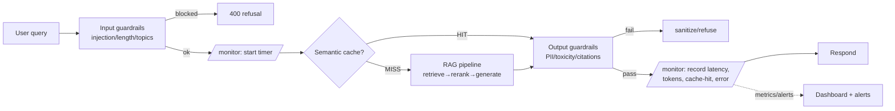
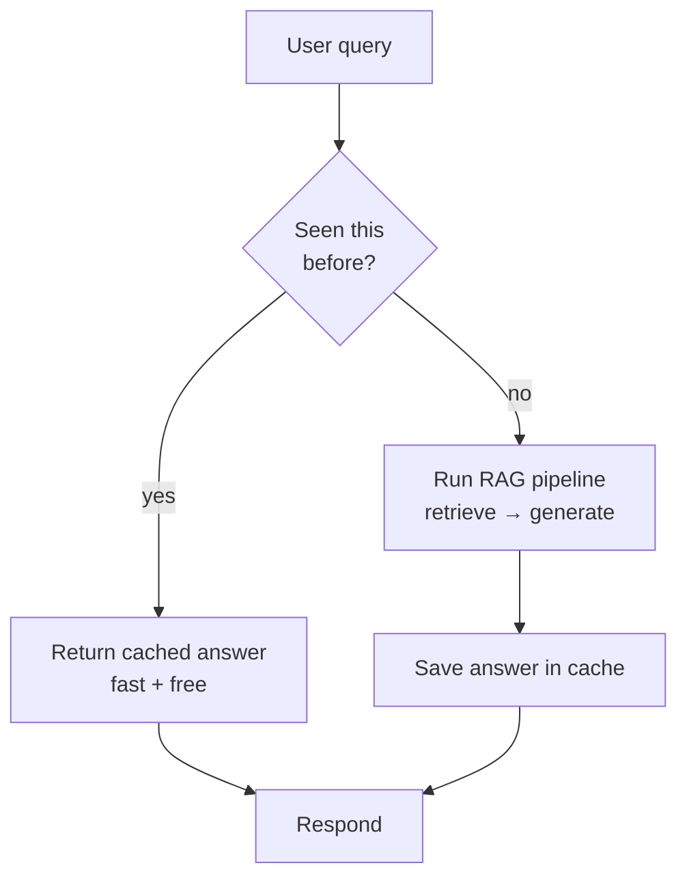
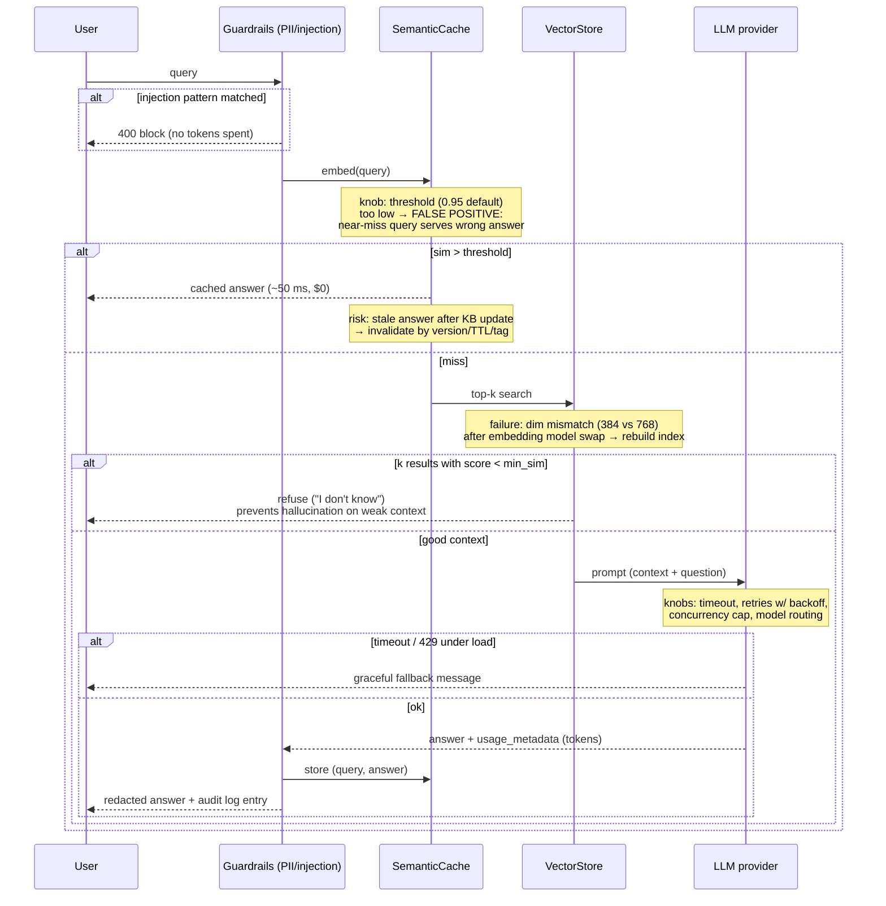

# 📖 Module 11 — Learning: Production RAG

A RAG demo answers questions. A **production** RAG system is fast, cheap, observable, and safe
under real traffic and adversarial input. This module covers the four pillars: **optimization,
caching, monitoring, security.**

---

## 1. Pipeline Optimization — where the time goes

The single most important production insight: **the LLM dominates latency.** Retrieval and
reranking are fast (tens to ~100 ms); generation is seconds. So optimization effort should be
weighted accordingly.

### Latency budget breakdown (typical, local models)

| Stage | Typical cost | % of total | Optimization lever |
|-------|-------------|-----------|--------------------|
| Embed query | ~50 ms | ~2% | batch / cache embeddings |
| Retrieve (dense + BM25) | ~20 ms | ~1% | tune `n_results`, index params |
| Rerank (cross-encoder) | ~100 ms | ~4% | cap candidate set (top-20→3) |
| **LLM generate** | **1–3 s** | **~90%+** | smaller model, streaming, caching |

**Takeaways:**
- **Stream tokens.** Perceived latency drops dramatically when the first token arrives in ~300 ms
  instead of waiting for the full answer.
- **Cap the rerank set.** Reranking top-20→top-3 keeps the cross-encoder cheap.
- **Cache aggressively.** The cheapest "generation" is no generation at all (see §2).
- **Route by difficulty.** Easy queries → small/fast model; hard ones → big model (§3).

---

## 2. Caching Strategies

Caching is the highest-leverage cost/latency win in production RAG.

### (a) Exact-match cache
Hash the normalized query; if seen before, return the stored answer. Cheap, but only helps with
*identical* repeats.

### (b) Semantic cache (the interesting one)
Embed the query, search a small Chroma "cache" collection for a near-duplicate, and if cosine
similarity exceeds a threshold (e.g. **0.95**), return the cached answer. This catches *paraphrases*
— the common case in real traffic ("What's the capital of France?" vs "What city is France's capital?").



### Explanation
- **Embed → search → threshold.** We store each past `(query, answer)` pair as a vector. A new
  query is embedded and compared; a near-duplicate short-circuits the whole pipeline.
- **Threshold tuning.** Too low → wrong answers served for different questions. Too high → few
  hits. 0.95 is a conservative default; tune on your traffic.
- **Hit-rate expectations.** Real systems see **20–60%** semantic hit rates depending on how
  repetitive the workload is (FAQ-style workloads are high; open research is lower).

### Cache invalidation
A cache is only as good as its freshness. When the knowledge base updates, stale cached answers
become wrong. Strategies:
- **Versioned collections:** bump a KB version; invalidate/rebuild the cache collection on update.
- **TTL:** expire entries after N minutes/hours.
- **Tag-based invalidation:** tag cache entries by source doc; drop entries whose source changed.

---

## 3. Cost Optimization

LLM calls are the main cost driver. Levers, roughly in order of impact:

| Lever | How it works | Typical saving |
|-------|--------------|----------------|
| **Caching** | Serve repeats without an LLM call | up to 50%+ on repetitive traffic |
| **Model routing / classifier** | A cheap classifier routes easy queries to a small model, hard ones to a large one | 30–70% |
| **Prompt compression** | Trim context, dedupe passages, compress instructions | 10–30% tokens |
| **Batch processing** | Batch non-interactive jobs (evals, backfills) for cheaper per-token pricing | varies |
| **Smaller models for easy queries** | Use a 7B/8B model when the task is simple | large |

**Model routing in practice:** run a tiny classifier (or even heuristics) that scores query
difficulty; route to `gpt-4o-mini`/`llama3.1` for easy, `gpt-4o`/larger for hard. This is the
biggest structural cost win after caching.

---

## 4. Monitoring & Debugging

You can't fix what you can't see. Production RAG needs tracing + metrics + alerting.

### Tracing
Use **LangSmith** (or OpenTelemetry) to get a per-request trace tree: every stage (embed,
retrieve, rerank, generate) with inputs, outputs, latency, and token counts. This is how you
debug "why did this answer come out wrong?" — you inspect exactly which passages were retrieved.

### Metrics that matter
| Metric | Why | Alert threshold (example) |
|--------|-----|---------------------------|
| **Latency** (p50/p95) | user experience | p95 > 8 s |
| **Token cost** (per req + daily $) | budget | daily $ > budget |
| **Retrieval hit rate** | did we find relevant context? | < 70% |
| **Cache hit rate** | cost efficiency | trending down |
| **Error rate** | reliability | > 1% |
| **Feedback scores** (👍/👎) | real quality signal | 👎 rate > 15% |

### Alerting
Alert on **p95 latency**, **error rate**, and **feedback score** — the three that correlate most
with user pain. Log every request with a request ID so all stages of one query are correlatable.

(Implemented concretely in `code/monitoring.py`.)

---

## 5. Common Pitfalls & Solutions

| Pitfall | Symptom | Fix |
|---------|---------|-----|
| **Bad chunking** (too big/small) | retrieval finds the doc but not the fact | tune size/overlap; try parent-document retrieval |
| **Wrong embedding model** | poor semantic recall | pick a domain-fit model; re-index on change |
| **No reranking** | relevant passage ranked #7, LLM misses it | add cross-encoder rerank (top-20→3) |
| **Over-trusting LLM grading** | agent "grades" bad context as good | use rubric prompts + eval gate, not just self-grade |
| **Stale index** | answers reflect old data | version + rebuild index & cache on KB update |
| **Prompt injection** | attacker makes model ignore its rules | input guardrails + output validation + system-prompt hardening |
| **Leaking PII** | answer contains emails/phones | output PII redaction before returning |
| **No evaluation** | regressions ship silently | RAGAS eval gate in CI |

---

## 6. Security & Compliance

Production RAG faces adversarial input and regulatory constraints.

### Prompt-injection defenses
- **Input guardrails:** detect injection patterns ("ignore previous instructions", "you are now…",
  role-hijack phrases) and block or sanitize.
- **System-prompt hardening:** clearly separate untrusted retrieved content from instructions;
  instruct the model to treat retrieved text as *data*, not commands.
- **Output validation:** verify the answer didn't leak system prompt or obey injected commands.

### PII redaction
Regex-based redaction of emails, phone numbers, and other PII patterns **before** returning an
answer (and ideally before logging). See `code/guardrails.py`.

### Access control / metadata-based RBAC
Store `owner`/`tenant`/`classification` in chunk metadata and **filter retrieval** so a user only
sees documents they're allowed to read. This is metadata pre-filtering in the vector DB.

### Audit logging
Log who asked what, which docs were retrieved, and what was returned — with a request ID. This
is essential for compliance investigations and debugging.

### GDPR basics
- **Right to erasure:** be able to delete a person's data from the index (delete by metadata).
- **Data minimization:** don't store more personal data than needed.
- **Consent & purpose:** know why you're processing the data.
- **Portability:** be able to export a user's data.

---

## 7. Production Request Flow (cache + guardrails + monitoring)

This is the full hardened request path — guardrails at both ends, cache in the middle, and
monitoring hooks wrapping every stage.



### Explanation
- **Guardrails bookend the pipeline.** Input checks reject attacks *before* spending compute;
  output checks sanitize the result *before* it reaches the user. Failing fast is cheap.
- **Cache sits between input validation and the pipeline.** Only validated, non-cached queries
  reach the expensive RAG path.
- **Monitoring wraps everything.** Every request records latency, token usage, cache-hit status,
  and errors, feeding dashboards and alerts. A request ID ties all stages together for debugging.

---

## 📊 Diagrams: Noob → Expert

### 1. Noob level — the core idea



*Next level adds: the real components — which cache (hash vs embedding), which store, and where cost is measured.*

### 2. Practitioner level — components & data types

```mermaid
flowchart LR
    subgraph Cache layer
        E[ExactCache<br/>dict[str→str]<br/>SHA-256 of normalized query]
        S[SemanticCache<br/>list of float32 vectors<br/>cosine sim &gt; 0.95 threshold]
    end
    subgraph Pipeline
        RET[Retriever<br/>top-k passages: list[str]]
        LLM[LLM via get_llm()<br/>ChatOpenAI / ChatOllama]
    end
    U[Query: str] --> N[normalize() → str]
    N --> E
    N -->|embed_query → list[float]| S
    E -- miss --> S
    S -- miss --> RET --> LLM
    LLM --> M[PipelineMetrics<br/>RequestRecord: stage latencies,<br/>tokens, cache_hit, error]
    LLM --> W[write back to both caches]
    M --> D[rich tables / dashboard]
```

*Next level adds: failure modes and the tuning knobs that decide whether a cache hit helps or hurts.*

### 3. Expert level — edge cases, failure modes, performance knobs



*This is the deepest level: every failure mode (false positives, stale cache, dim mismatch, timeouts) and its tuning knob from the module's playbook.*
