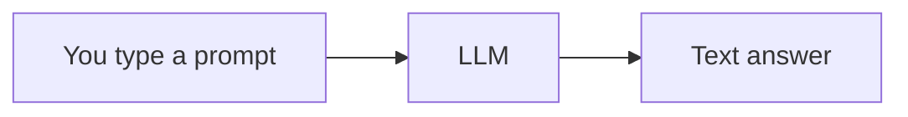
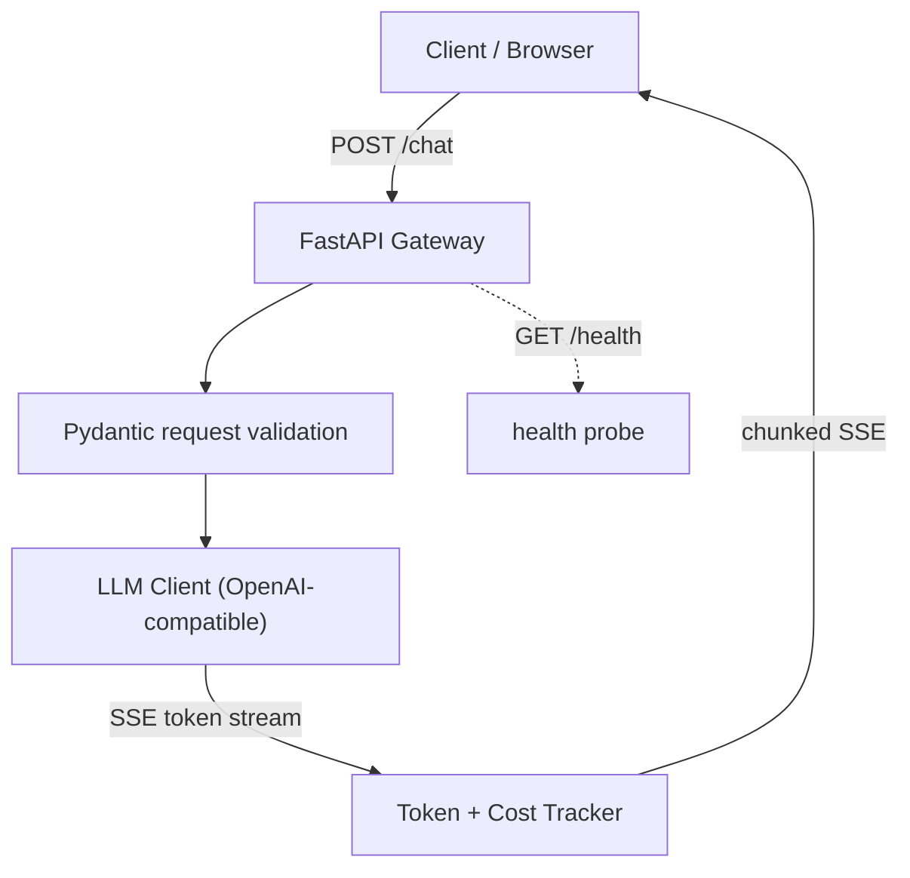
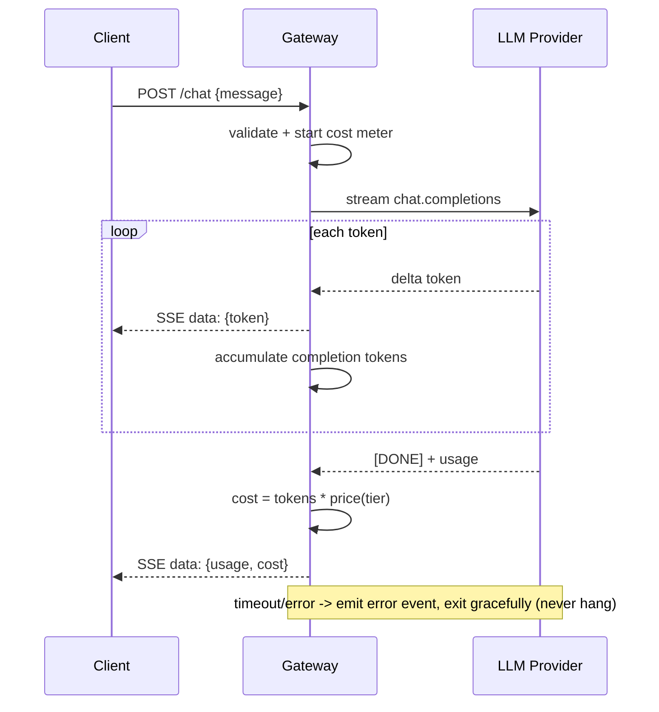
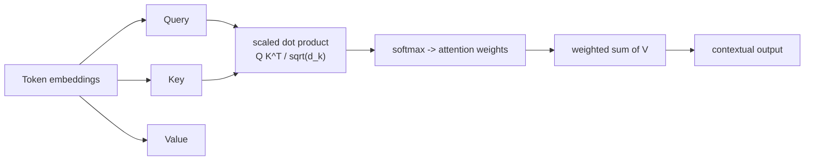
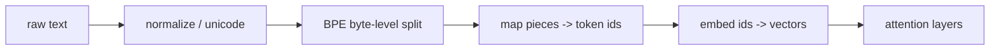
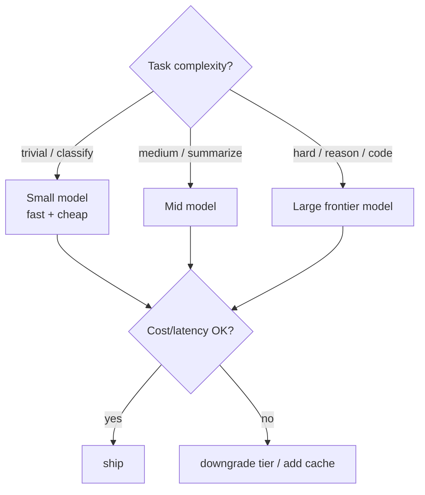

# 📖 Week 1 Learning — Python for AI & LLM Fundamentals

> Read top-to-bottom. Each section ends with a **"why it matters"** line. The
> **Diagrams: Noob → Expert** section builds mental models from trivial to production-grade.

---

## 1. Python Fundamentals for AI

You already know how to code. Here are the specific idioms that dominate AI/ML codebases.

### Functions & first-class behavior
LLM pipelines are built by composing small functions (load → chunk → embed → retrieve → generate).
Keep each stage a pure, testable function.

### Classes & objects
An `Agent`, a `Retriever`, a `CostTracker` are all stateful objects. Prefer explicit
`__init__` + typed attributes over global state.

### Dataclasses
Cheap, typed, immutable-by-convention records — perfect for things like a `Usage` (prompt tokens,
completion tokens, cost) that you pass around a pipeline.

### Type hints
AI libraries (Pydantic, FastAPI) lean on type hints for validation and docs. Use them.

**Why it matters:** every later week's code is a graph of these small pieces. Clean primitives = debuggable agents.

---

## 2. Async Python, APIs & Streaming Responses

### Why async?
An LLM call takes **seconds**. If your backend blocks on it, one slow user freezes everyone else.
`async/await` lets the event loop serve other requests while waiting on the network.

### Generators & streaming
Tokens arrive one-by-one from the provider. A generator (`yield`) lets you forward each token to
the client the instant it lands — that's the "typing effect" users see.

### Server-Sent Events (SSE)
The standard way to stream text over HTTP: the server sends a sequence of
`data: <chunk>

` events over one long-lived connection. Simpler than WebSockets for
one-way text streams.

### Non-blocking rule
Never do blocking I/O (sync `requests`, file reads, DB calls) inside an `async def` handler —
use async clients (`httpx.AsyncClient`) or offload to a thread pool.

**Why it matters:** a chat backend that blocks is a backend that can't scale. This is the #1 reason real LLM services feel sluggish.

---

## 3. Transformer Internals: Tokenization, Vectorization, Attention

### Tokenization
Text → integer **token ids** via a learned vocabulary (BPE/byte-level BPE). Tokens are sub-word
pieces ("unbelievable" → "un", "believ", "able"). You pay for tokens, so token count ≈ cost.

### Vectorization (embeddings)
Each token id maps to a dense **vector** (e.g., 384-dim for MiniLM). Meaning lives in geometry:
similar meanings sit close together. Cosine similarity compares them.

### Attention (the heart of a transformer)
Every token looks at every other token to decide what to focus on.
- **Q**uery, **K**ey, **V**alue are three projections of the input.
- Score = softmax(Q·Kᵀ / √d_k) → weights.
- Output = weights · V.
The √d_k scaling prevents scores from exploding (which would kill the softmax gradient).

**Why it matters:** understanding tokens→vectors→attention explains *why* RAG works (retrieve by vector similarity) and *why* long contexts cost more.

---

## 4. End-to-End LLM Lifecycle & Model Tiering

### Lifecycle
`prompt → tokenize → embed → N attention/FFN layers → logits → sample tokens → detokenize → text`.
Each generated token is conditioned on all previous ones (autoregressive decoding).

### Model Tiering
Not every task needs the biggest model. Tier by task difficulty:
- **Small/fast/cheap** — classification, extraction, routing.
- **Mid** — summarization, standard Q&A.
- **Large/frontier** — hard reasoning, complex code, agentic planning.

Pick the **smallest tier that clears your quality bar**, then optimize cost/latency (caching, batching).

**Why it matters:** unit economics (Week 5) and fine-tune-vs-RAG decisions (Week 7) both hinge on tiering discipline.

---

## 🧠 Diagrams: Noob → Expert

### Level 1 — Noob: "what is an LLM call?"

One box in, one box out. That's the whole idea before we add any engineering.

### Level 2 — Practitioner: The AI Gateway components

Now you see the moving parts: validate → call provider → account for tokens/cost → stream back.

### Level 3 — Expert: streaming request sequence (with failure modes)

The expert view adds the accounting loop and the **failure path** — a production gateway must
degrade, not hang, when the provider misbehaves.

### Level 4 — Attention mechanism (Q/K/V)

### Level 5 — Tokenization pipeline

### Level 6 — Model tiering decision

---

## Key Terms (ubiquitous language)
| Term | Meaning |
|------|---------|
| Token | Sub-word unit the model reads/writes; the billing unit |
| Embedding | Dense vector representing a token/passage |
| Attention | Mechanism letting each token weigh every other token |
| SSE | Server-Sent Events — one-way HTTP text streaming |
| TTFT | Time To First Token — perceived responsiveness |
| Model tier | Size/cost class of model chosen per task |
| Unit economics | Cost + latency per request (deepened in Week 5) |
