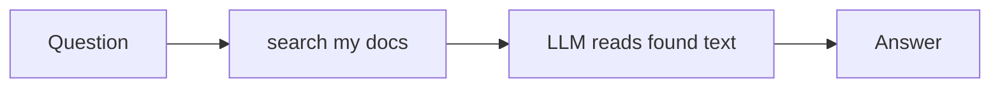
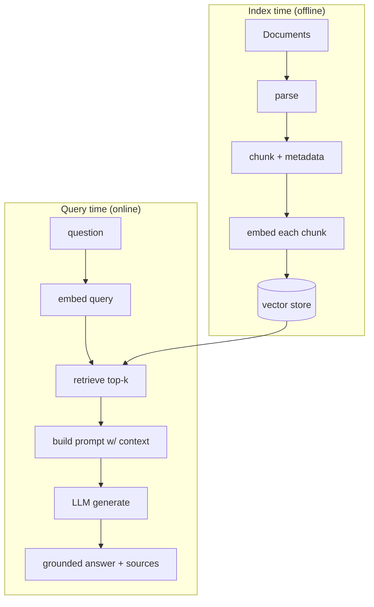
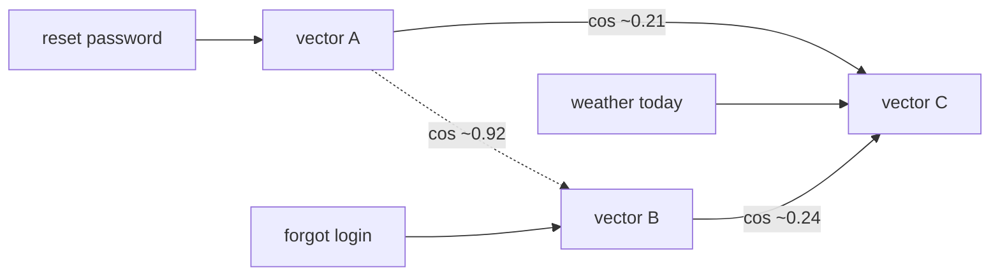
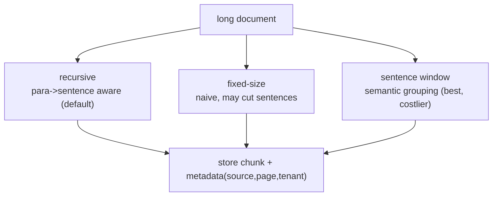
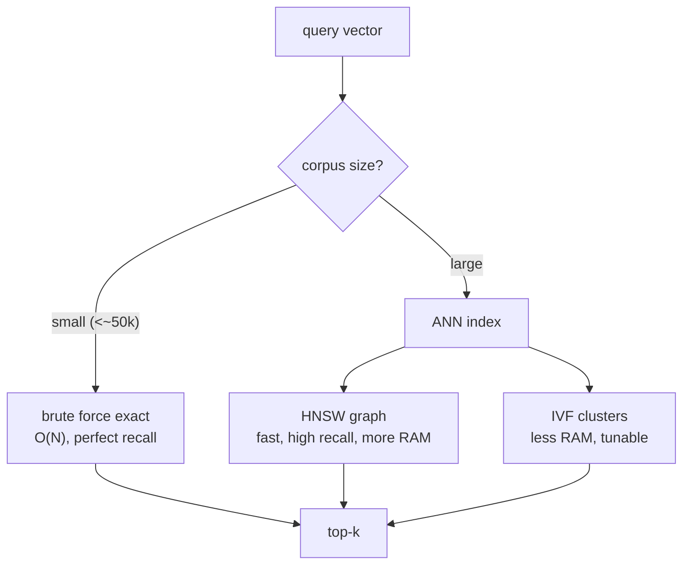
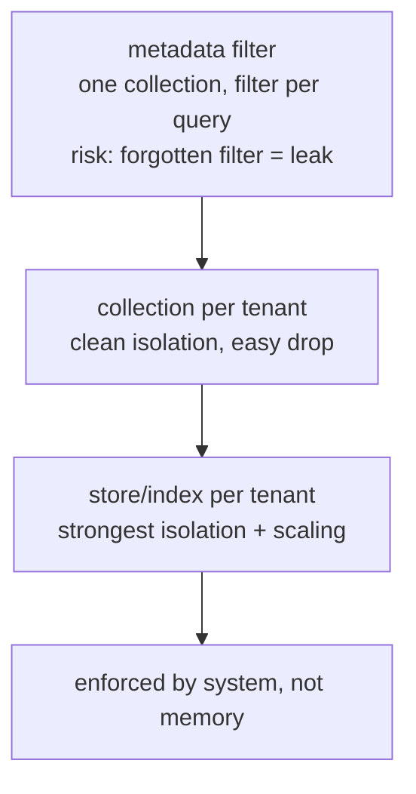

# 📖 Week 2 Learning — RAG Foundations

> Read top-to-bottom. Each section ends with a **"why it matters"** line. The **Diagrams: Noob → Expert** section builds mental models from trivial to production-grade.

---

## 1. Why RAG?

A raw LLM answers from its training weights only. That gives you three failure modes:
- **Hallucination** — confident answers with no factual basis.
- **Stale knowledge** — weights freeze at training cutoff; your data changes daily.
- **No private data** — your company's docs were never in the training set.

RAG (Retrieval-Augmented Generation) fixes all three: at query time, **retrieve** relevant passages from *your* data, **inject** them into the prompt, and let the LLM **generate** an answer grounded in that evidence. The model becomes a reader over your corpus, not a memorizer.

**Why it matters:** RAG is the #1 way enterprises make LLMs trustworthy. Every later week (hybrid search, agents, evals) builds on this loop.

---

## 2. Embeddings & Vector Geometry

An **embedding** maps text to a dense vector (e.g., 384 floats for MiniLM). Meaning becomes geometry: similar texts land near each other in the vector space.

- **Similarity = cosine.** `cos(a,b) = (a·b) / (|a||b|)` — 1 = identical direction, 0 = orthogonal, -1 = opposite. Cosine ignores magnitude, so it compares *direction* (meaning), not length.
- **Retrieval = nearest neighbors.** Embed the query, find the k stored vectors with the highest cosine similarity, return their source passages.

The magic: "How do I reset my password?" and "I forgot my login credentials" point in nearly the same direction even though they share almost no words. That's semantic matching keyword search can't do.

**Why it matters:** if you don't understand that retrieval is just "nearest vectors," you can't debug why a RAG system retrieves the wrong chunk.

---

## 3. The RAG Pipeline (two phases)

**Index time (offline):** load documents → parse → chunk → embed each chunk → store (vector + metadata + source).

**Query time (online):** embed the question → retrieve top-k chunks → build a prompt with those chunks as context → LLM generates an answer citing the context.

The quality ceiling of your RAG system is set at **index time** (chunking + embeddings) and **retrieval** (how well you find the right chunks). Generation is the easy part.

**Why it matters:** most "my RAG is bad" problems are actually bad chunking or bad retrieval — not a weak LLM.

---

## 4. Document Parsing & Chunking

You rarely feed a whole document to the model (context limits + cost + diluted attention). You split it into **chunks**.

Trade-offs:
- **Too small** → each chunk lacks context; answers are fragmentary.
- **Too large** → wastes tokens, dilutes relevance, may exceed context.
- **Overlap** → repeat a few tokens across chunk boundaries so a fact split mid-sentence isn't lost.

Strategies: fixed-size (simple, naive), recursive character split (respects paragraph/sentence boundaries — the practical default), and semantic/sentence-window (group by meaning — better, costlier). Always store **metadata** (source, page, tenant) per chunk so you can filter and cite.

**Why it matters:** chunking is the single highest-leverage RAG knob. `chunking_benchmark.py` measures this directly.

---

## 5. Vector Databases & Indexing

Storing vectors is easy; finding the nearest one fast is the engineering.

- **Brute force (exact):** compare the query against every vector. Perfect recall, O(N) per query. Fine up to ~tens of thousands of vectors.
- **Approximate Nearest Neighbors (ANN):** trade a little recall for big speedups at scale.
  - **HNSW** — multi-layer graph; great recall, fast queries, higher memory.
  - **IVF** — cluster vectors, search only nearby clusters; lower memory, tunable.
- **Metadata filtering:** combine vector search with structured filters (`where tenant == 'acme'`) so you only search the right slice.

Chroma (used here) does exact search locally and supports metadata filters — ideal for learning and small corpora. At enterprise scale you'd reach for pgvector/Qdrant/Pinecone with ANN indexes.

**Why it matters:** knowing exact-vs-ANN tells you when a "slow" vector search is expected and what to change.

---

## 6. Multi-Tenant Isolation

One vector store often serves many customers. You must guarantee tenant A never retrieves tenant B's data. Three patterns, weakest→strongest:
1. **Metadata filter** — one collection, every chunk tagged `tenant=acme`; always filter on query. Simple, but a missing filter = data leak.
2. **Namespace/collection per tenant** — separate Chroma collections. Cleaner isolation, easy to drop a tenant.
3. **Separate store/index per tenant** — strongest isolation + independent scaling; more ops.

Rule: **isolation must be enforced by the system, not by remembering to add a filter.** Prefer (2) or (3) for real multi-tenant products.

**Why it matters:** a RAG leak across tenants is a security incident, not a bug. This is tested in enterprise AI interviews.

---

## 🧠 Diagrams: Noob → Expert

### Level 1 — Noob: "ask, get answer"

### Level 2 — Practitioner: index vs query

### Level 3 — Expert: cosine geometry

Close meaning = close angle. Retrieval picks the smallest angles to the query.

### Level 4 — Chunking strategies compared

### Level 5 — Exact vs ANN indexing

### Level 6 — Multi-tenant isolation ladder

---

## Key Terms (ubiquitous language)
| Term | Meaning |
|------|---------|
| Embedding | Dense vector encoding of text meaning |
| Cosine similarity | Direction-based similarity in [-1, 1] |
| Chunk | A passage-sized slice of a document stored+embedded |
| Overlap | Repeated tokens across chunk boundaries |
| ANN | Approximate Nearest Neighbor index (HNSW/IVF) |
| Recall@k | Fraction of truly-relevant items in the top-k retrieved |
| Metadata filter | Structured predicate applied alongside vector search |
| Tenant isolation | Guaranteeing one customer's data never leaks to another |
