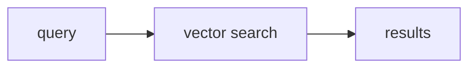
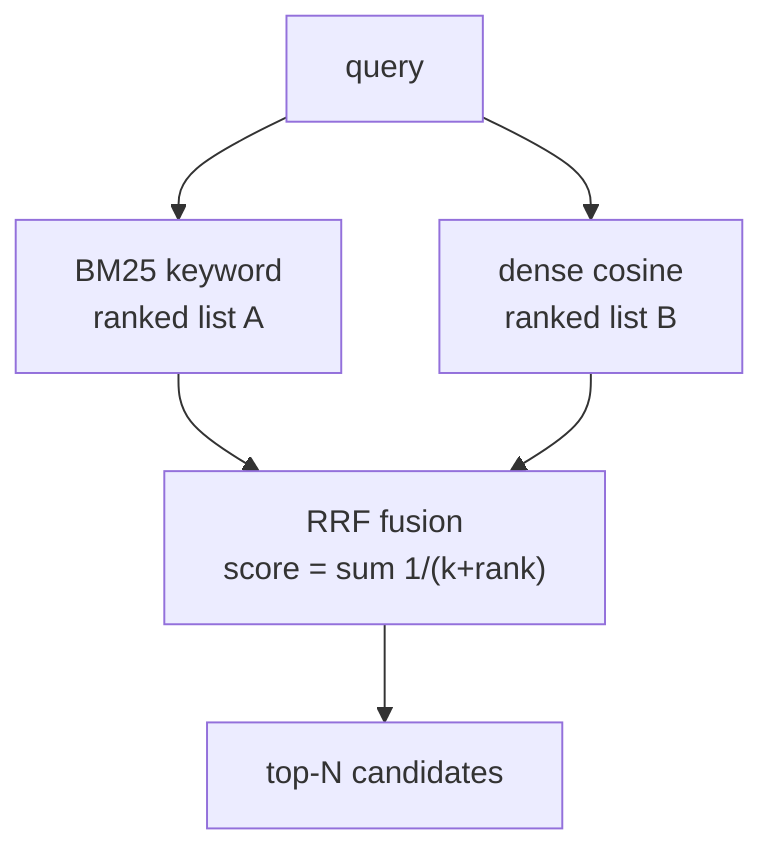
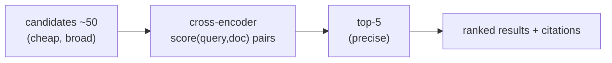
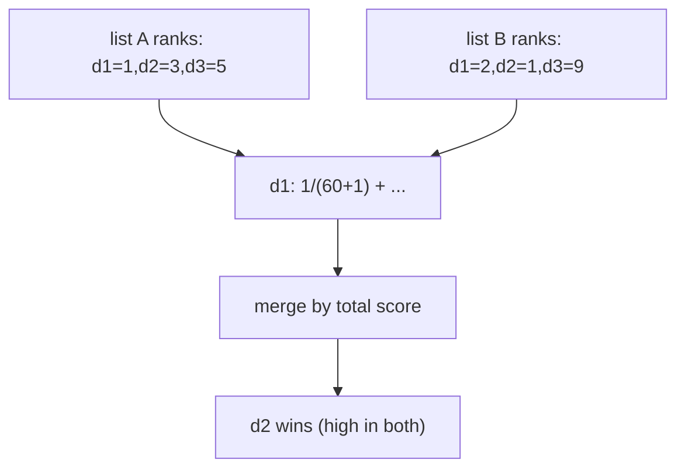
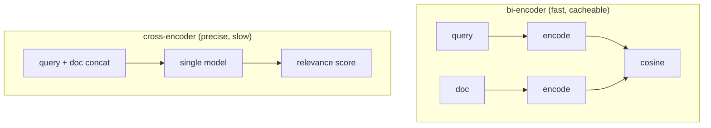
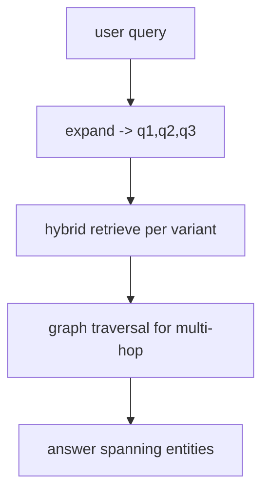

# 📖 Week 3 Learning — Enterprise-grade RAG Pipelines

> Read top-to-bottom. Each section ends with a **"why it matters"** line. **Diagrams: Noob → Expert** builds mental models from trivial to production-grade.

---

## 1. Why Naive Vector Search Isn't Enough

Pure dense (semantic) search fails on **exact-match** queries:
- Part numbers, SKUs, error codes (`ERR-4042`), proper nouns, version strings.
- Embeddings smooth over rare tokens, so "find ticket #A-1234" retrieves *similar-sounding* tickets, not the right one.

Keyword search (BM25) nails exact tokens but misses paraphrase. **Hybrid search** combines both: semantic recall + lexical precision.

**Why it matters:** this is the single biggest accuracy win in production RAG, and the reason real search stacks are never "just embeddings."

---

## 2. Hybrid Search: BM25 + Dense

- **BM25** — a statistical keyword scorer (TF-IDF with term-frequency saturation + document-length normalization). Fast, explainable, great for rare/exact terms.
- **Dense** — embed query + docs, cosine similarity. Great for paraphrase/semantics.

Each produces its own **ranked list**. You don't average their raw scores (different scales) — you fuse the *ranks*.

**Why it matters:** understanding that you're fusing two independent rankings (not two scores) is the key insight behind RRF.

---

## 3. Reciprocal Rank Fusion (RRF)

RRF merges ranked lists without needing comparable scores:

```
score(d) = Σ_lists  1 / (k + rank_list(d))     # k ≈ 60
```

A document ranked high in *both* lists accumulates a large score; one ranked high in only one gets half. `k` dampens the gap between rank 1 and rank 2 (robustness). It's scale-free, trivially extensible to N retrievers, and empirically strong.

**Why it matters:** RRF is the default glue for hybrid search because it needs no calibration and survives adding new retrievers.

---

## 4. Cross-Encoder Re-Ranking

Two encoder families:
- **Bi-encoder** (what we've used): encode query and doc *separately*, compare vectors. Fast, cacheable, but can't see the pair together.
- **Cross-encoder**: feed the **(query, doc) pair** into one model → direct relevance score. More accurate, but must run per-pair (slow, not cacheable).

The production pattern: **retrieve broadly & cheaply** (BM25 + dense, top ~50), then **re-rank narrowly & precisely** (cross-encoder, top ~5). Accuracy where it matters, cost where it doesn't.

**Why it matters:** re-ranking is the highest-leverage quality knob after chunking. It's why "top-50 then rerank to top-5" beats "top-5 directly."

---

## 5. Query Expansion & Graph RAG Basics

- **Query expansion / rewriting:** turn one user query into several (variants, keywords, sub-questions) to lift recall; often LLM-driven. Trade: more recall, more cost/noise.
- **Graph RAG:** build an entity–relation graph from the corpus; answer multi-hop questions by traversing relations ("who manages the team that owns service X?") that flat chunks can't connect.

**Why it matters:** these are the next tier once hybrid+rerank plateaus — know when each is worth its complexity.

---

## 6. Multi-Tenant Enterprise Search

Same isolation ladder as Week 2, applied to a search service: scope every BM25 index and every vector query to the tenant. BM25 indexes are built **per tenant** (they're in-memory term stats), and dense queries carry a `where tenant=...` filter. A missing scope on either side = cross-tenant leak.

**Why it matters:** enterprise search is judged on isolation as much as relevance.

---

## 🧠 Diagrams: Noob → Expert

### Level 1 — Noob: one search box


### Level 2 — Practitioner: hybrid fan-out + fusion


### Level 3 — Expert: retrieve-then-rerank


### Level 4 — RRF math


### Level 5 — Bi-encoder vs cross-encoder


### Level 6 — Query expansion + Graph RAG


---

## Key Terms (ubiquitous language)
| Term | Meaning |
|------|---------|
| BM25 | Statistical keyword relevance scorer |
| Dense retrieval | Vector-cosine semantic search |
| Hybrid search | Fusing keyword + dense rankings |
| RRF | Reciprocal Rank Fusion - merge ranks, not scores |
| Bi-encoder | Encodes query/doc separately (fast) |
| Cross-encoder | Scores the (query,doc) pair (precise, slow) |
| Re-rank | Re-score broad candidates precisely, keep top-k |
| Query expansion | Generate query variants to raise recall |
| Graph RAG | Entity-relation graph for multi-hop answers |
