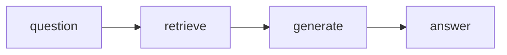
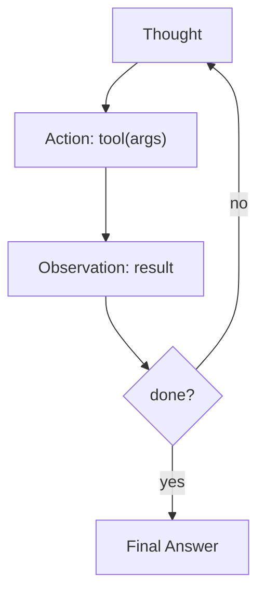
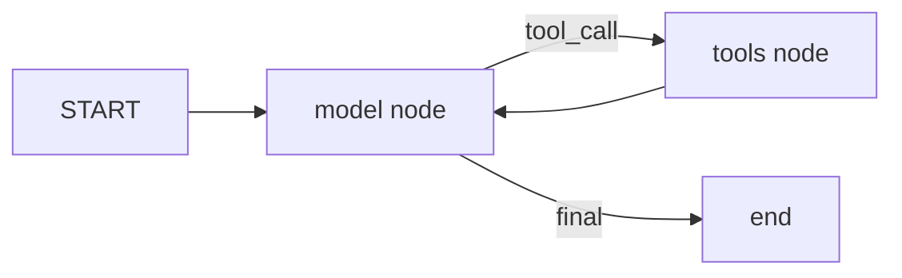
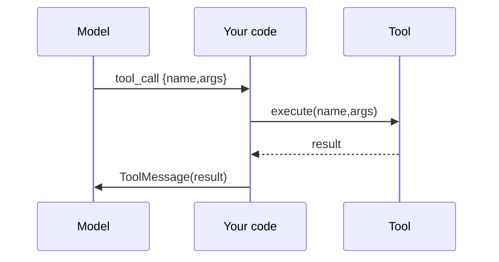
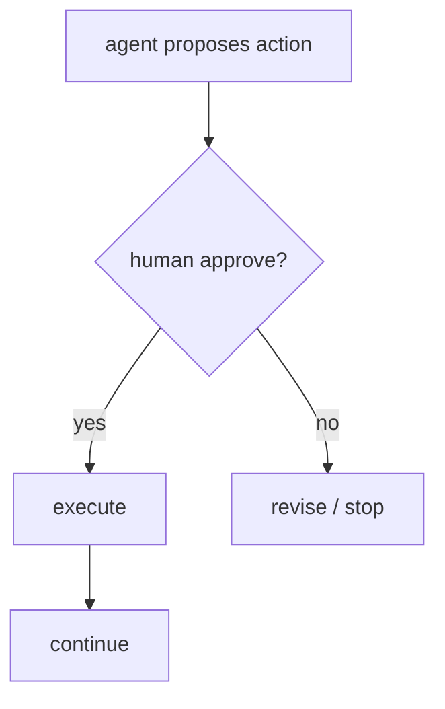
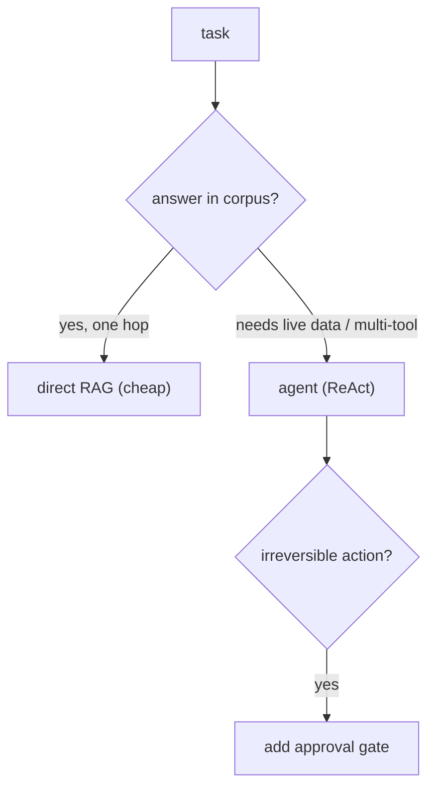

# 📖 Week 4 Learning — AI Agents & State Machines

> Read top-to-bottom. Each section ends with a **"why it matters"** line. **Diagrams: Noob → Expert.**

---

## 1. From RAG to Agents

RAG answers *"what does the knowledge base say?"* in one shot. An **agent** answers *"get this task done"* — it may need several steps, different data sources, and decisions along the way. An agent = an LLM in a loop that can **call tools** and react to their results.

**Why it matters:** most real support/sales/ops tasks are multi-step and touch live data (orders, tickets) that no static corpus contains. That's the gap agents fill.

---

## 2. The ReAct Pattern

**ReAct = Reason + Act.** Each turn the model:
1. **Thought** — reason about what to do next.
2. **Action** — pick a tool and its arguments.
3. **Observation** — receive the tool's result.
Repeat until it can give a **Final Answer**.

Modern tool-calling replaces the textual "Thought/Action" format with structured `tool_calls`, but the loop is identical.

**Why it matters:** ReAct is the mental model behind nearly every agent framework. Understand the loop and any framework becomes transparent.

---

## 3. Tool Calling Mechanics

You give the model a set of **tools** (name, description, typed args). The model emits a structured request `{name, args}` instead of free text. Your code executes the tool and returns a result the model reads. Schemas come from function signatures/docstrings (or Pydantic models).

**Why it matters:** the model never executes anything — *you* do. That boundary is where safety, logging, and permissions live.

---

## 4. LangGraph StateGraph

LangGraph models an agent as a **graph**: nodes are steps (LLM call, tool execution), edges are transitions, and a shared **state** (e.g., the message list) flows through. The prebuilt `create_react_agent` wires the standard ReAct graph for you; a manual `StateGraph` gives you explicit control over routing and loops.

**Why it matters:** graphs make control flow explicit and inspectable — you can see exactly where the agent is and why it moved.

---

## 5. Human-in-the-Loop (HITL)

Some actions are irreversible or high-stakes (refund, escalation, deletion). HITL inserts an **approval gate**: the agent pauses, a human approves/rejects, then it continues. In LangGraph this is an `interrupt`; in a plain FSM it's a state that waits for input.

**Why it matters:** autonomy without guardrails is how agents cause incidents. Gates are the production norm, not the exception.

---

## 6. Agents vs Direct RAG

Direct RAG wins when the answer is in the corpus and one retrieval suffices (fast, cheap). Agents win when the task needs live data, multiple tools, or branching logic. Rule of thumb: **start with RAG; add an agent only when retrieval alone demonstrably fails.**

**Why it matters:** agents cost more (multiple LLM calls) and add failure modes. Don't pay for them unless they earn it.

---

## 🧠 Diagrams: Noob → Expert

### Level 1 — Noob: one-shot RAG

### Level 2 — Practitioner: ReAct loop

### Level 3 — Expert: LangGraph StateGraph

### Level 4 — Tool-calling boundary

### Level 5 — Human-in-the-loop gate

### Level 6 — When to use which

---

## Key Terms (ubiquitous language)
| Term | Meaning |
|------|---------|
| Agent | LLM in a loop that can call tools |
| ReAct | Reason + Act - think, act, observe, repeat |
| Tool call | Structured {name, args} the model requests |
| StateGraph | Nodes + edges + shared state (LangGraph) |
| Node / Edge | A step / a transition in the graph |
| HITL | Human-in-the-loop approval gate |
| Interrupt | Pause the graph awaiting external input |
