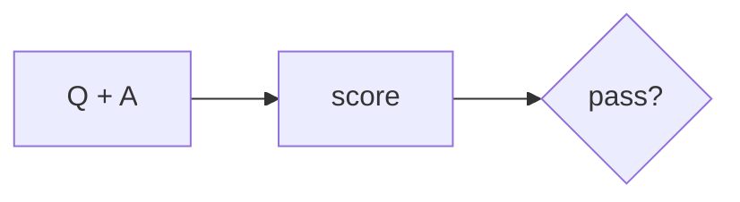
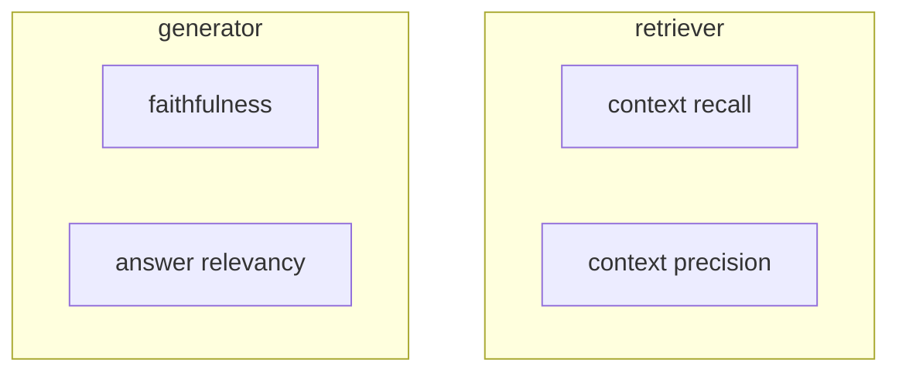
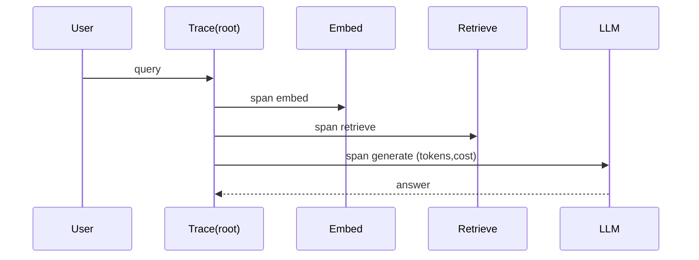
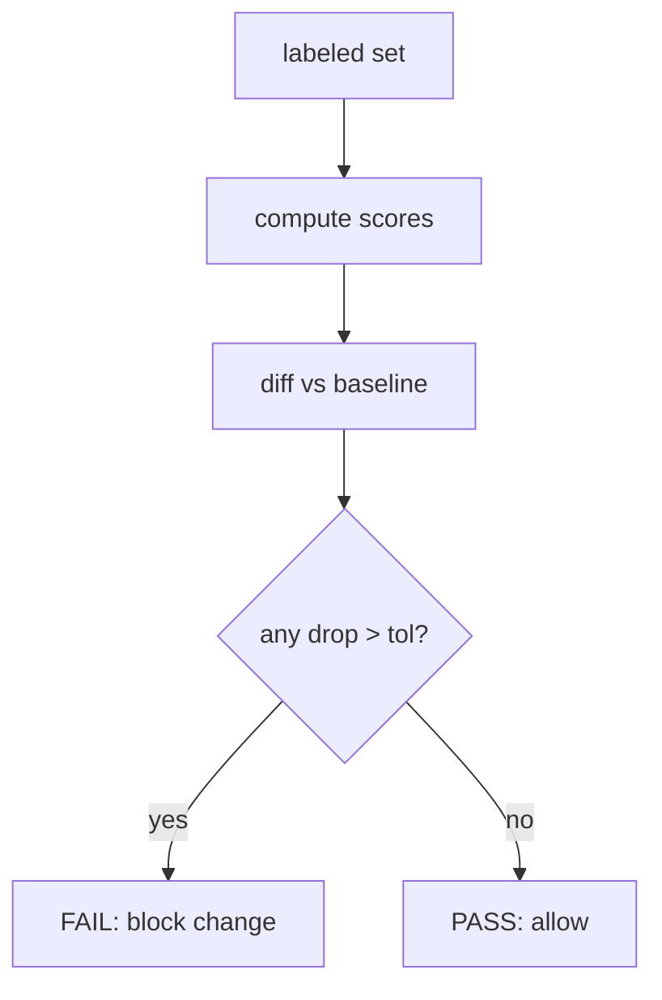
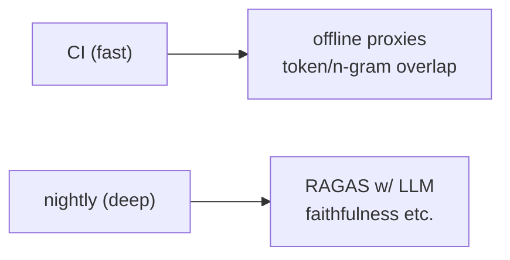
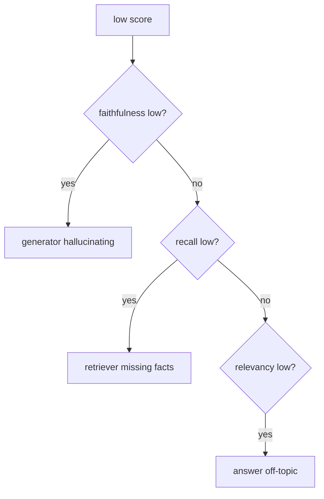

# 📖 Week 5 Learning — Evals & Observability

> Read top-to-bottom. Each section ends with a **"why it matters"** line. **Diagrams: Noob → Expert.**

---

## 1. Why You Can't Eyeball LLM Quality

LLM output is non-deterministic and high-volume. You cannot read every answer. **Evals** turn "is this good?" into numbers you can track over time and gate on. Without evals, every prompt/model change is a blind deploy.

**Why it matters:** evals are the difference between shipping AI confidently and shipping vibes.

---

## 2. RAG Metric Taxonomy

Four core RAGAS-style metrics:
- **Faithfulness** — is every claim in the answer *supported by* the retrieved context? (catches hallucination)
- **Answer Relevancy** — does the answer actually address the question? (catches rambling)
- **Context Recall** — did retrieval pull the facts the answer needs? (retrieval quality)
- **Context Precision** — is the retrieved context *relevant*, not just present? (signal vs noise)

Faithfulness + relevancy judge the *generator*; recall + precision judge the *retriever*. Diagnose which side is failing before you tune it.

**Why it matters:** knowing whether your problem is retrieval or generation points you at the right fix.

---

## 3. Frameworks: RAGAS vs DeepEval

Both compute these metrics against a labeled dataset. **RAGAS** is RAG-specific and pairs with LangChain; **DeepEval** is broader (unit-test style, pytest-integrated). Pick one, wire it to your dataset, and treat scores as CI signals. (This repo has RAGAS installed; DeepEval is the swap-in alternative.)

**Why it matters:** the framework is a means; the discipline (labeled set + tracked scores) is the point.

---

## 4. Observability & Tracing (Langfuse)

A single user query fans out into embeddings, retrieval, rerank, and LLM calls. **Tracing** records each span (inputs, outputs, latency, tokens, cost) so you can debug *which* step failed. Langfuse is a common open-source tracer; the pattern (a root trace + child spans per step) is framework-agnostic.

**Why it matters:** when answer quality drops, traces tell you *where* — without them you're guessing.

---

## 5. Regression Testing for AI

Classic tests assert exact output; AI tests assert **score thresholds**. The pattern:
1. Keep a **baseline** score per test case.
2. On each change, recompute scores.
3. **Flag regressions** where a case drops beyond a tolerance.
4. **Gate**: block the change if any critical case regresses.

**Why it matters:** this is how you stop a "harmless" prompt tweak from silently breaking half your use cases.

---

## 6. Building the Regression Gate

Combine the pieces: a labeled dataset -> metric computation (offline proxies for CI speed, real RAGAS for depth) -> tracing -> baseline diff -> pass/fail verdict. The gate runs fast enough for CI (offline metrics) and can be deepened on demand (RAGAS).

**Why it matters:** a gate that's too slow gets bypassed; too shallow gets ignored. Match depth to the risk.

---

## 🧠 Diagrams: Noob → Expert

### Level 1 — Noob: one number

### Level 2 — Practitioner: four RAG metrics

### Level 3 — Expert: traced pipeline

### Level 4 — Regression gate

### Level 5 — Offline proxy vs deep eval

### Level 6 — Where failures live

---

## Key Terms (ubiquitous language)
| Term | Meaning |
|------|---------|
| Eval | Scored check of model/RAG output |
| Faithfulness | Answer claims supported by context |
| Answer relevancy | Answer addresses the question |
| Context recall | Retrieval captured needed facts |
| Context precision | Retrieved context is relevant |
| Trace | Root + child spans of one request |
| Baseline | Reference scores to diff against |
| Regression | A case scoring worse than baseline |
| Gate | Pass/fail decision that blocks changes |
