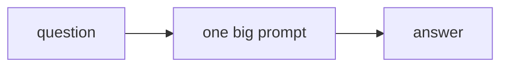
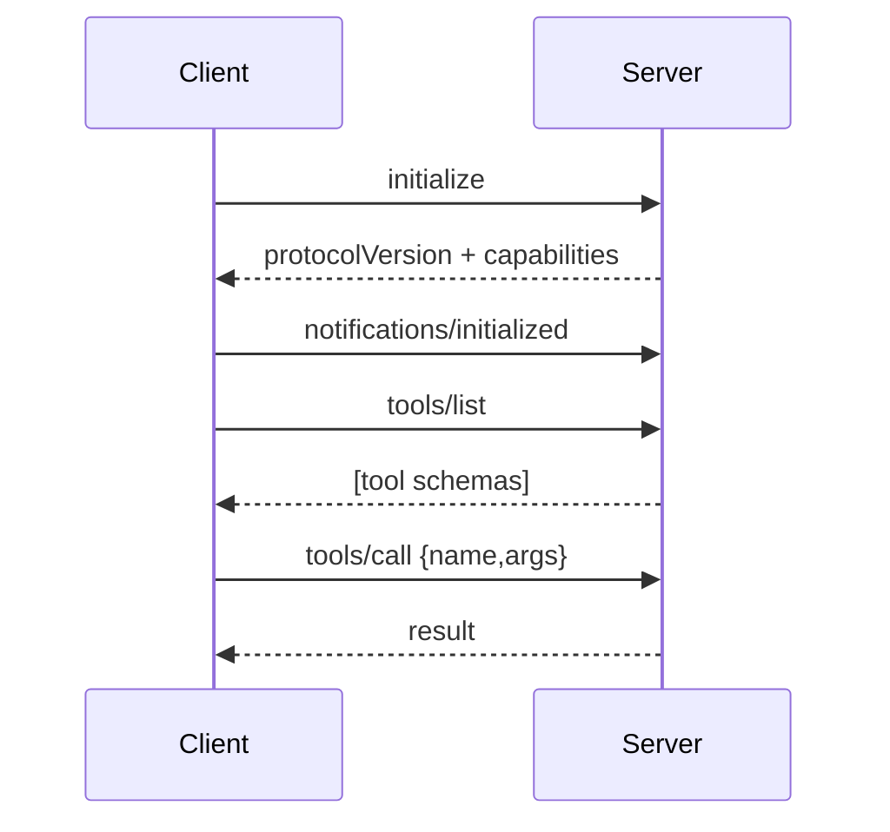
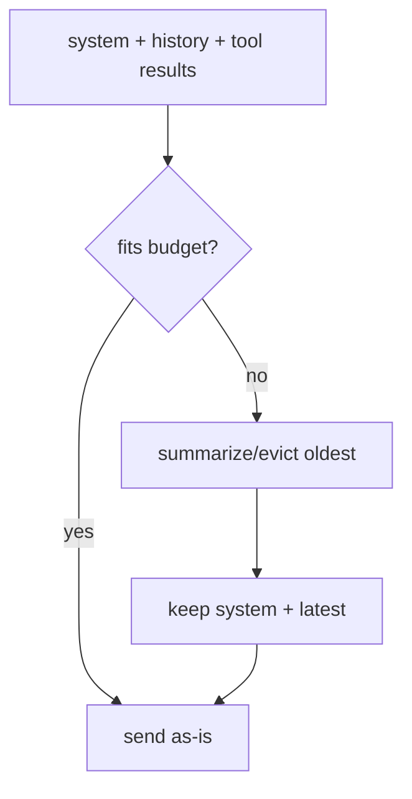
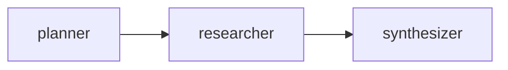
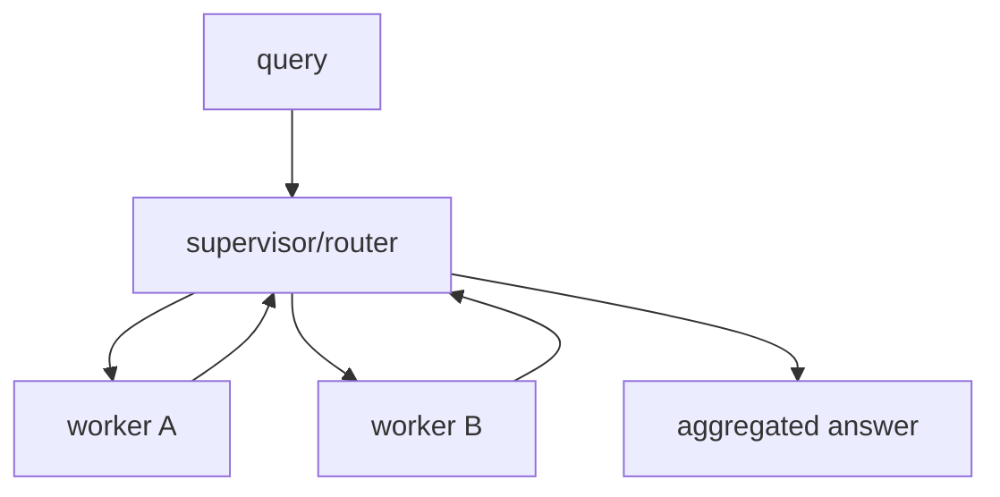
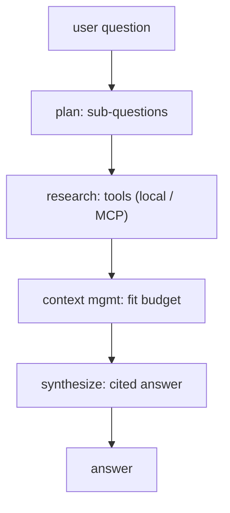

# 📖 Week 6 Learning — MCP, Context & Multi-Agent

> Read top-to-bottom. Each section ends with a **"why it matters"** line. **Diagrams: Noob → Expert.**

---

## 1. What MCP Is

**Model Context Protocol** is a standardized client-server protocol for giving models **tools** and **context** from external sources. A *server* exposes capabilities (tools, resources, prompts) over **JSON-RPC**; a *client* (your app/agent) discovers them (`tools/list`) and invokes them (`tools/call`). It's the "USB-C for AI tools": build once, plug into any MCP-aware host.

**Why it matters:** instead of hard-coding every integration, you speak one protocol and gain any MCP server's tools.

---

## 2. The MCP Handshake

Every session follows a fixed shape:
1. `initialize` request -> server returns its `protocolVersion` + `capabilities`.
2. `notifications/initialized` (client ack).
3. `tools/list` -> array of tool schemas (name, description, inputSchema).
4. `tools/call` -> `{name, arguments}` -> structured result.

Each message is a JSON-RPC object: `{jsonrpc, id, method, params}` for requests, `{jsonrpc, id, result|error}` for responses.

**Why it matters:** knowing the exact message shapes lets you debug any MCP integration and even implement a minimal client by hand.

---

## 3. Context Engineering

The model only sees what fits in its **window**. Context engineering decides *what* goes in: system prompt, relevant history, tool results, retrieved docs — under a **token budget**. Techniques: keep system + latest turn, evict or **summarize** older turns, truncate long tool outputs. Bad context management = lost instructions or blown budgets.

**Why it matters:** most "the agent forgot" bugs are context-management bugs, not model bugs.

---

## 4. Multi-Agent Orchestration

Split work across **specialized agents**, each with a narrow prompt and its own context:
- **Pipeline** — fixed sequence (plan -> research -> write).
- **Supervisor** — a router agent dispatches to workers and aggregates.
Isolation is the win: each agent's context stays small and focused, so quality holds as tasks grow. LangGraph models this as a `StateGraph` (nodes = agents, edges = flow, shared state).

**Why it matters:** one giant prompt degrades as it grows; many small focused contexts scale better.

---

## 5. Building the Research Assistant

Combine the pieces: a LangGraph graph where a **planner** breaks the question into sub-questions, a **researcher** answers each via tools (local corpus, or MCP tools when available), and a **synthesizer** merges findings into a cited answer. Context management keeps each node lean.

**Why it matters:** this is the reference architecture for most production research/analysis agents.

---

## 🧠 Diagrams: Noob → Expert

### Level 1 — Noob: one agent, one prompt

### Level 2 — Practitioner: MCP handshake

### Level 3 — Expert: context budgeting

### Level 4 — Pipeline multi-agent

### Level 5 — Supervisor multi-agent

### Level 6 — Research assistant full stack

---

## Key Terms (ubiquitous language)
| Term | Meaning |
|------|---------|
| MCP | Model Context Protocol - std tool/context protocol |
| JSON-RPC | Wire format for MCP requests/responses |
| Tool schema | name + description + inputSchema |
| Context window | Max tokens the model can see |
| Compaction | Summarizing old turns to fit budget |
| Multi-agent | Specialized agents sharing state |
| Supervisor | Router agent dispatching to workers |
| StateGraph | LangGraph nodes + edges + shared state |
