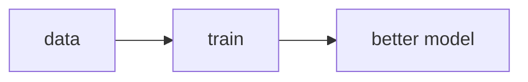
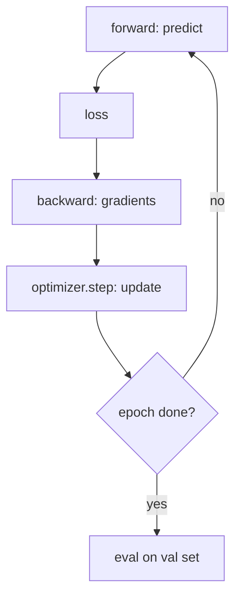
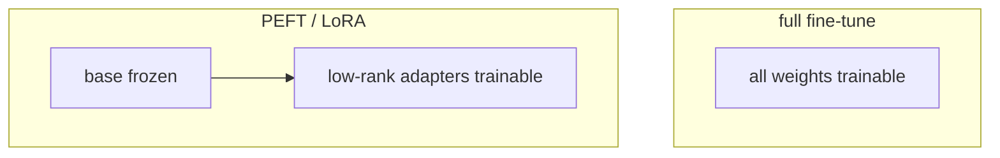
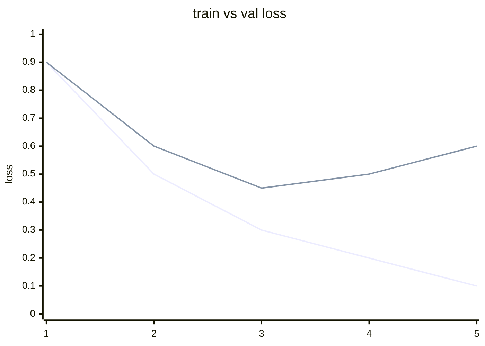
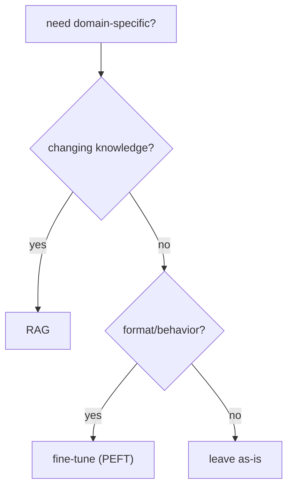
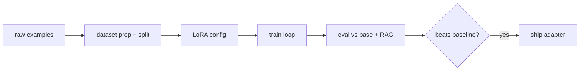

# 📖 Week 7 Learning — ML & Fine-Tuning

> Read top-to-bottom. Each section ends with a **"why it matters"** line. **Diagrams: Noob → Expert.**
> ⚠️ This week is **code + docs** on this machine: real fine-tuning is too heavy for an 8 GB laptop. The runnable parts prove the *mechanics* on a toy problem.

---

## 1. Fine-Tuning vs RAG

Two ways to make a model domain-specific:
- **RAG** — keep the model frozen; inject knowledge at inference. Great for *changing* knowledge, citations, and low cost.
- **Fine-tuning** — update the model's weights on your data. Great for *behavior/format/style* and removing retrieval latency.

Rule of thumb: **RAG for knowledge, fine-tuning for behavior.** If the answer is "the model keeps getting the format wrong," fine-tune. If it's "the model doesn't know our latest facts," use RAG.

**Why it matters:** picking the wrong tool wastes weeks. Most teams should try RAG first.

---

## 2. Full vs Parameter-Efficient (PEFT/LoRA)

Full fine-tuning updates *every* weight - expensive and prone to overfitting on small data. **PEFT** freezes the base model and trains only a small set of added parameters. **LoRA** injects low-rank matrices into attention layers; you train ~0.1–1% of parameters. Cheaper, faster, less overfitting, and you can swap adapters per task.

**Why it matters:** PEFT is why fine-tuning is affordable on modest hardware and why one base model can serve many tasks.

---

## 3. Dataset Preparation

Quality beats quantity. You need clean **prompt -> completion** pairs in the exact template your trainer expects, a **train/val split**, and enough examples to avoid memorization. Common failure: leaking val rows into train, or a template mismatch that silently trains garbage.

**Why it matters:** most "bad fine-tune" results are dataset bugs, not algorithm bugs.

---

## 4. The Training Loop

Every epoch: **forward** pass (predict) -> **loss** (how wrong) -> **backward** (gradients) -> **optimizer.step** (update weights). Track train + val loss; if val loss rises while train falls, you're **overfitting** - stop early. This loop is identical whether you're training a 2-layer MLP or a 7B LLM.

**Why it matters:** understanding forward/loss/backward/update demystifies every framework's trainer.

---

## 5. Evaluating a Fine-Tuned Model

Don't trust train loss alone. Evaluate on held-out data with task metrics (accuracy, BLEU/ROUGE for text, or your RAGAS-style checks). Compare against the base model and against RAG on the same set before deciding to ship.

**Why it matters:** a fine-tune that doesn't beat your RAG baseline isn't worth its serving cost.

---

## 🧠 Diagrams: Noob → Expert

### Level 1 — Noob: one knob

### Level 2 — Practitioner: the training loop

### Level 3 — Expert: full vs PEFT

### Level 4 — Overfitting signature

### Level 5 — RAG vs fine-tune decision

### Level 6 — End-to-end fine-tune pipeline

---

## Key Terms (ubiquitous language)
| Term | Meaning |
|------|---------|
| Fine-tuning | Updating weights on domain data |
| PEFT | Train few params, freeze the rest |
| LoRA | Low-rank adapter matrices |
| Epoch | One full pass over the training set |
| Loss | How wrong the predictions are |
| Backprop | Computing gradients for the update |
| Overfitting | Train improves, validation worsens |
| Adapter | Swappable per-task PEFT module |
