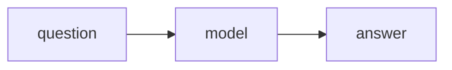
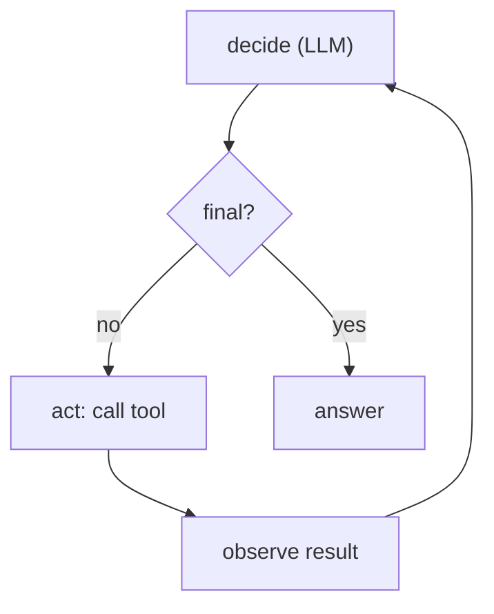
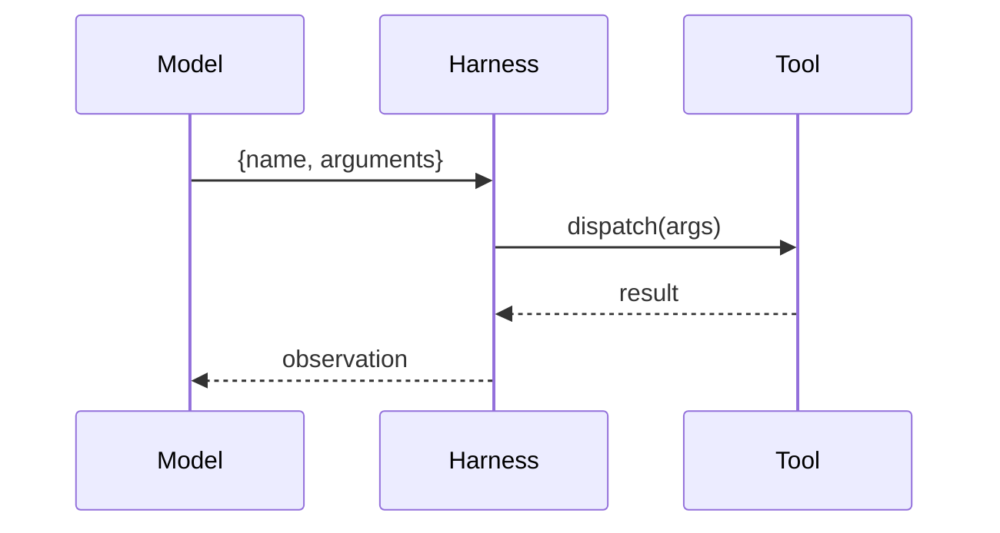
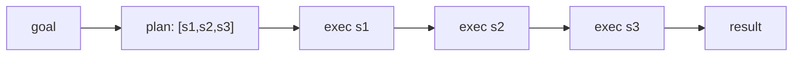
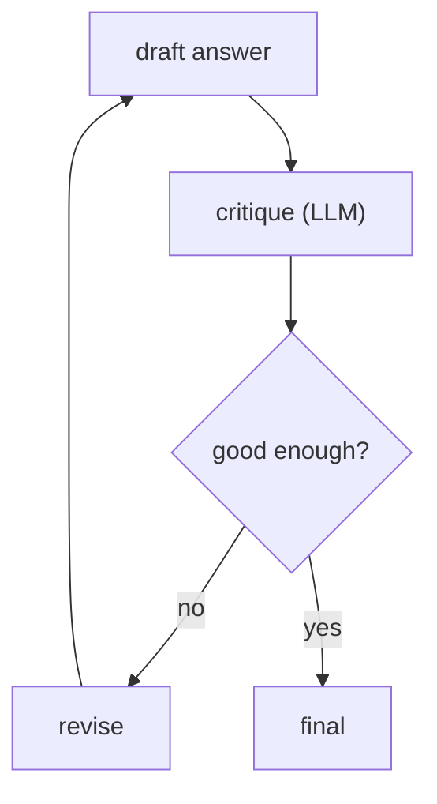
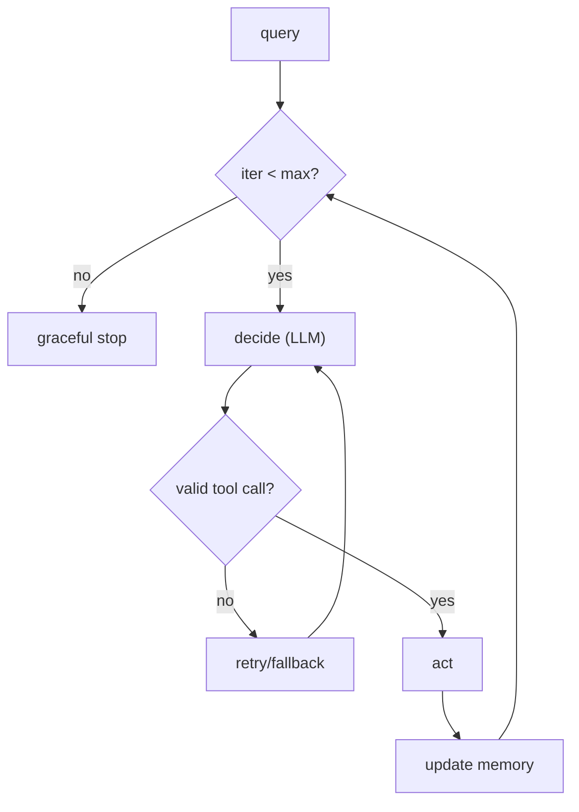

# 📖 Week 8 Learning — Agentic System Design

> Read top-to-bottom. Each section ends with a **"why it matters"** line. **Diagrams: Noob → Expert.**

---

## 1. What Makes a System "Agentic"

An **agent** is a model in a **loop** that can act on the world (call tools), observe results, and decide its next step until a goal is met. Three ingredients: **autonomy** (it chooses next actions), **tool use** (it affects/reads the world), and a **termination condition** (it knows when to stop). Without a stop condition you get runaway loops; without tools you get a chatbot.

**Why it matters:** "agent" is just "model + tools + loop + stopping rule." Name the parts and the design becomes tractable.

---

## 2. Tool Use & Function Calling

A **tool** is declared with a name, description, and a JSON **input schema**. The model emits a *tool call* (`{name, arguments}`); your code parses it, runs the real function, and feeds the result back as an observation. The contract is the schema - a mismatch there silently breaks the whole loop.

**Why it matters:** function calling is the seam between model and reality; get the schema/dispatch right and any capability plugs in.

---

## 3. Planning & Memory

**Planning** decomposes a goal into sub-steps before acting (plan-and-execute) or interleaves thinking and acting (ReAct). **Memory** persists what the agent has learned across steps/sessions so it doesn't repeat work. Short-term memory = the working context; long-term = a retrievable store.

**Why it matters:** planning keeps long tasks coherent; memory makes an agent improve across turns instead of amnesiac.

---

## 4. Error Handling & Recovery

Agents fail: bad tool args, empty results, hallucinated ids. Robust designs **validate** tool inputs, **retry** with a corrected call, **fall back** to a safer action, and **self-correct** (reflection: critique the draft, then revise). Always cap iterations so a stuck agent terminates gracefully instead of looping forever.

**Why it matters:** the difference between a demo and a production agent is how it behaves on the 10% of steps that go wrong.

---

## 5. Design Patterns

- **ReAct** - alternate Reason and Act; flexible, but more LLM calls.
- **Plan-and-Execute** - plan once, then run steps; cheaper, less adaptive.
- **Reflection / Reflexion** - critique then revise; higher quality, higher cost.
Pick by task: open-ended exploration -> ReAct; known procedure -> plan-and-execute; quality-critical output -> add reflection.

**Why it matters:** these are the reusable shapes; most production agents are one of these plus error handling.

---

## 🧠 Diagrams: Noob → Expert

### Level 1 — Noob: ask once

### Level 2 — Practitioner: the agent loop

### Level 3 — Expert: function-calling contract

### Level 4 — Plan-and-execute

### Level 5 — Reflection / self-correction

### Level 6 — Production agent (loop + guards)

---

## Key Terms (ubiquitous language)
| Term | Meaning |
|------|---------|
| Agent | Model + tools + loop + stopping rule |
| Tool call | `{name, arguments}` emitted by the model |
| Observation | Tool result fed back to the model |
| ReAct | Interleaved reasoning + acting |
| Plan-and-execute | Plan once, then run steps |
| Reflection | Critique then revise the output |
| Memory | Persisted knowledge across steps/sessions |
| Guardrail | Cap/validation that prevents runaway |
