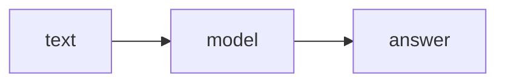
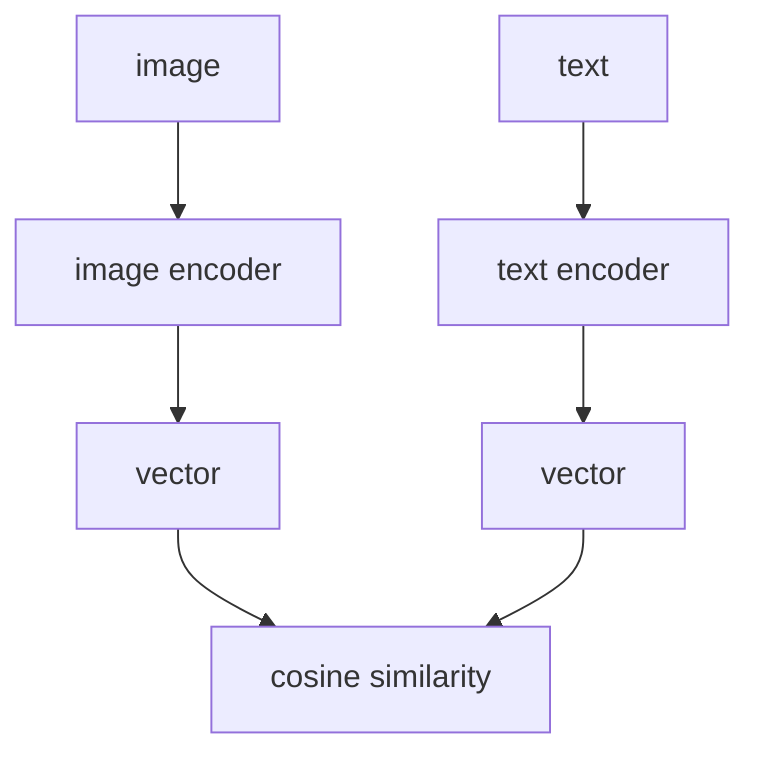
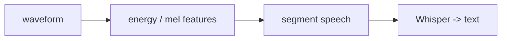
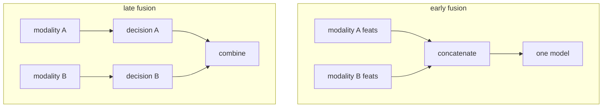
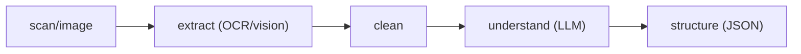
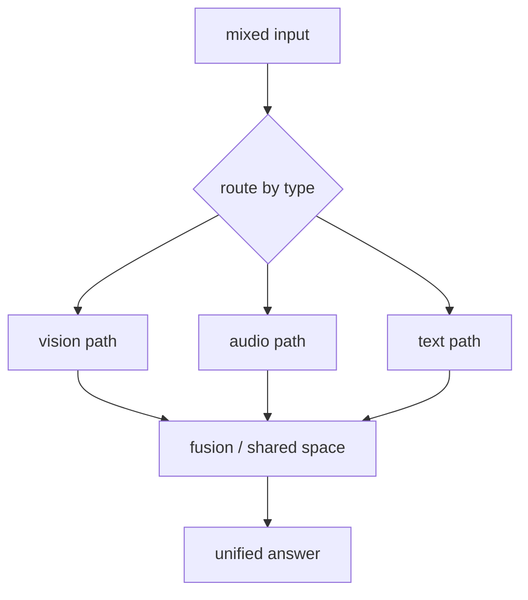

# 📖 Week 9 Learning — Multimodal AI

> Read top-to-bottom. Each section ends with a **"why it matters"** line. **Diagrams: Noob → Expert.**
> ⚠️ Heavy week: real vision/audio models are too big for this machine. The runnable parts prove the *mechanics* with NumPy.

---

## 1. What "Multimodal" Means

A **multimodal** system ingests more than one data type - text, images, audio - and reasons across them. The hard part isn't any single modality; it's making them **comparable**, so a sentence can be matched to a photo or a transcript aligned to sound.

**Why it matters:** most real products (search, assistants, doc processing) are multimodal by default.

---

## 2. Vision: ViT & CLIP

A **Vision Transformer (ViT)** splits an image into patches and treats them like tokens. **CLIP** trains two encoders (image, text) so that matching pairs land **close** in a shared embedding space and mismatches land far apart - learned by a contrastive loss. At inference you just compare vectors with cosine similarity.

**Why it matters:** CLIP gives you zero-shot image-text matching with no task-specific labels.

---

## 3. Audio: Waveforms, Features, STT

Raw audio is a **waveform** (amplitude over time). You rarely feed raw samples to a model: you compute features (energy, zero-crossings, mel-spectrograms) and often do **voice activity detection (VAD)** to find where speech is. **Whisper** turns those features into text end-to-end.

**Why it matters:** the front-end (features + segmentation) determines how well any STT model does.

---

## 4. Multimodal Fusion

- **Early fusion** - concatenate raw/modalities' features before one model.
- **Late fusion** - process each modality separately, combine decisions at the end.
- **Shared space** (CLIP-style) - align modalities into one embedding space and compare.
Early fusion captures cross-modal interactions but needs lots of paired data; late fusion is modular and easier to extend.

**Why it matters:** the fusion choice sets your accuracy/cost/data trade-off before you write a line of training code.

---

## 5. Document Intelligence Pipeline

Real doc processing chains: **extract** (OCR / vision model pulls text + layout) -> **clean** (normalize, dedupe) -> **understand** (LLM classifies, summarizes, extracts fields) -> **structure** (emit JSON). Each stage is swappable; the LLM stage is where domain logic lives.

**Why it matters:** this staged pipeline is the reference architecture for invoices, forms, scans, and screenshots.

---

## 🧠 Diagrams: Noob → Expert

### Level 1 — Noob: one modality

### Level 2 — Practitioner: CLIP shared space

### Level 3 — Expert: audio front-end

### Level 4 — Early vs late fusion

### Level 5 — Doc intelligence pipeline

### Level 6 — Production multimodal product

---

## Key Terms (ubiquitous language)
| Term | Meaning |
|------|---------|
| Multimodal | System handling >1 data type |
| ViT | Image split into patch tokens |
| CLIP | Contrastive text-image alignment |
| Shared space | Embeddings comparable across modalities |
| Waveform | Amplitude over time |
| VAD | Detect where speech occurs |
| Whisper | End-to-end speech-to-text model |
| Early/late fusion | Combine before vs after per-modality models |
