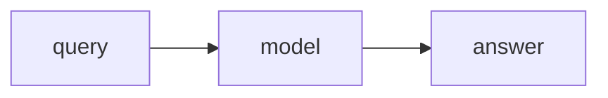
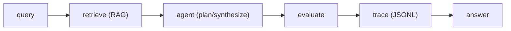
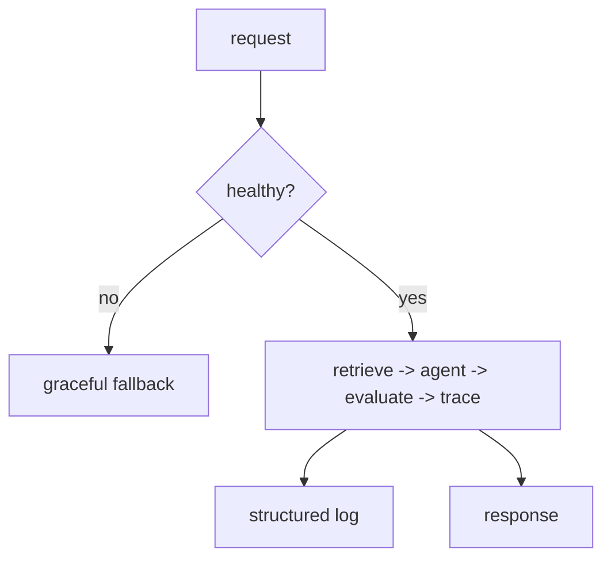
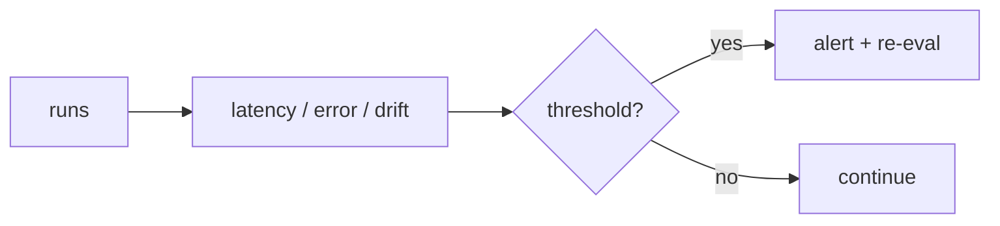
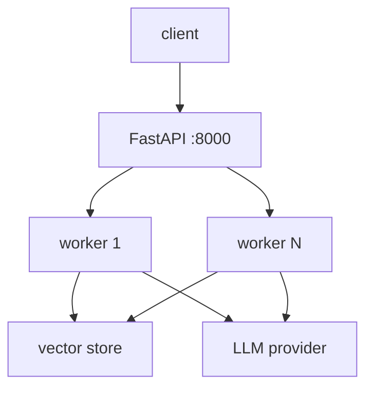
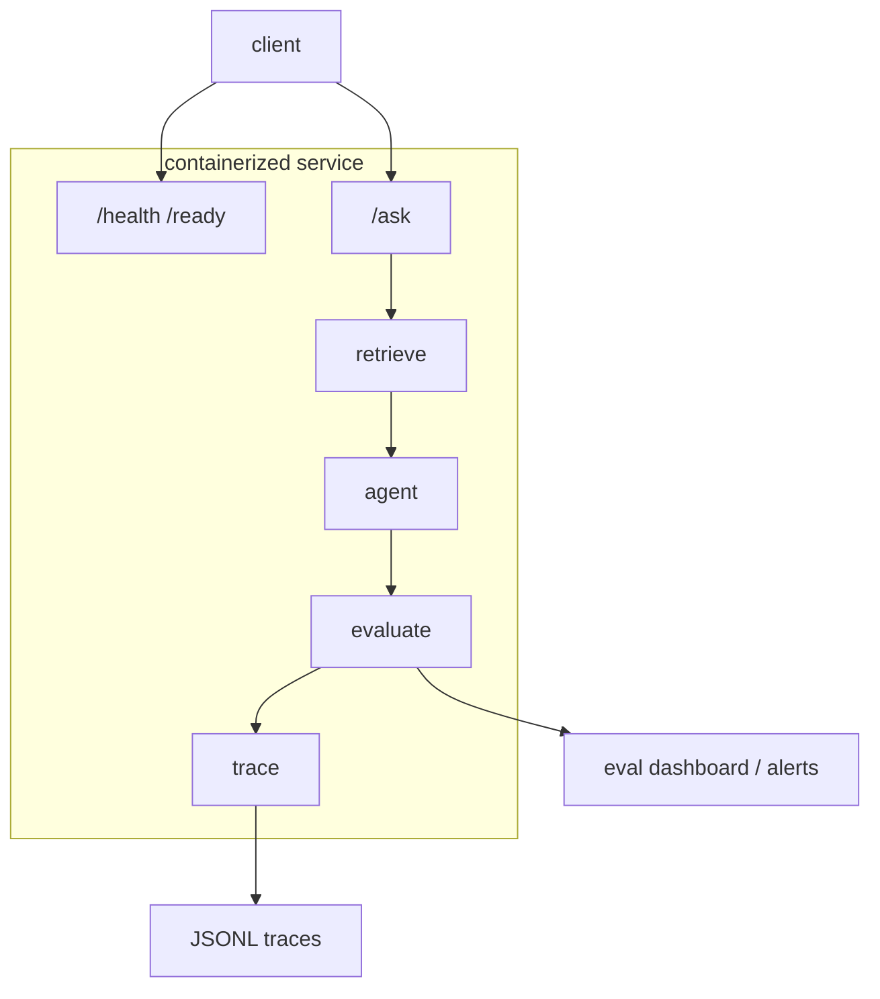

# 📖 Week 10 Learning — Capstone: The Enterprise AI Platform

> Read top-to-bottom. Each section ends with a **"why it matters"** line. **Diagrams: Noob → Expert.**

---

## 1. System Integration

A production AI system composes the pieces from earlier weeks: **retrieval** (RAG) grounds answers, an **agent** plans and acts, **evaluation** scores quality, and **observability** traces every step. The skill is the *seams* - clean interfaces between components so each can be swapped, tested, and scaled independently.

**Why it matters:** integration quality, not any single component, determines whether a demo becomes a product.

---

## 2. Production Readiness

Before traffic: **validate config** at startup (fail fast on bad env), expose **health/readiness** probes, **degrade gracefully** when a dependency is down (return a clear fallback, not a crash), and emit **structured logs** (JSON) so log aggregators can parse them. Idempotent, bounded, observable.

**Why it matters:** these are the checks that keep a system alive when something - always something - goes wrong.

---

## 3. Monitoring & Maintenance

Track **latency**, **error rate**, and a **drift proxy** (e.g., distribution of answer lengths or retrieval hit-rate) over time. Alert when a metric crosses a threshold. Re-run your eval suite on a schedule so model/prompt/data changes are caught before users are.

**Why it matters:** models and data drift silently; monitoring is how you find out before customers do.

---

## 4. Deployment Strategies

**Containerize** (Docker) for reproducible environments; serve via an **API** (FastAPI); choose **batch vs streaming** by UX need; pick **on-prem vs cloud** by data-sensitivity and cost. Scale out stateless workers behind the API. Keep secrets in env, never in the image.

**Why it matters:** the deployment choice sets your cost, latency, and compliance profile.

---

## 5. The Enterprise AI Platform (capstone)

One request flows: **retrieve** relevant context -> **agent** plans and synthesizes a grounded answer -> **evaluate** the answer (faithfulness/groundedness) -> **trace** the whole path to JSONL. Health/readiness guards the entry; structured logs record each stage. Containerized and API-served.

**Why it matters:** this is the reference shape of a real enterprise AI backend - and the thing you can point a recruiter at.

---

## 🧠 Diagrams: Noob → Expert

### Level 1 — Noob: one call

### Level 2 — Practitioner: integrated request path

### Level 3 — Expert: production envelope

### Level 4 — Monitoring loop

### Level 5 — Deployment topology

### Level 6 — Full platform (capstone)

---

## Key Terms (ubiquitous language)
| Term | Meaning |
|------|---------|
| Integration | Composing components at clean seams |
| Health check | Probe: is the service alive? |
| Readiness | Probe: can it take traffic now? |
| Graceful degradation | Fallback instead of crash |
| Structured log | Machine-parseable (JSON) log line |
| Drift | Slow shift in data/model behavior |
| Containerize | Package app + deps in an image |
| Stateless worker | Scales out behind the API |
