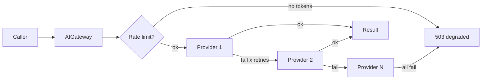
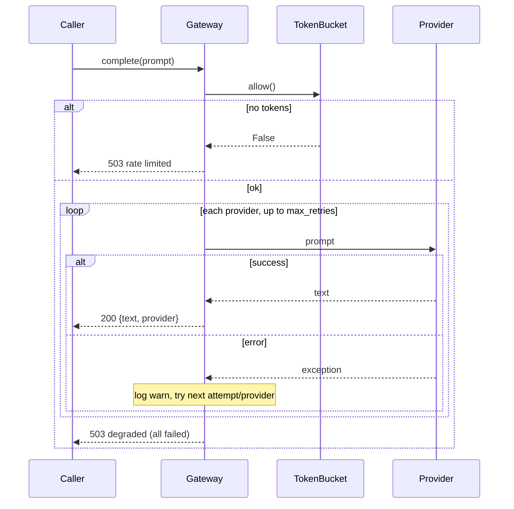
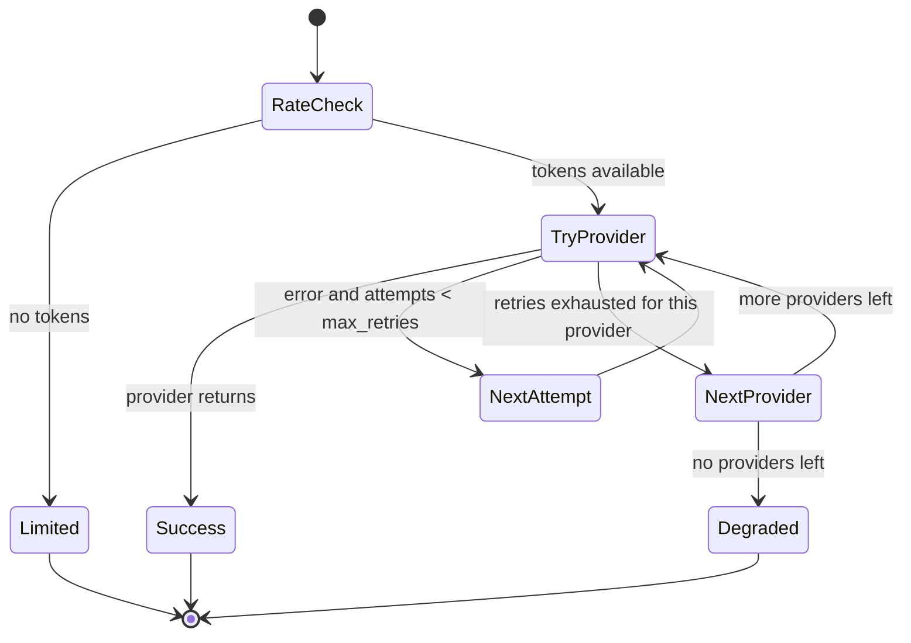
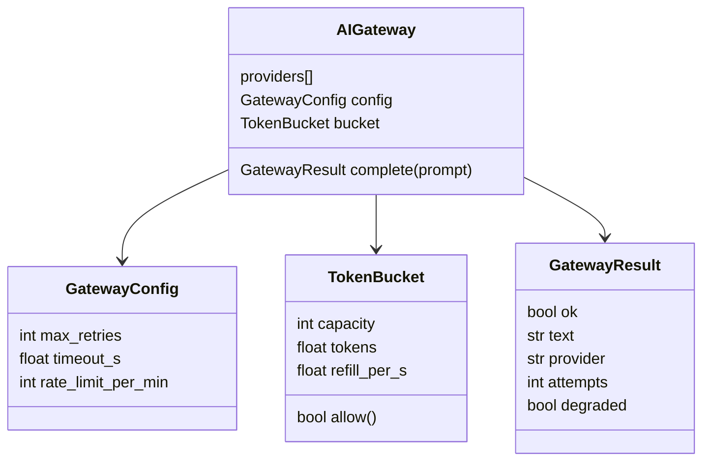
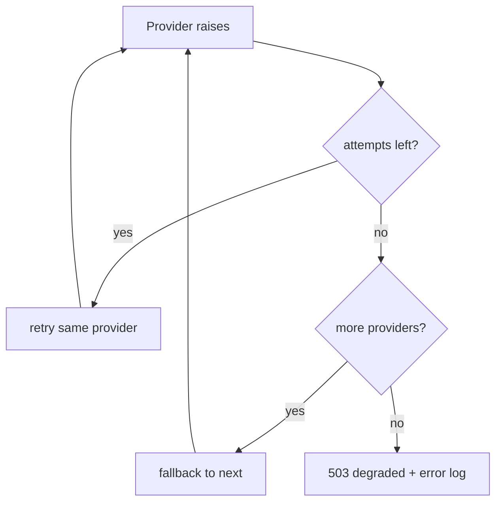

# DESIGN — AI Gateway Service

## 1. Component overview
The gateway sits between callers and N ordered LLM providers. It owns retry,
fallback, rate limiting, and logging. Providers are opaque callables.

## 2. Request lifecycle

## 3. Retry + fallback state machine

## 4. Data model

## 5. Failure modes & recovery

## Key decisions
- **Providers are callables** — no SDK coupling; trivially swappable/testable.
- **Token bucket** over fixed window — smooths bursts, standard technique.
- **Graceful degradation** — a downed gateway returns 503, never an unhandled crash.
