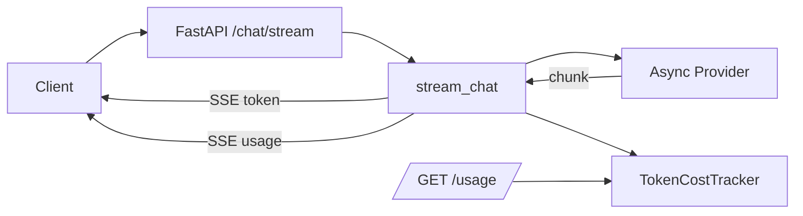
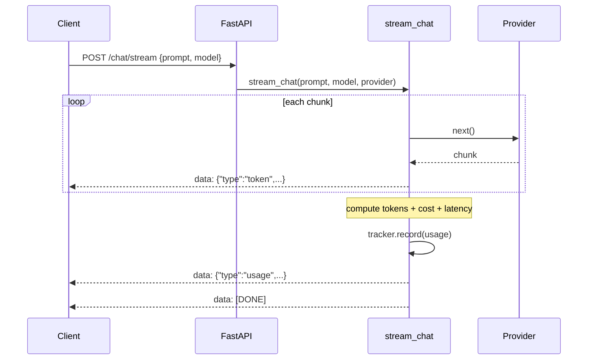
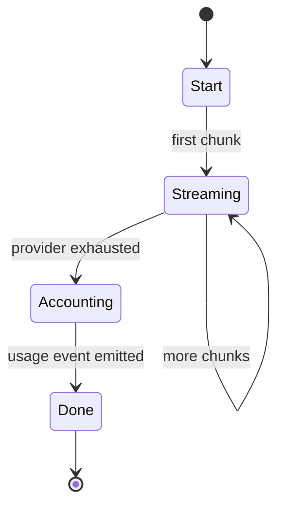

# DESIGN — The AI Gateway

## 1. Component overview
The gateway streams from a pluggable async provider, emits SSE events, and records
token/cost into a shared tracker.



## 2. Streaming sequence



## 3. Request state machine



## 4. Data model

```mermaid
classDiagram
    class Usage {
        str model
        int input_tokens
        int output_tokens
        float cost_usd
        float latency_ms
        dict as_dict()
    }
    class TokenCostTracker {
        int requests
        int input_tokens
        int output_tokens
        float cost_usd
        void record(Usage)
        dict summary()
    }
    class MODEL_PRICING {
        <<map>>
        model -> {input, output}
    }
    TokenCostTracker --> Usage
```

## 5. Cost computation

```mermaid
flowchart TD
    A[prompt, completion] --> B[estimate_tokens ~4 chars/token]
    B --> C{model in price table?}
    C -->|yes| D[use model prices]
    C -->|no| E[use default prices]
    D --> F[cost = (in*pin + out*pout)/1e6]
    E --> F
    F --> G[round to 8 dp]
```

## Key decisions
- **Async generator + SSE** — non-blocking streaming, standard for LLM chat backends.
- **Pluggable async provider** — offline-testable; production wraps OpenAI/OpenRouter.
- **Centralized tracker** — one place for real-time spend accounting.
