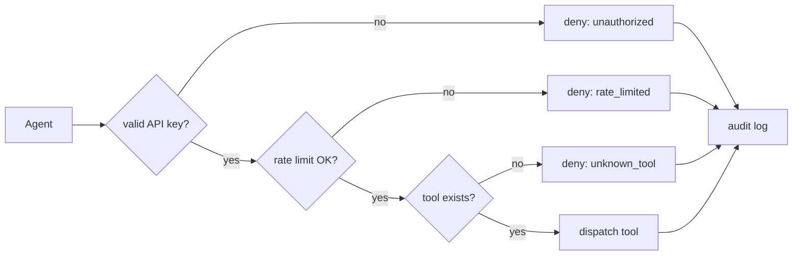
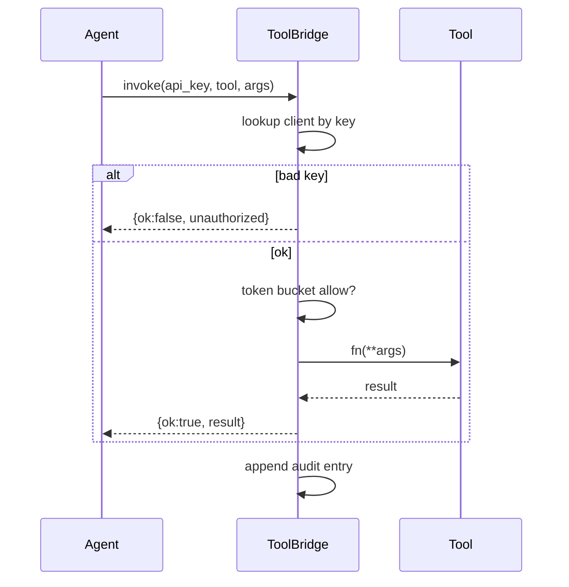
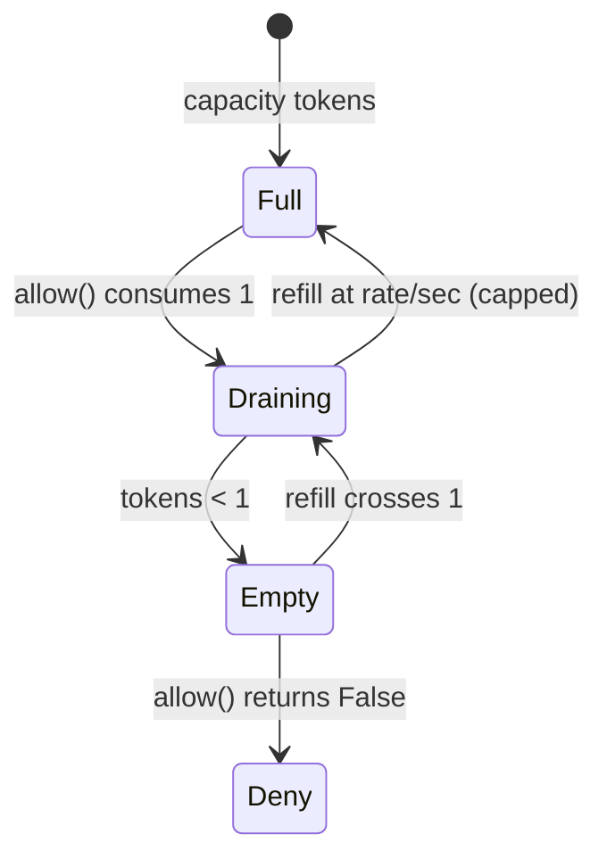
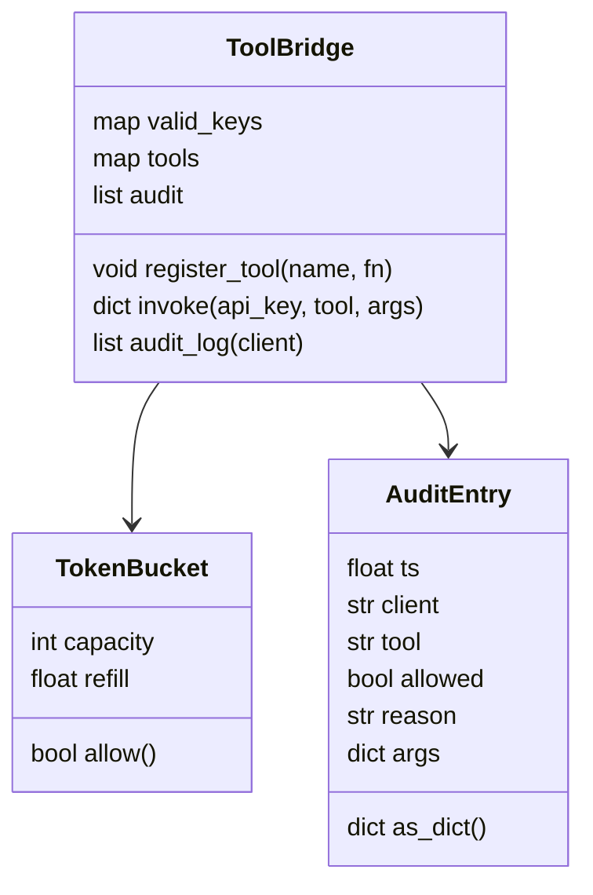
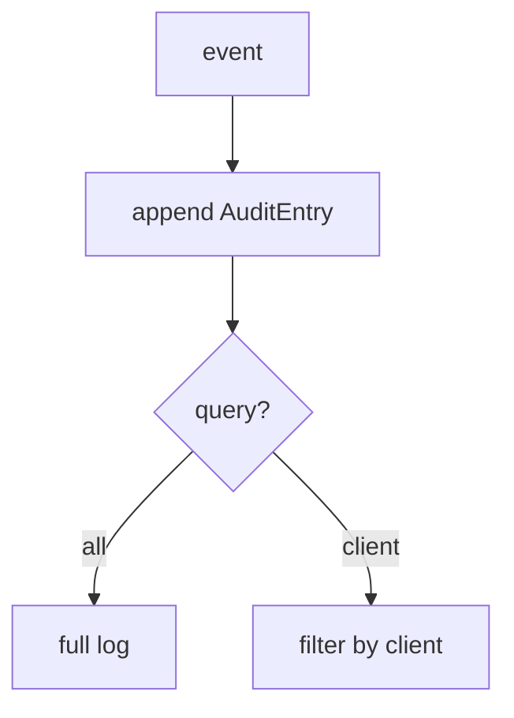

# DESIGN — The Audited Tool Bridge

## 1. Gateway pipeline

## 2. Call sequence

## 3. Token bucket

## 4. Data model

## 5. Audit flow

## Key decisions
- **Auth first** — nothing runs before the key check.
- **Audit every path** — allow, deny, and error all logged with a reason.
- **Per-client buckets** — one noisy client can't starve others.
