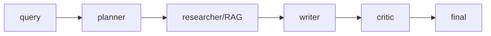
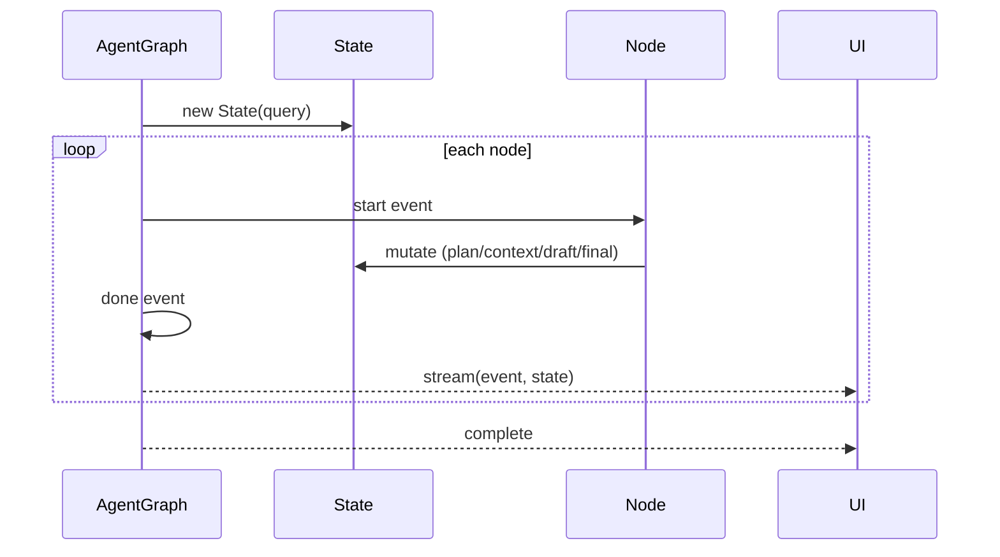
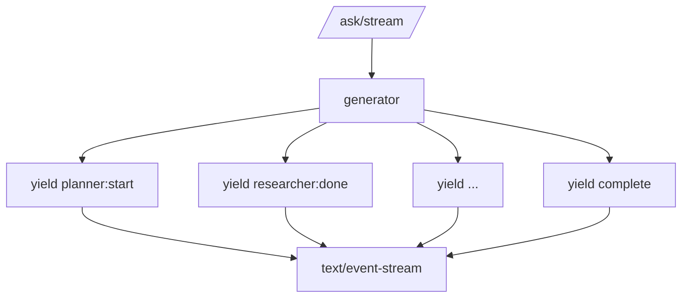
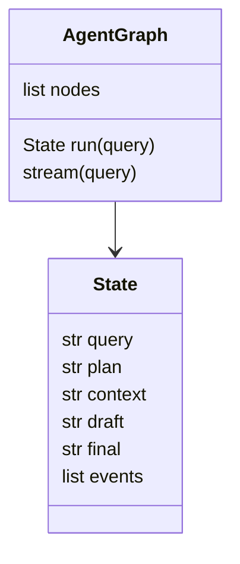

# DESIGN — The Capstone

## 1. Multi-agent graph

## 2. Shared state flow

## 3. Streaming (SSE)

## 4. Data model

## Key decisions
- **Shared mutable State** — like LangGraph's channel; each node reads/writes what it needs.
- **Stream per node** — the UI gets progress without waiting for the whole run.
- **Pluggable everything** — LLMs, retriever, and tracing are all injected, never hardcoded.
