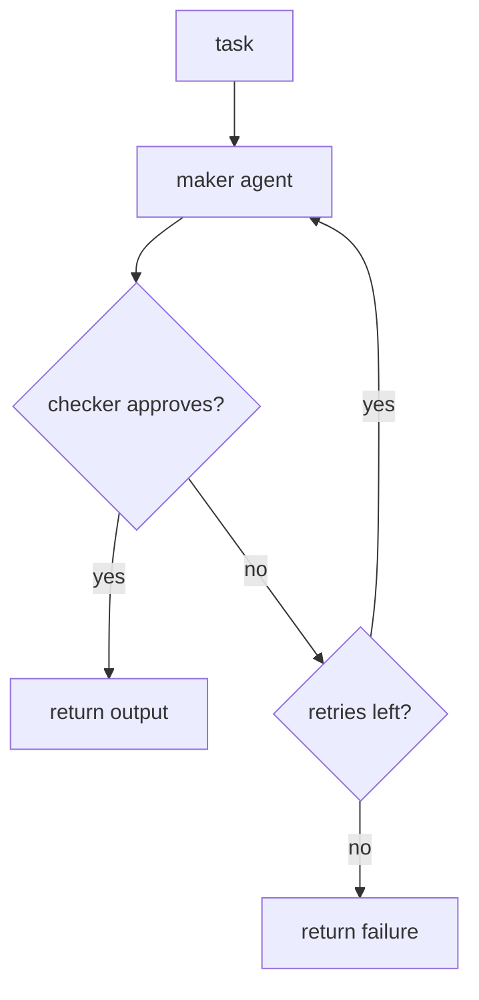
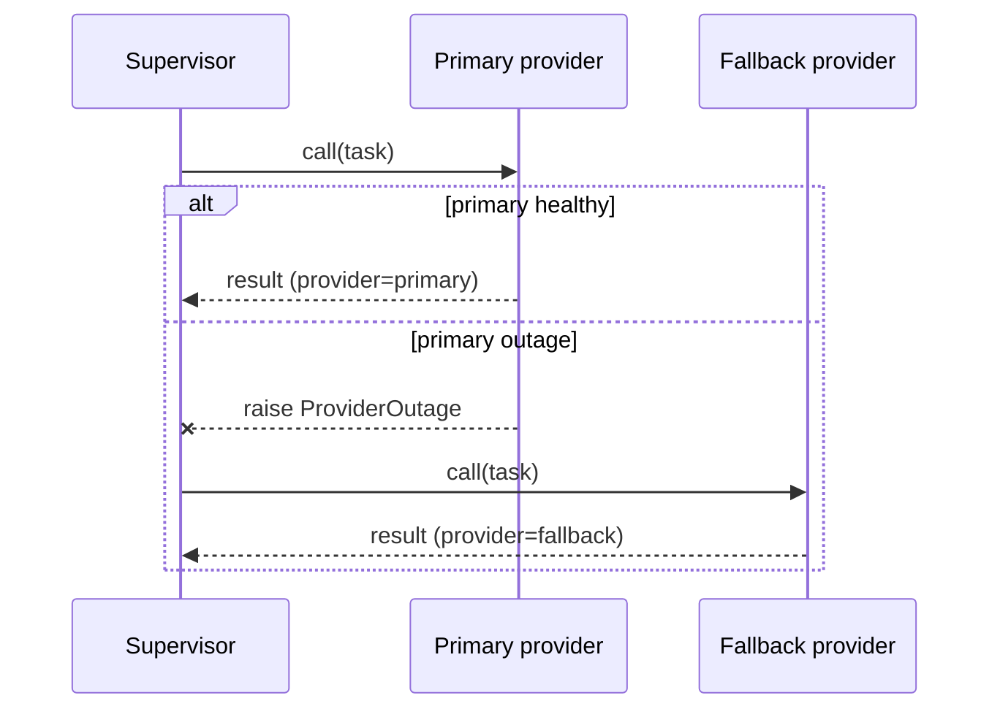
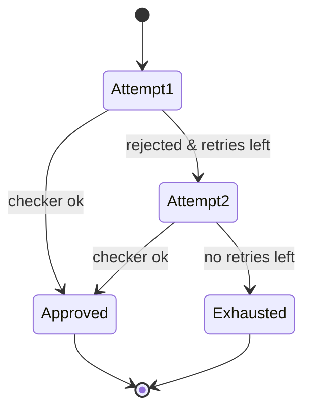
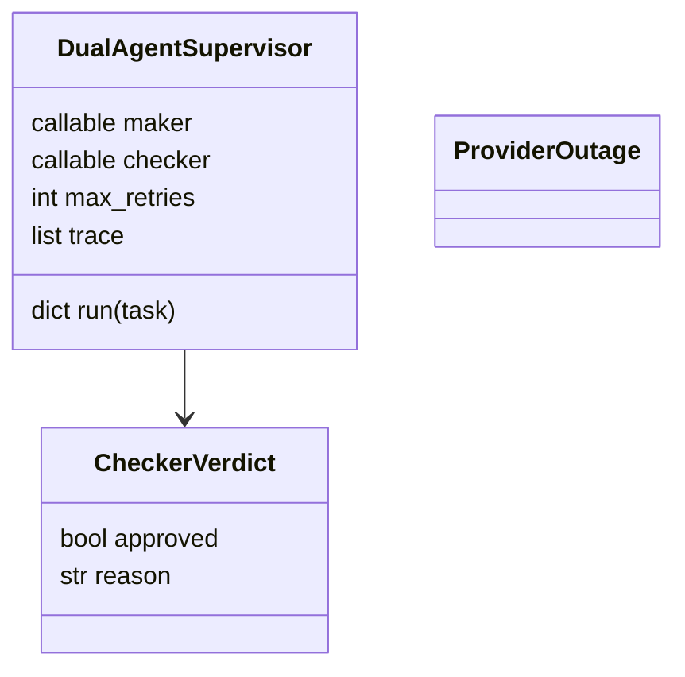

# DESIGN — The Dual-Agent Supervisor

## 1. Maker-checker loop

## 2. Failover per agent

## 3. Retry state machine

## 4. Data model

## Key decisions
- **Failover is broad** — any exception on the primary triggers the fallback (outages are
  messy; don't guess which error means "down").
- **Bounded by design** — `max_retries` is a hard cap; the loop can never spin forever.
- **Trace everything** — every attempt records maker value, provider, and verdict for audit.
