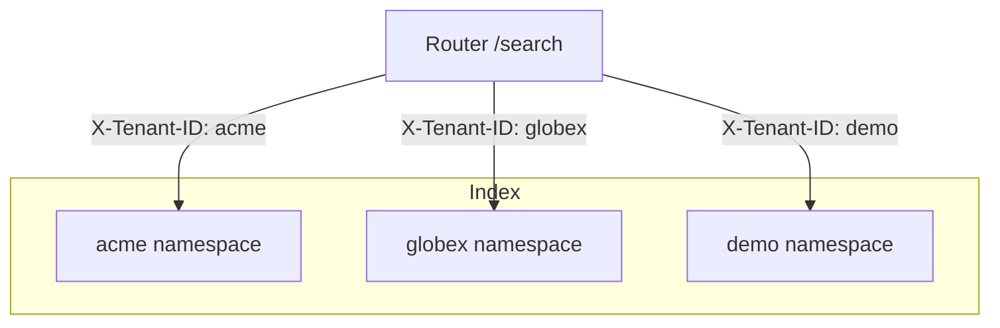
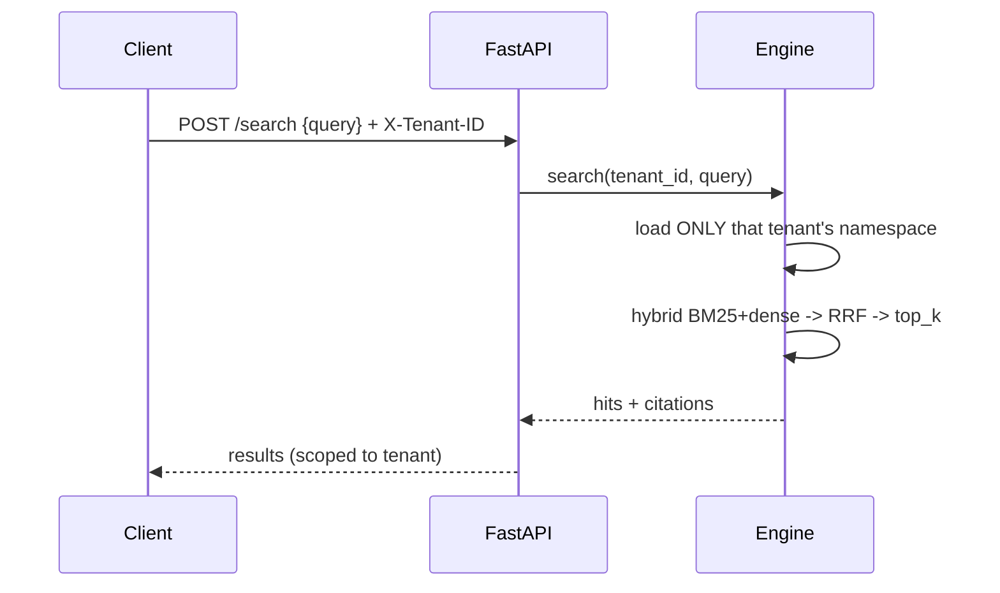
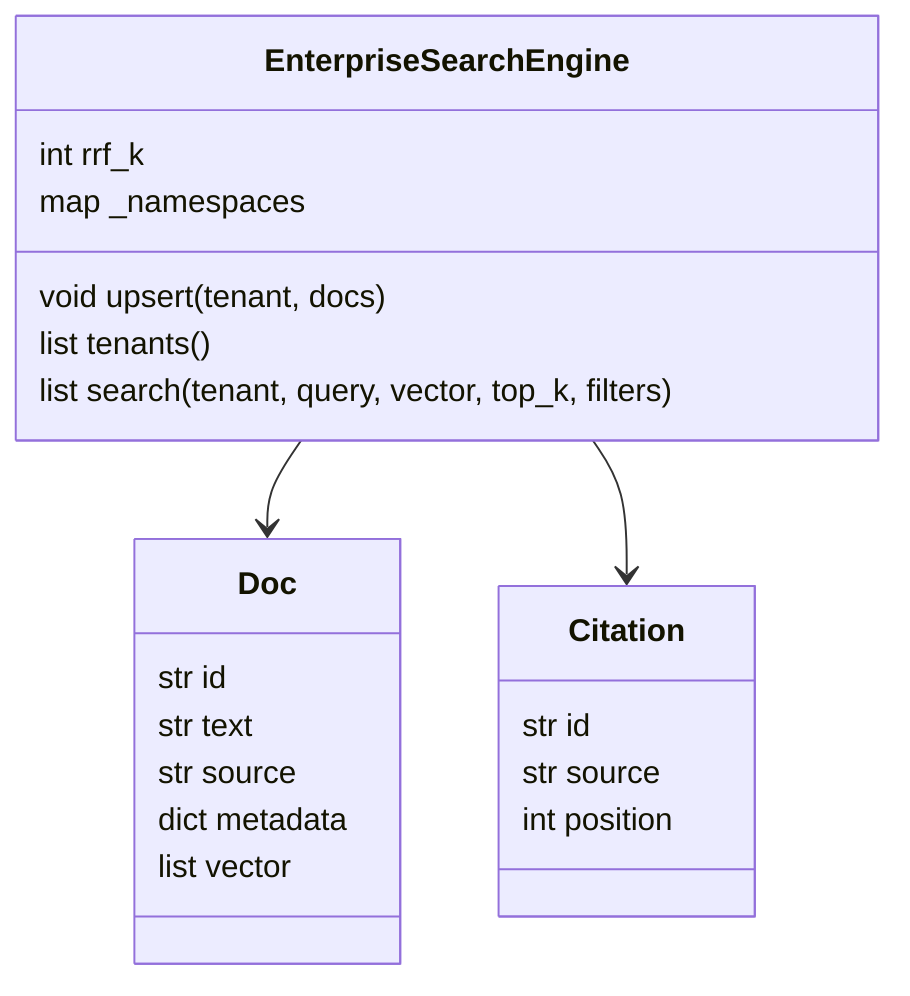
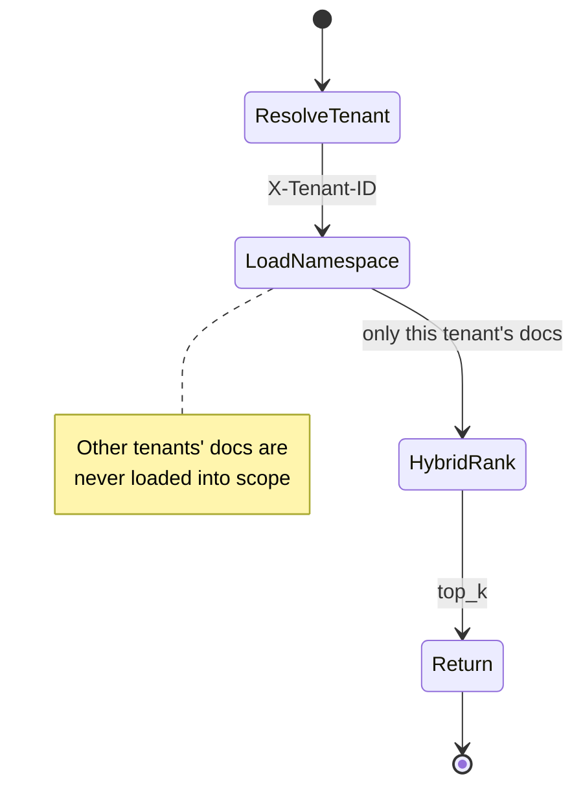

# DESIGN — The Enterprise Search Engine

## 1. Multi-tenant architecture



## 2. Request flow



## 3. Hybrid fusion

```mermaid
flowchart TD
    Q[query] --> S[BM25 sparse ranks]
    Q --> D[dense cosine ranks]
    S --> F[RRF: sum 1/(k+rank)]
    D --> F
    F --> T[top_k + citations]
```

## 4. Data model



## 5. Isolation guarantee



## Key decisions
- **Namespace-per-tenant** — hard isolation at the data layer, not a post-filter.
- **Hybrid + RRF** — robust recall without score calibration.
- **Tenant via header** — clean trust boundary for a fronting auth gateway.
