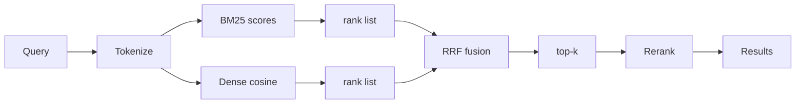
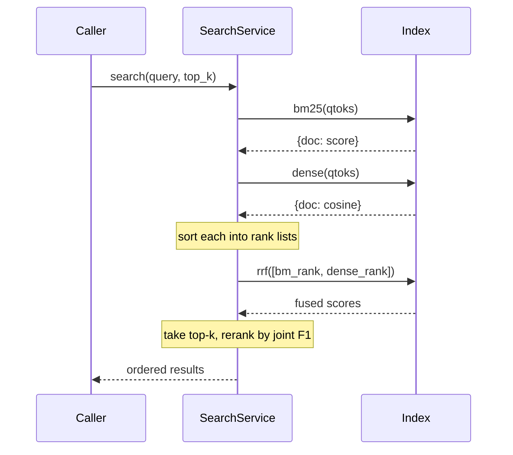
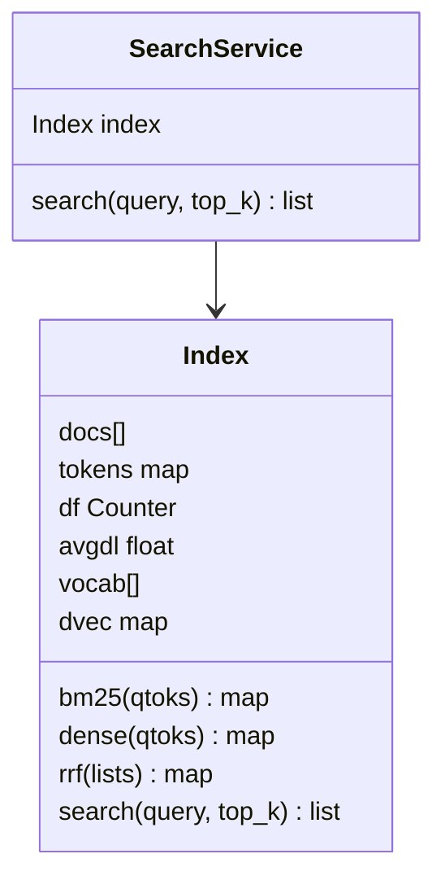
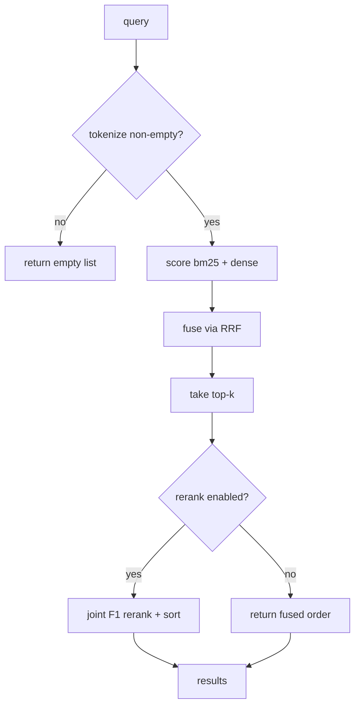

# DESIGN — Enterprise Search Service

## 1. Pipeline overview

## 2. Retrieval + fusion sequence

## 3. RRF math
For each document, `RRF(d) = Σ over lists of 1/(k + rank_in_list + 1)`, with `k=60`.
Rank-based, so it needs no calibration between BM25 and cosine scales.

## 4. Data model

## 5. Failure / edge handling

## Key decisions
- **Rank-based fusion (RRF)** — avoids fragile cross-method score normalization.
- **Deterministic dense proxy** — offline-testable; clean swap-in point for real embeddings.
- **Rerank only top-k** — keeps the expensive joint scoring cheap.
