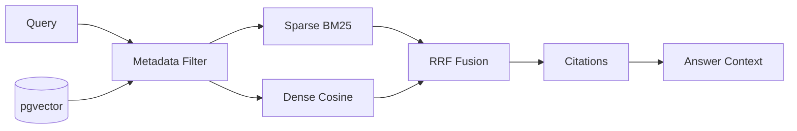
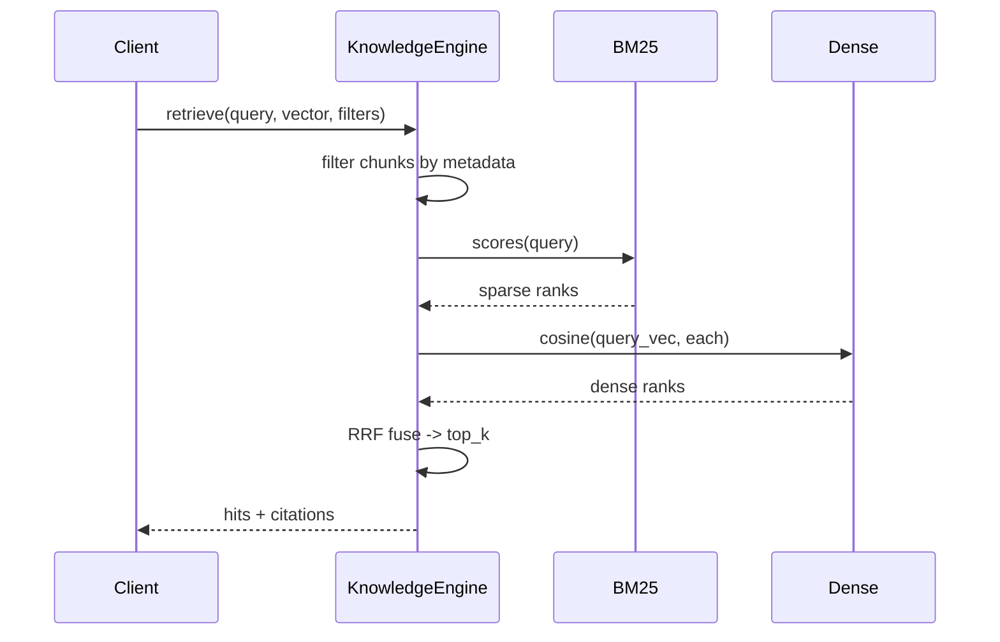
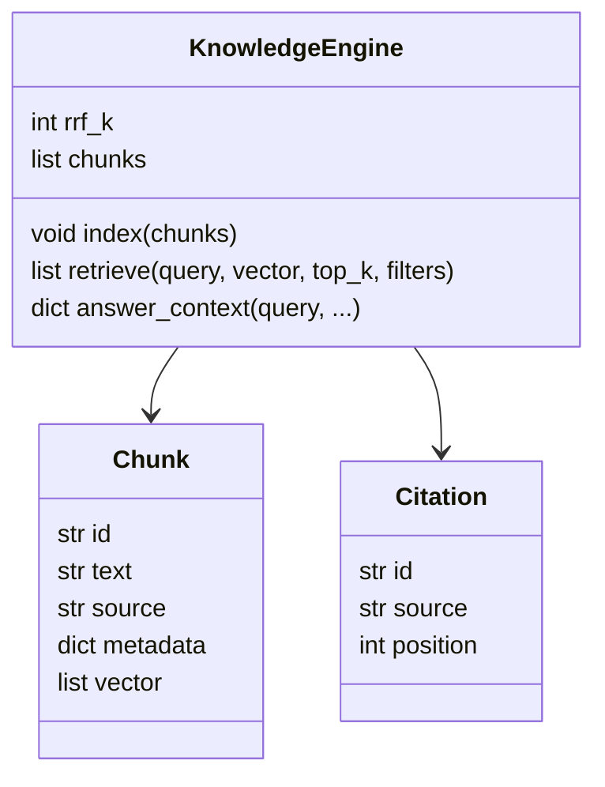
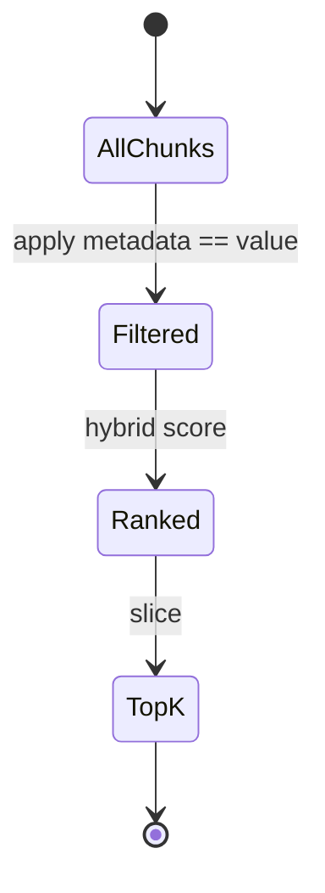

# DESIGN — The Knowledge Engine

## 1. Pipeline overview



## 2. Retrieval sequence



## 3. RRF fusion

```mermaid
flowchart TD
    A[sparse ranks] --> K[1/(k+rank)]
    B[dense ranks] --> K
    K --> S[sum per chunk]
    S --> T[sort desc, take top_k]
```

## 4. Data model



## 5. Metadata filtering



## Key decisions
- **Hybrid + RRF** — robust to both exact-term and semantic queries; RRF needs no score calibration.
- **Filter-before-rank** — cheap scoping; avoids ranking out-of-scope docs.
- **Citations as first-class output** — traceability is a production requirement, not an afterthought.
