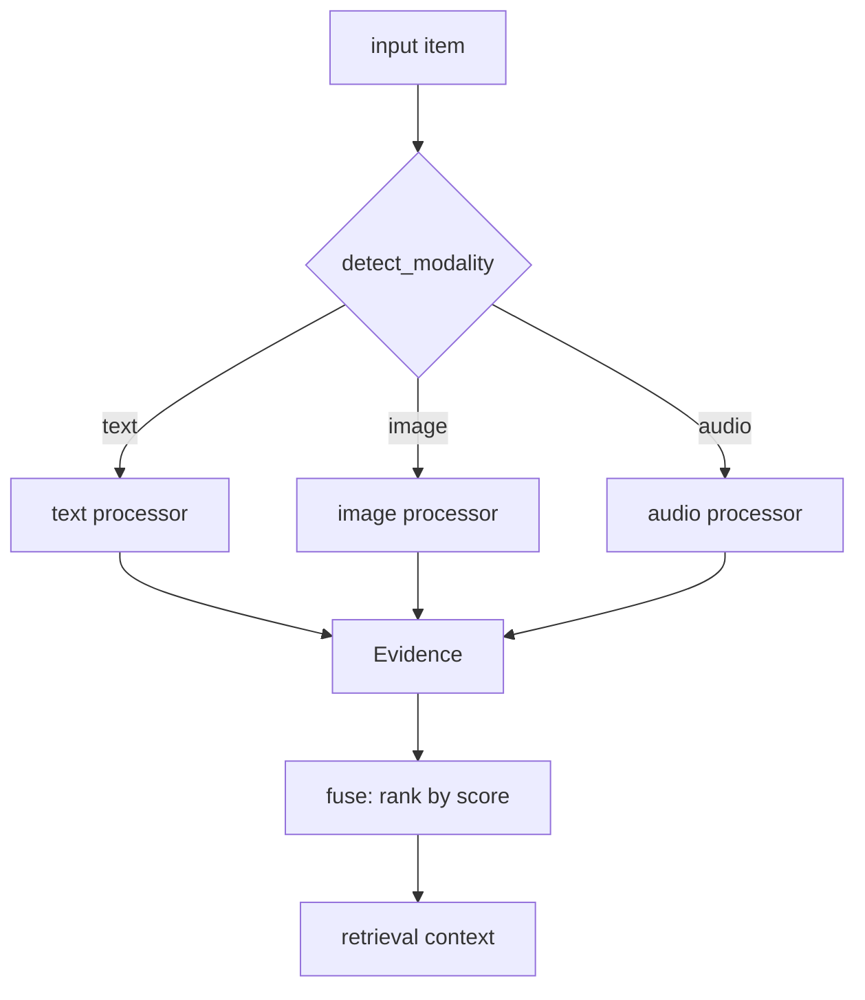
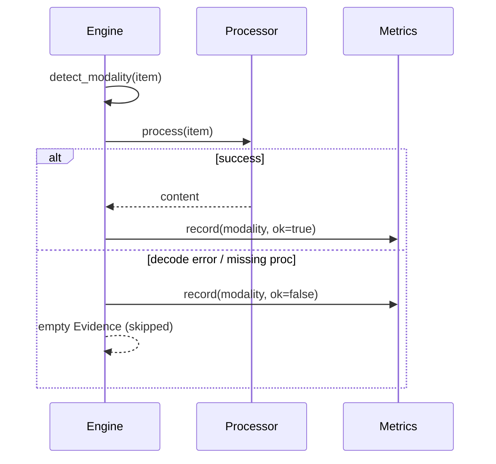
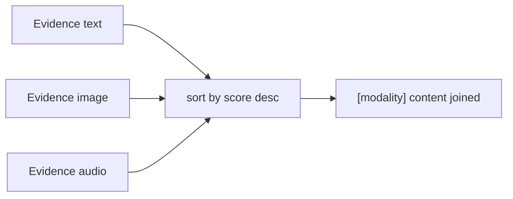
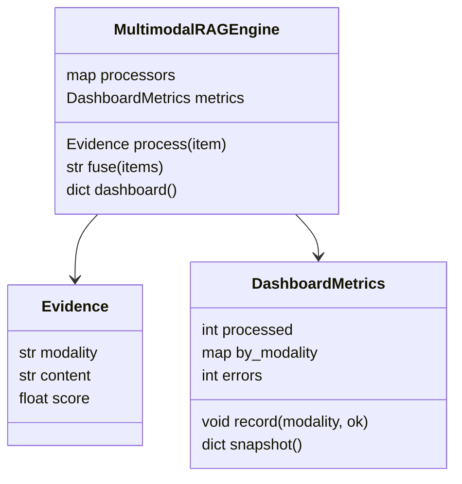

# DESIGN — The Multimodal RAG Engine

## 1. Routing + fusion

## 2. Per-item processing

## 3. Fusion ranking

## 4. Data model

## Key decisions
- **Pluggable processors** — swap heuristic stand-ins for CLIP/Whisper without touching routing/fusion.
- **Fail soft** — a bad file is an error metric, not an exception; the query still returns what it can.
- **Ranked fusion** — best-scored evidence first, so the LLM sees the strongest signal up top.
