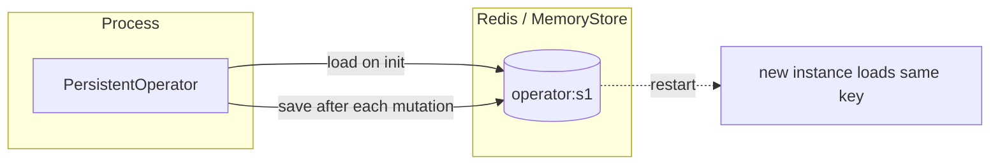
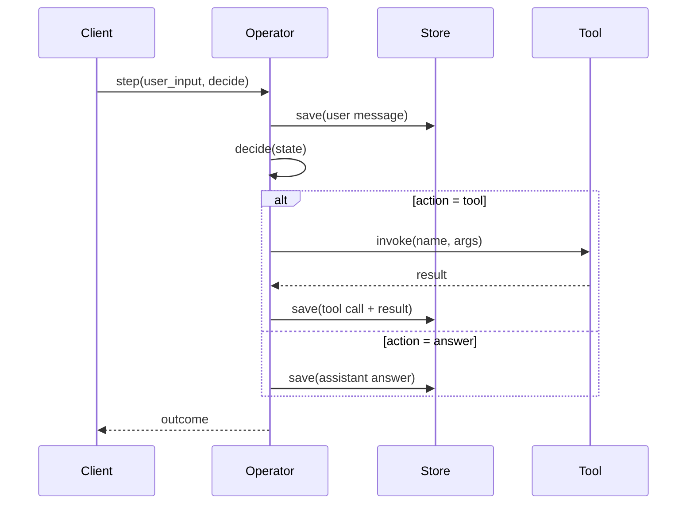
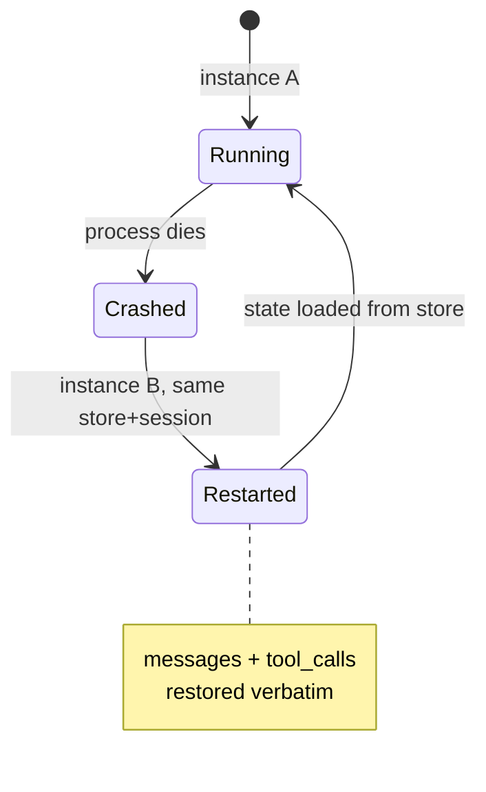
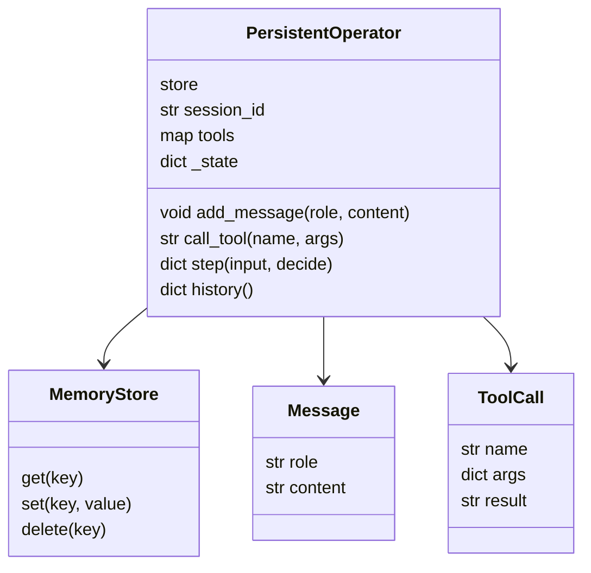
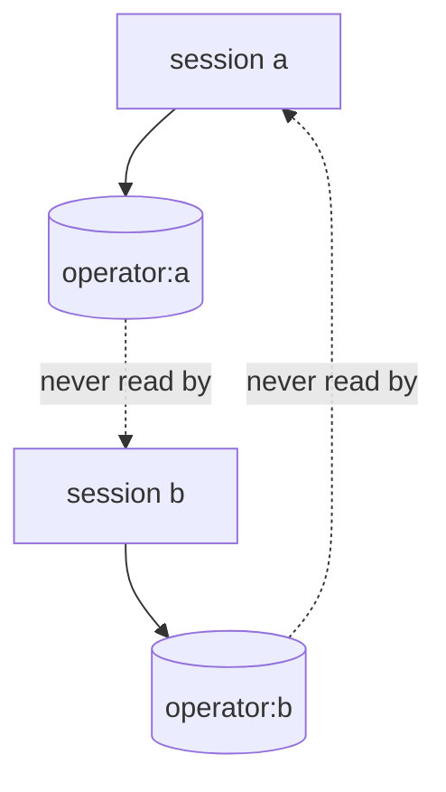

# DESIGN — The Persistent Operator

## 1. Externalized state

## 2. Turn sequence

## 3. Restart continuity

## 4. Data model

## 5. Session isolation

## Key decisions
- **Write-through persistence** — save after every mutation; no lost work on crash.
- **Store abstraction** — 3-method interface; Redis drops in without touching agent logic.
- **Injected `decide`** — keeps the LLM/LangGraph loop out of the core (testable, swappable).
