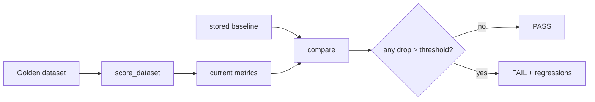
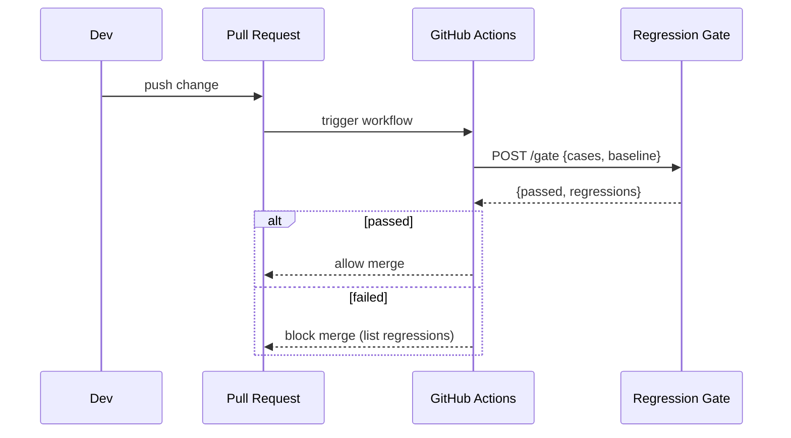
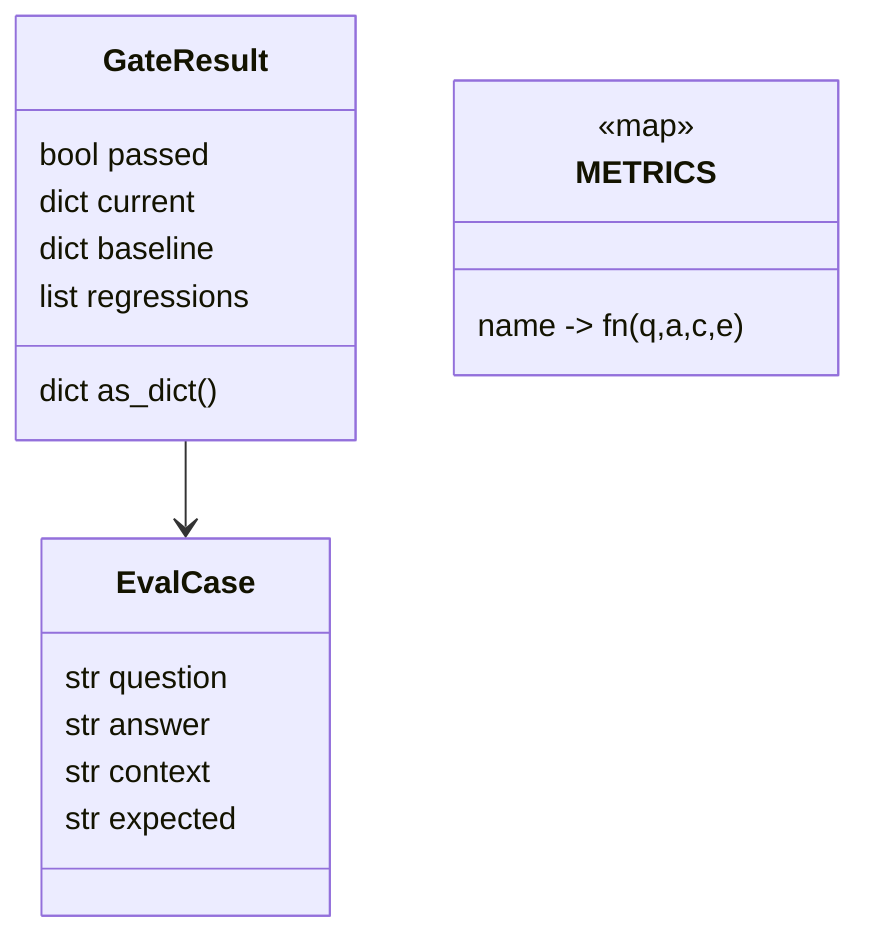
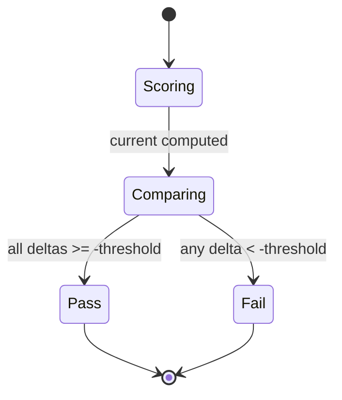

# DESIGN — The Regression Gate

## 1. Gate pipeline



## 2. CI integration



## 3. Metric computation

```mermaid
flowchart TD
    A[case: q,a,c,e] --> M1[answer_correctness = overlap(a,e)/e]
    A --> M2[context_relevance = overlap(c,q)/q]
    A --> M3[faithfulness = overlap(a,c)/a]
    M1 --> AVG[mean across cases]
    M2 --> AVG
    M3 --> AVG
```

## 4. Data model



## 5. Verdict state machine



## Key decisions
- **Deterministic metrics** — reproducible in CI; no flaky LLM calls on every PR.
- **Threshold-based verdict** — simple, tunable, explainable (lists exact regressions).
- **Swappable scorers** — metric functions are the only thing to replace for RAGAS/LangSmith.
