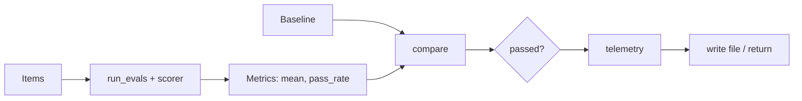
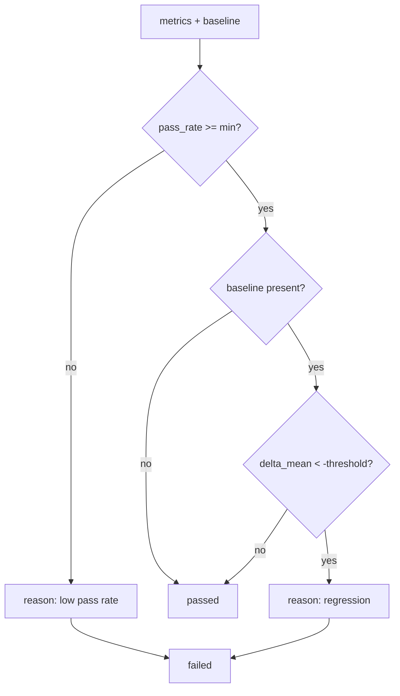
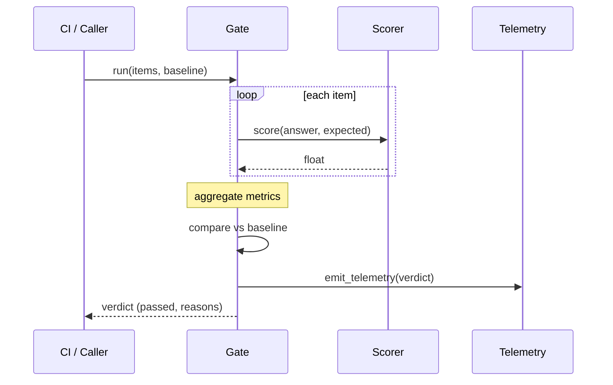
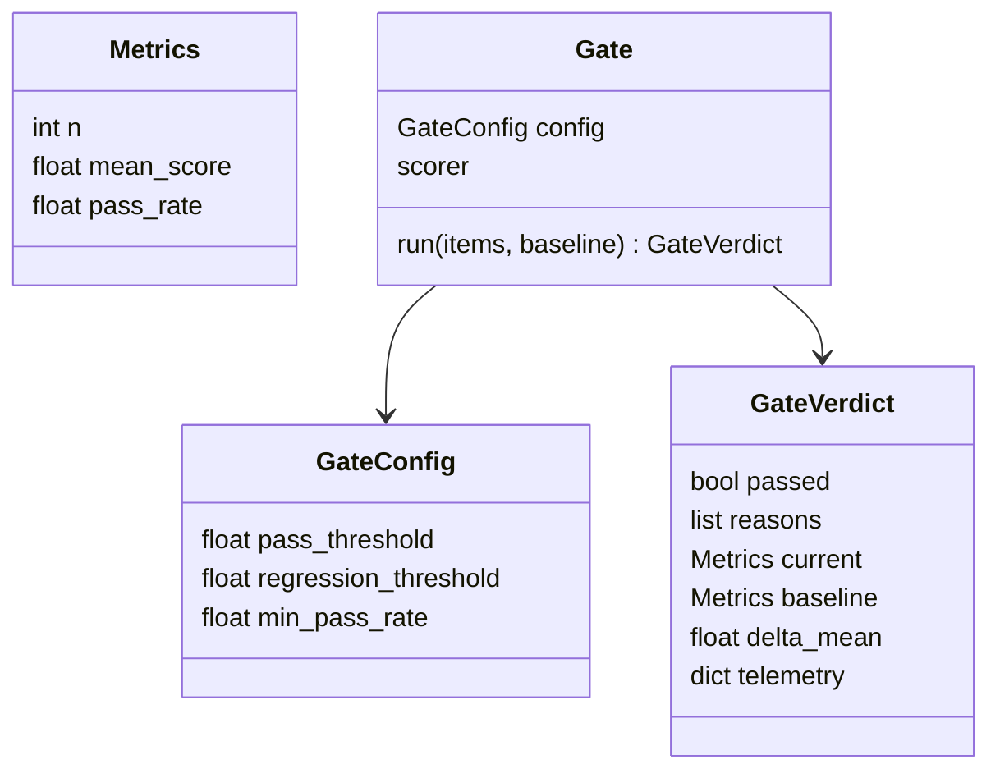
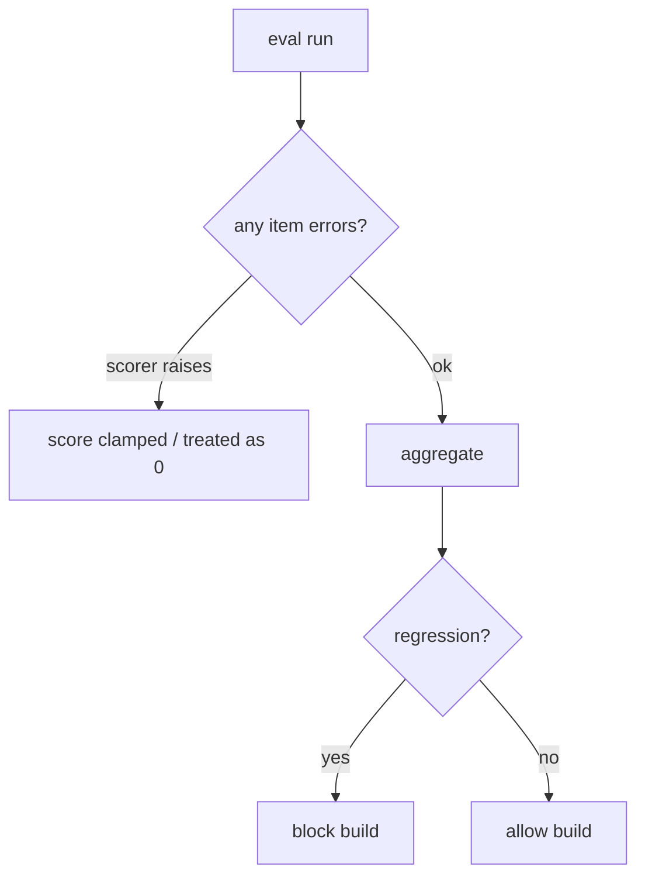

# DESIGN — Regression Telemetry Gate

## 1. Pipeline overview

## 2. Gate decision flow

## 3. Sequence

## 4. Data model

## 5. Failure modes

## Key decisions
- **Pluggable scorer** — gate logic independent of how quality is measured.
- **Rank-free thresholds** — simple, explainable pass/fail rules.
- **Telemetry always emitted** — even on pass, for trend tracking.
