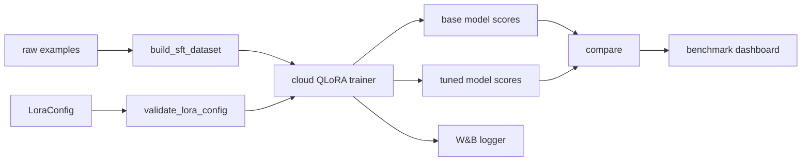
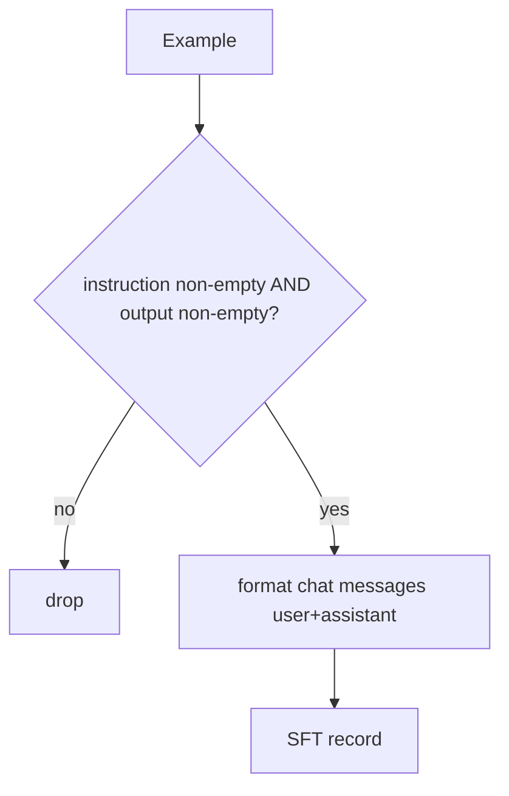
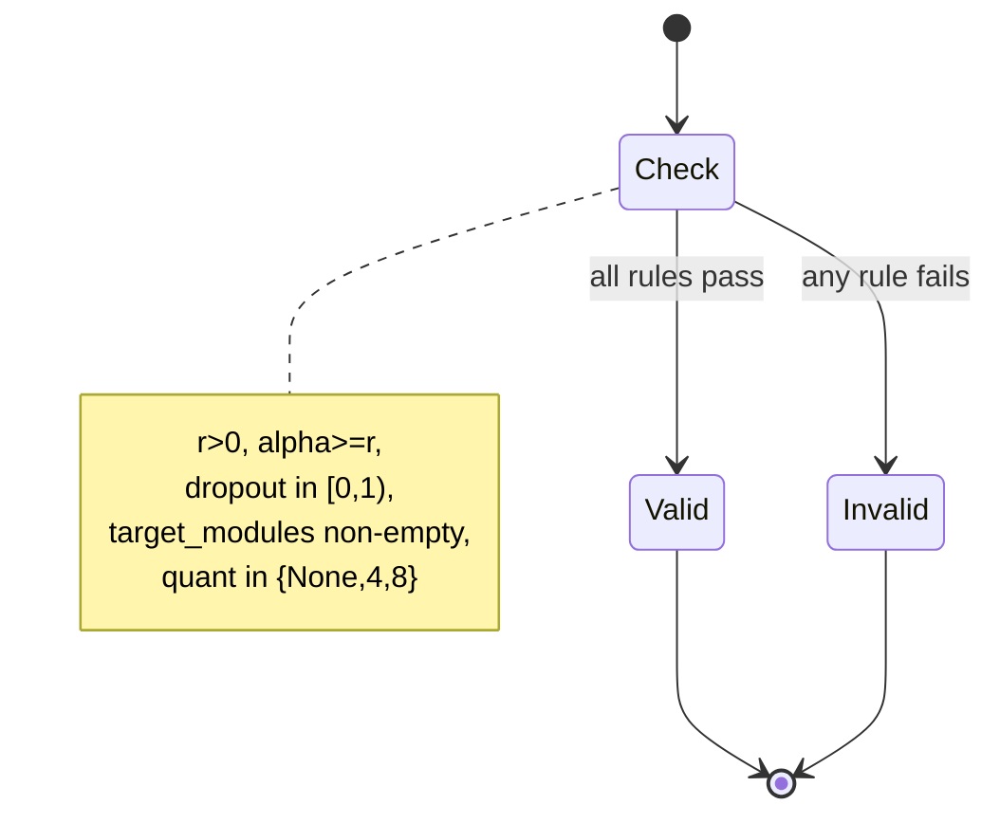
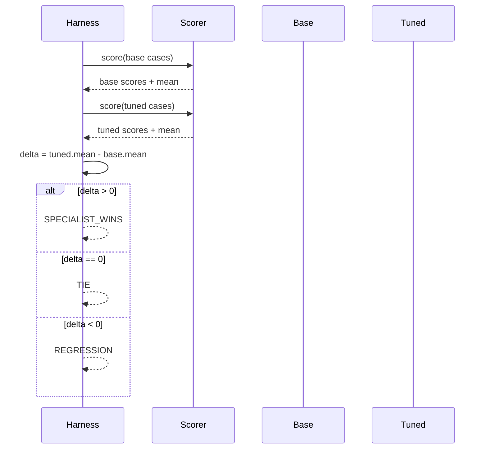
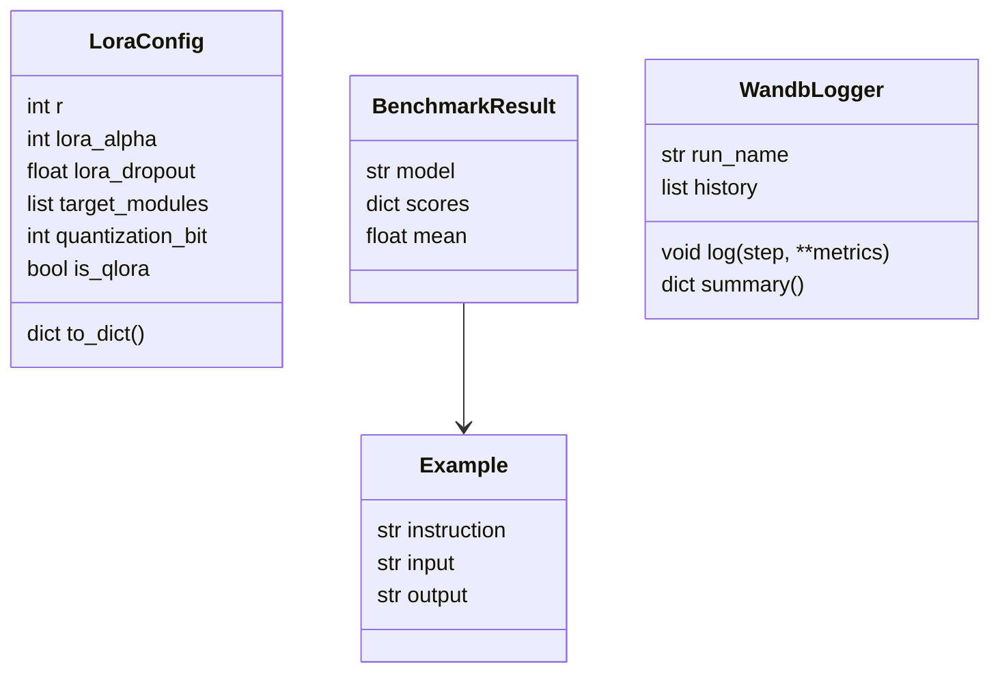

# DESIGN — The Specialist Model

## 1. Control-plane overview

## 2. Dataset engineering

## 3. Config validation

## 4. Benchmark + verdict

## 5. Data model

## Key decisions
- **Control plane only** — the laptop never trains; it prepares, validates, and proves.
- **Explicit verdict** — no ambiguous "looks better"; compare() returns a machine-readable result.
- **Pluggable scorer** — swap heuristic for exact-match / LLM-judge / RAGAS without changing the harness.
