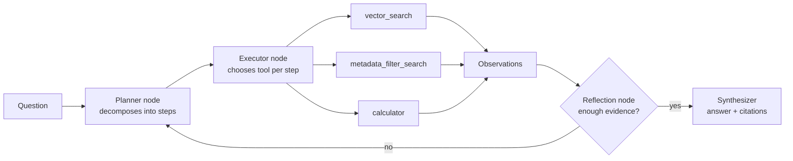

# Agentic Research Agent

LangGraph plan-and-execute RAG agent with a reflection loop, multi-tool use (vector search, metadata-filter search, calculator), citations, and a streaming SSE API.

## Architecture



## Run

```bash
uv sync
# ingest the corpus once (uses local MiniLM embeddings):
uv run python scripts/ingest.py   # if present; otherwise any script that fills chroma_db/research_docs
# start the API:
uv run uvicorn main:app --port 8000
```

Endpoints:
- `GET /health` — LLM status + corpus size
- `POST /ask` — `{"question": "..."}` → answer, citations, plan, reflections
- `POST /ask/stream` — same, as server-sent events (plan → steps → answer)

Requires `YOLO_AUTO_API_KEY` (or `OPENAI_API_KEY`) in `.env` for LLM calls; retrieval itself is local.

## Test

```bash
uv run pytest -v   # offline: calculator safety, tool dispatch, vector + metadata search
```

## Production notes
- The calculator tool evaluates only pure arithmetic via an AST allowlist (no names, no calls) — it is safe to expose to an LLM-driven loop.
- Reflection caps iteration count to bound cost; each extra loop is another planner+executor LLM call.
- Citations are index-sanitized against the actual observation count so the UI never renders dangling `[9]` references.