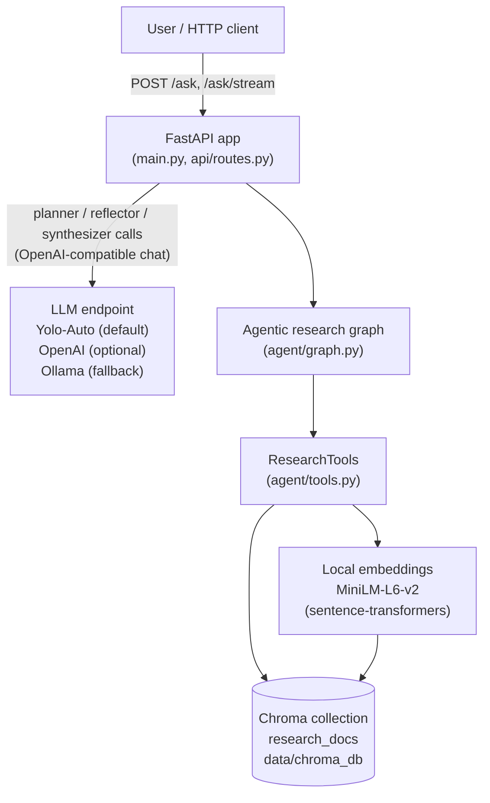
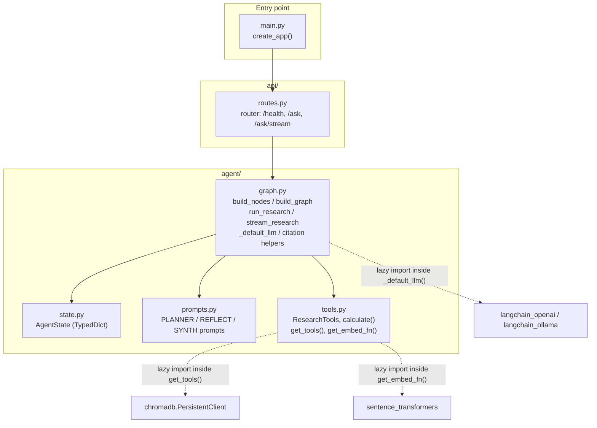
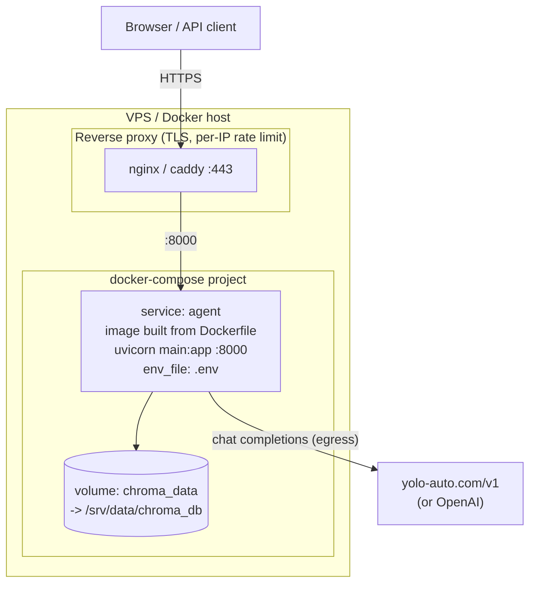
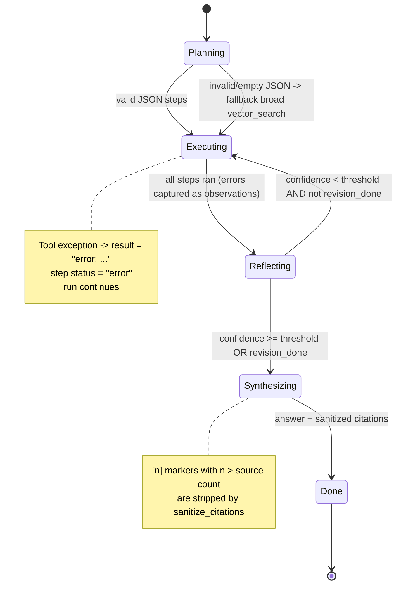

# Design — Agentic Research Agent

LangGraph **plan-and-execute + reflection** RAG agent with a streaming FastAPI (SSE).
This document describes the code as it exists in this repository:

| Module | Responsibility |
|---|---|
| `main.py` | `create_app()` — builds the FastAPI app, lazily attaches `app.state.llm` (via `agent.graph._default_llm()`) and `app.state.tools` (via `agent.tools.get_tools()`), includes the API router |
| `agent/state.py` | `AgentState` — a `TypedDict(total=False)` carrying `question`, `plan`, `steps`, `observations`, `reflections`, `revision_done`, `answer`, `citations` |
| `agent/prompts.py` | `PLANNER_PROMPT`, `REFLECT_PROMPT`, `SYNTH_PROMPT` — each starts with a machine-readable marker (`PLAN:`, `REFLECT:`, `SYNTH:`) so tests can route canned responses and logs are greppable |
| `agent/tools.py` | `ResearchTools` (`vector_search`, `metadata_filter_search`, `calculator`), safe-AST `calculate()`, lazy singletons `get_tools()` / `get_embed_fn()` over a persisted Chroma collection `research_docs` |
| `agent/graph.py` | `build_nodes()`, `build_graph()` (compiled LangGraph), `run_research()`, `stream_research()`, `_default_llm()` (3-tier LLM selection), citation helpers (`build_citations`, `sanitize_citations`) and tolerant JSON extraction (`_extract_json`) |
| `api/routes.py` | FastAPI router: `GET /health`, `POST /ask`, `POST /ask/stream` (SSE) |
| `tests/test_tools.py` | Offline tests: calculator safety, tool dispatch, vector + metadata search against an ephemeral Chroma client |

---

## 1. System context

The agent sits between a human user (or any HTTP client) and two external systems: an OpenAI-compatible LLM endpoint (Yolo-Auto by default, OpenAI optional, Ollama as last resort) and a local document corpus stored in Chroma. Retrieval is fully local; only planning/reflection/synthesis touch the network.



## 2. Component diagram

Internal structure of the Python package. Note the deliberate dependency direction: `graph.py` never imports concrete LLM or vector-store clients at module level — both are injected, which is what makes the graph unit-testable with fakes.



## 3. Retrieval & data-flow sequence

What happens on `POST /ask/stream` for a question that needs one revision pass (low first reflection). The non-streaming `POST /ask` runs the same node sequence via `graph.invoke()` and returns the final state in one JSON body.

```mermaid
sequenceDiagram
    participant C as Client
    participant R as api/routes.py
    participant G as agent/graph.py
    participant L as LLM (chat)
    participant T as ResearchTools
    participant V as Chroma (research_docs)

    C->>R: POST /ask/stream {"question": ...}
    R->>G: stream_research(question, llm, tools)
    G-->>R: ("phase", "planning")
    G->>L: PLANNER_PROMPT(question)
    L-->>G: JSON array of steps [{tool, input, purpose}]
    Note over G: _extract_json tolerates fences/prose;<br/>falls back to one broad vector_search
    G-->>R: ("phase", "executing")
    loop each unexecuted plan step
        G->>T: run(tool_name, input)
        T->>V: query(query_embeddings=[embed(query)])
        V-->>T: ids, documents, metadatas, distances
        T-->>G: [{"text", "source", score}]
    end
    G-->>R: ("phase", "reflecting")
    G->>L: REFLECT_PROMPT(question, observations summary)
    L-->>G: {"confidence": 40, "critique": ..., "missing": [...]}
    Note over G: confidence < threshold and not revision_done:<br/>append revision steps, set revision_done=True
    G->>T: run("vector_search", missing term)
    T-->>G: results
    G->>L: REFLECT_PROMPT again (second reflection)
    L-->>G: {"confidence": 80, ...}
    G-->>R: ("phase", "synthesizing")
    G->>L: SYNTH_PROMPT(question, numbered sources) [streamed]
    L-->>R: ("token", chunk) ...
    Note over G: sanitize_citations drops [n] > source count
    G-->>R: ("done", final state)
    R-->>C: SSE data: {"type": "token", "payload": ...}
```

Citation numbering is assigned by `build_citations()` in first-seen order across all observations; `sanitize_citations()` strips any `[n]` marker whose index exceeds the real source count, so the UI can never render a dangling reference.

## 4. Deployment topology

Single container (see `Dockerfile`: `python:3.12-slim`, `uv sync --frozen --no-dev`, uvicorn on port 8000). The Chroma persist directory is a named volume so the ingested corpus survives container rebuilds. In production it sits behind a TLS reverse proxy with rate limiting (the reflection loop multiplies LLM calls per question — see `docs/DEPLOYMENT.md`).



## 5. Failure modes & state diagram

The graph is designed so that *no single failure kills a run*: planner JSON garbage degrades to one broad search; a crashing tool call becomes an `error:` observation; a bad metadata spec returns `[]`; the calculator rejects anything outside the AST allowlist; the reflector gets exactly one revision pass (`revision_done` guard) to bound cost.



API-level failure modes:

| Failure | Behavior | Where |
|---|---|---|
| No LLM key configured | App still boots; `/health` reports `"llm": "missing"`; `/ask` returns 503 with a hint to check `.env` | `main.create_app`, `api.routes.ask_impl` |
| Corpus not ingested | `vector_search` returns `[]` on empty collection; answer degrades but run completes | `ResearchTools.vector_search` |
| Bad metadata filter spec | Returns `[]` instead of raising | `ResearchTools.metadata_filter_search` |
| Malicious calculator input | AST allowlist rejects names/calls → `error:` string, never executes | `calculate()` |
| LLM emits non-JSON | `_extract_json` strips fences, then scans for outermost `[...]`/`{...}`; if still unparseable, planner falls back, reflector scores confidence 0 (triggers the one revision pass) | `agent/graph.py` |
| Streaming error mid-run | Emits a final SSE `{"type": "error", ...}` event instead of dropping the connection | `api.routes.ask_stream` |

---

## Key decisions & trade-offs

### D1 — Plan-and-execute with a bounded reflection loop (vs. ReAct free loop)

| Option | Pros | Cons | Chosen? |
|---|---|---|---|
| ReAct loop (think→act→observe until done) | Flexible, no upfront plan | Unbounded LLM calls → unbounded cost; hard to test | |
| **Plan-and-execute + 1 reflection pass** | Cost is bounded (≤ 2× executor passes); plan is inspectable in the API response; deterministic topology for tests | Less adaptive than ReAct; a bad plan only gets one fix | ✅ |

The bound is enforced twice: the `revision_done` flag in state and the conditional edge in `route_after_reflection`. Threshold is tunable via `REFLECT_CONFIDENCE_THRESHOLD` (default 60).

### D2 — Injected LLM/tools vs. module-level singletons

`build_nodes(llm, tools)` closes over injected dependencies; production singletons (`_default_llm`, `get_tools`) are lazy and cached. Trade-off: slightly more wiring in `main.create_app()` in exchange for fully offline tests (tests use an ephemeral Chroma client and fake embed functions — see `tests/test_tools.py`).

### D3 — Local MiniLM embeddings + persisted Chroma (vs. hosted embedding API)

| Option | Pros | Cons | Chosen? |
|---|---|---|---|
| Hosted embeddings (e.g. OpenAI) | Higher quality vectors | Per-query egress cost + latency; retrieval no longer works offline | |
| **Local sentence-transformers MiniLM-L6-v2** | Free after first cache, ~80MB model, retrieval fully offline | Weaker than frontier embedding models | ✅ |

Model name is configurable via `LOCAL_EMBEDDING_MODEL`; the collection uses cosine space (`hnsw:space: cosine`) and normalized embeddings.

### D4 — Safe calculator via AST allowlist (vs. `eval` / no math tool)

`calculate()` parses with `ast.parse(mode="eval")` and walks only `Constant`, `BinOp` (+ − × ÷ // % **) and unary ±. Anything else raises and is returned as an `error:` string. This lets the LLM do arithmetic without any code-execution surface. Trade-off: no functions/constants (`math.sqrt` unavailable) — acceptable for a research agent.

### D5 — SSE streaming with phase events (vs. plain JSON response only)

`stream_research()` runs planner/executor/reflector synchronously, then streams only the synthesis tokens. Trade-off: the client sees progress phases (`planning → executing → reflecting → synthesizing`) and token-by-token text, at the cost of duplicating the revision logic outside the compiled graph (the streaming path drives nodes directly rather than using `graph.stream`). Both paths share `build_nodes`, so behavior stays consistent.

### D6 — Citation sanitization as a post-processing invariant

Rather than trusting the LLM to cite only real sources, `sanitize_citations()` mechanically drops out-of-range `[n]` markers after synthesis. Cheap insurance; the strict citation rules in `SYNTH_PROMPT` remain the primary mechanism.
