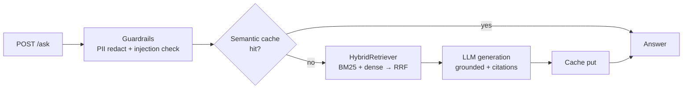

# Enterprise Knowledge Assistant

Production-grade RAG service (FastAPI): hybrid BM25+dense retrieval with RRF fusion, metadata filters, PII redaction + prompt-injection guardrails, semantic response caching, and grounded answers with citations.

## Architecture



## Run

```bash
uv sync
# ingest markdown knowledge base into Chroma (data/kb/*.md):
uv run python -m app.main  # or start uvicorn after ingesting via HybridRetriever.ingest_files
uv run uvicorn app.main:app --port 8000
```

Endpoints:
- `GET /health` — provider + doc count
- `POST /ask` — `{"question": "...", "k": 4}` → answer, citations, cached flag

Requires `YOLO_AUTO_API_KEY` (or `OPENAI_API_KEY`) in `.env`; without a key `/ask` degrades to top-passage mode instead of failing.

## Test

```bash
uv run pytest tests -v   # offline: chunking, RRF math, end-to-end retrieval
```

## Production notes
- Reranking is opt-in (`RERANK_ENABLED=1`) because the cross-encoder downloads ~80MB; default off on low-power machines.
- Semantic cache threshold is the safety dial: lower it to trade hit-rate for freshness.
- Guardrails run before any LLM call, so blocked questions cost nothing.