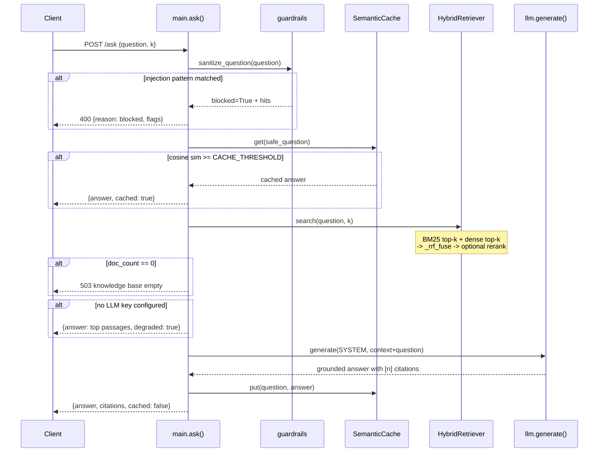
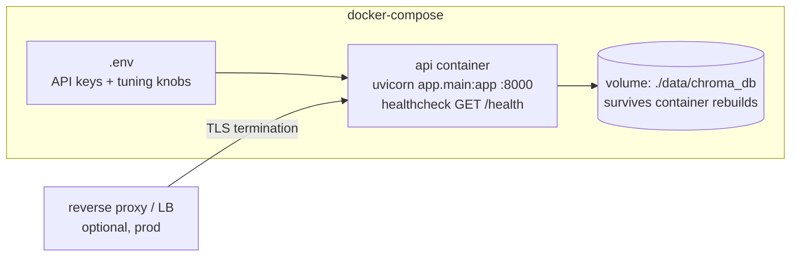
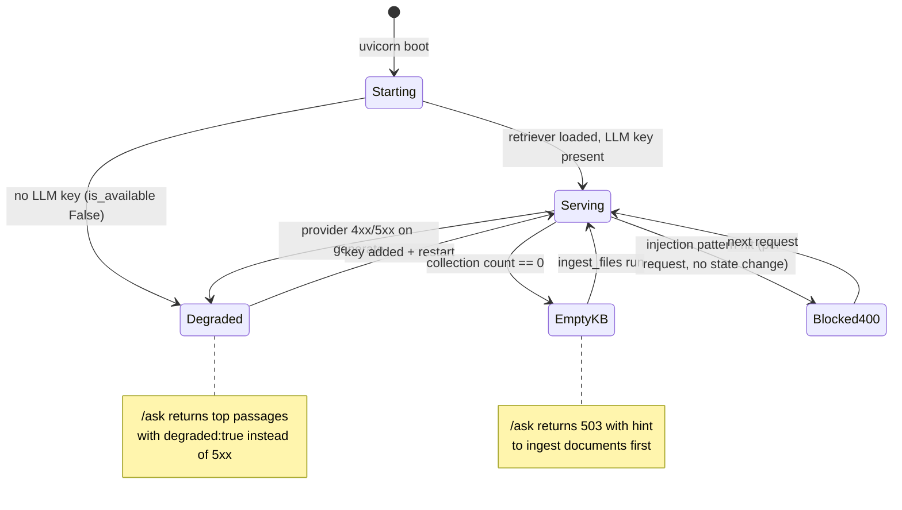

# DESIGN — Enterprise Knowledge Assistant

Architecture of a production-grade RAG service: FastAPI + hybrid BM25/dense retrieval with RRF fusion, guardrails, semantic cache, and graceful degradation. Every diagram below maps to real modules in `app/`.

## 1. System Context (noob level)

Who talks to what. The service sits between API clients and two external systems: the LLM provider (OpenAI or Yolo-Auto) and the local ChromaDB vector store.

```mermaid
flowchart TD
    Client[API client<br/>curl / SDK] -->|POST /ask, GET /health| Svc[Enterprise Knowledge Assistant<br/>FastAPI service]
    Svc -->|chat/completions (HTTPS)| LLM[LLM provider<br/>OpenAI or Yolo-Auto]
    Svc -->|persistent read/write| Chroma[(ChromaDB<br/>data/chroma_db)]
    KB[Markdown knowledge base<br/>data/kb/*.md] -->|batch ingest| Chroma
```

## 2. Component Diagram (practitioner level)

Modules, their responsibilities, and data types crossing boundaries.

```mermaid
flowchart LR
    subgraph app
        main[main.py<br/>FastAPI routes<br/>AskRequest -> dict]
        guard[guardrails.py<br/>sanitize_question<br/>GuardrailResult]
        cache[cache.py<br/>SemanticCache<br/>get/put, cosine_similarity]
        ret[retrieval.py<br/>HybridRetriever<br/>search -> list RetrievedDoc]
        llm[llm.py<br/>generate(system,user)<br/>str | LLMError]
        cfg[config.py<br/>Settings frozen dataclass<br/>settings singleton]
    end
    main --> guard
    main --> cache
    main --> ret
    main --> llm
    guard -.-> cfg
    cache -.-> cfg
    ret -.-> cfg
    llm -.-> cfg
    ret -->|PersistentClient| chroma[(ChromaDB)]
    ret -->|encode| st[sentence-transformers<br/>MiniLM, lazy singleton]
```

Key data types:
- `AskRequest` (pydantic): `question` (3–2000 chars), `k` (1–10).
- `RetrievedDoc` (dataclass): `text`, `source`, `score` normalized to (0, 1].
- `GuardrailResult`: `safe_question`, `redactions` counts, `injection_hits`; `.blocked` property.
- `Settings`: frozen dataclass, every field read from env at construction; `settings` is the process-wide singleton.

## 3. Request Flow — `POST /ask` (sequence)

The happy path plus both degradation branches.



## 4. Retrieval Internals (expert level)

How hybrid search works inside `HybridRetriever`, including the RRF math and the rerank opt-in.

```mermaid
flowchart TD
    Q[query text] --> B[BM25Okapi<br/>in-memory index over chunks]
    Q --> D[Dense search<br/>Chroma cosine top-k]
    B --> BL[ranked list A<br/>(idx, score)]
    D --> DL[ranked list B<br/>(idx, score)]
    BL --> F[_rrf_fuse<br/>score_i = sum 1/(RRF_K + rank)<br/>normalized by max possible]
    DL --> F
    F --> RE{RERANK_ENABLED?}
    RE -->|yes| XE[cross-encoder<br/>ms-marco-MiniLM-L-6-v2<br/>~80MB download]
    RE -->|no, default| OUT[list RetrievedDoc<br/>scores in 0,1 descending]
    XE --> OUT
    subgraph index-build once per process
        ING[ingest_files data/kb/*.md] --> CK[chunk_markdown<br/>paragraph-packed, CHUNK_SIZE/OVERLAP]
        CK --> EV[embed_texts normalized]
        EV --> CH[(Chroma collection<br/>hnsw:space=cosine)]
        CK --> BM[rebuild BM25 corpus]
    end
```

Notes:
- BM25 is rebuilt in memory from the same chunk list — cheap up to ~100k chunks; Chroma stays the source of truth for vectors.
- RRF normalization divides by the maximum attainable sum (both lists, both rank 1), so scores land in (0, 1] and thresholds are meaningful.
- Oversized paragraphs are hard-split with overlap; normal paragraphs are packed until `CHUNK_SIZE`.

## 5. Deployment Topology

Single container, persistent volume for the vector store, healthcheck-driven orchestration.



- One replica is enough for the target load (single trusted deployment, no multi-tenant auth).
- The Chroma volume is the only state; losing it means re-ingesting the markdown KB (idempotent batch job).
- Scale-out path if ever needed: run N replicas behind an LB; each keeps its own in-memory BM25 (rebuilt from the shared volume) — no coordination required because writes are batch-only.

## 6. Failure Modes & State (expert level)

What breaks, how the service behaves, and how it recovers.



Failure-mode table:

| Failure | Detection | Behavior | Recovery |
|---|---|---|---|
| No API key | `llm.is_available()` at request time | `degraded: true` + top passages | set key in `.env`, restart |
| LLM HTTP error / bad shape | `httpx.HTTPError`, `KeyError/IndexError` → `LLMError` | exception propagates as 500 (fail loud on transient provider outage) | provider-side; retry client |
| Empty KB | `retriever.doc_count == 0` | 503 + actionable hint | run ingestion |
| Prompt injection | regex patterns in `guardrails.INJECTION_PATTERNS` | 400 before any retrieval/LLM cost | none needed — by design |
| Cache near-dup drift | threshold dial `CACHE_THRESHOLD` | stale-ish answers possible when lowered | raise threshold or restart (cache is in-memory) |
| Chroma volume loss | empty collection after boot | 503 path | re-run `ingest_files` (idempotent) |

## 7. Key Decisions & Trade-offs

| Decision | Chosen | Rejected | Why |
|---|---|---|---|
| Retrieval fusion | RRF (k=60) | weighted score blend | RRF needs no score calibration between BM25 (unbounded) and cosine (0–1); robust out of the box |
| Embeddings | local MiniLM (sentence-transformers) | OpenAI embeddings | free, offline-testable, cached on disk; quality sufficient for KB-scale corpus |
| LLM client | raw `httpx` against OpenAI-compatible API | `openai` SDK | one fewer dependency; Yolo-Auto compatibility is trivial with base_url swap |
| Rerank | opt-in cross-encoder, default OFF | always-on | ~80MB model download hurts low-power machines; RRF alone passes the test suite |
| Cache | in-memory semantic (cosine ≥ 0.92) | Redis / disk-backed | single replica, in-memory is enough; entries replace near-dups, capped at 512 |
| Guardrails | regex PII redaction + injection blocklist | LLM-based moderation | zero latency, zero cost, deterministic; runs before retrieval so blocked requests are free |
| Ingestion | batch `ingest_files` over `.md` | upload API | non-goal: no runtime write path keeps the attack surface small |
| State | Chroma persistent volume only | DB for answers/metrics | answers are regenerable; metrics can be added later without schema migration |
