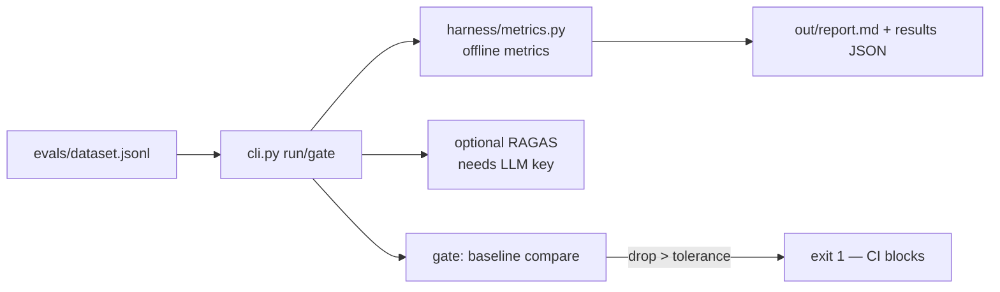

# RAG Evaluation & MLOps Harness

Standalone, offline-first harness for evaluating RAG pipelines: custom metrics that need **no API keys**, optional RAGAS (LLM-judged) scores, A/B pipeline comparison, and a CI regression gate.

## Architecture



## Run

```bash
uv sync
uv run python cli.py run --pipeline A --dataset evals/dataset.jsonl --report out/report.md
# Pipeline B adds RAGAS metrics (requires YOLO_AUTO_API_KEY or OPENAI_API_KEY in .env):
uv run python cli.py run --pipeline B --report out/report_b.md
```

## Regression gate (CI)

```bash
uv run python cli.py gate --baseline evals/baseline.json --tolerance 0.05
```

Exit 0 = no metric dropped more than tolerance; exit 1 = quality regression (blocks the pipeline). Generate a baseline from a known-good run's `out/results_A.json` `averages` block.

## Test

```bash
uv run pytest -v   # fully offline
```

## Production notes
- Offline metrics use a deterministic hashing embedder fallback — stable across machines, so gate results are reproducible in CI without GPU/model downloads.
- RAGAS is opt-in per run (`--pipeline B`) and degrades to `{}` when the LLM is unavailable; the report flags `ragas_available` per row.
- Keep the golden dataset small (8–10 rows) and version it with the code; every prompt/pipeline change should re-run the gate.