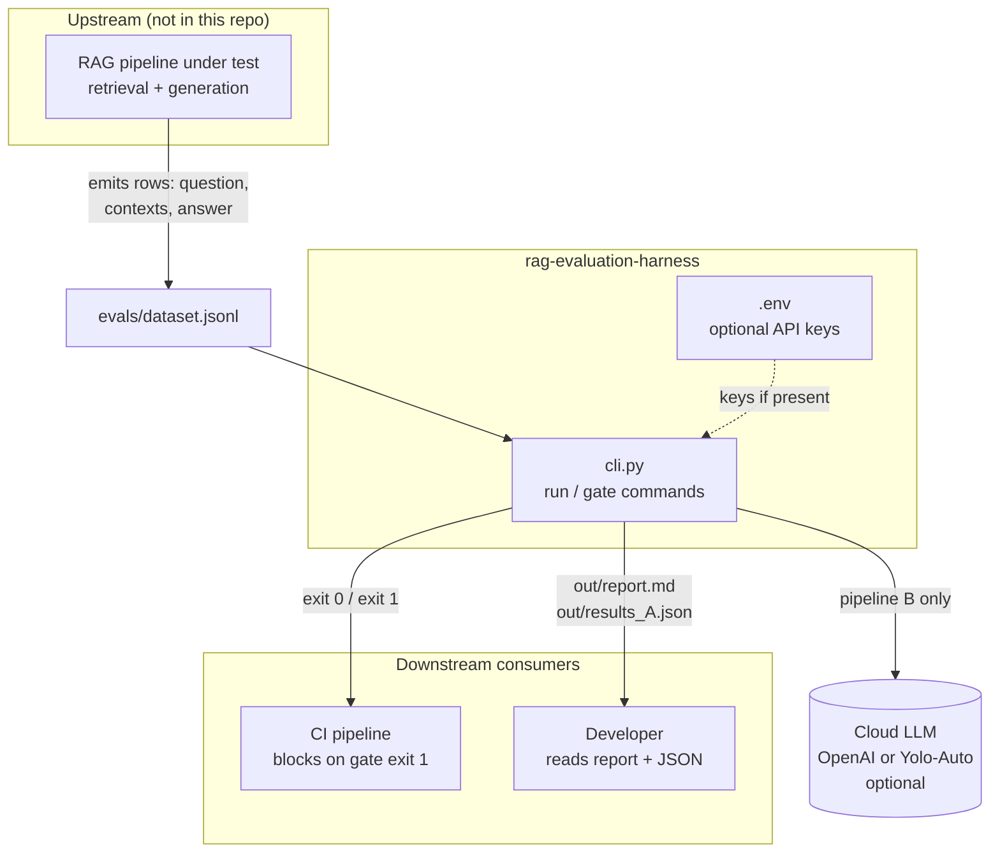
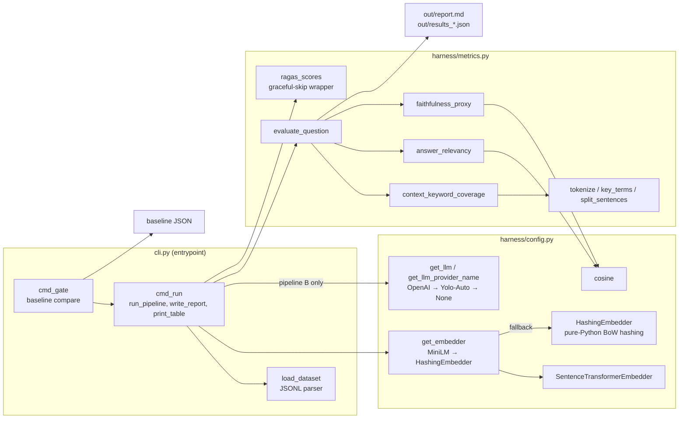
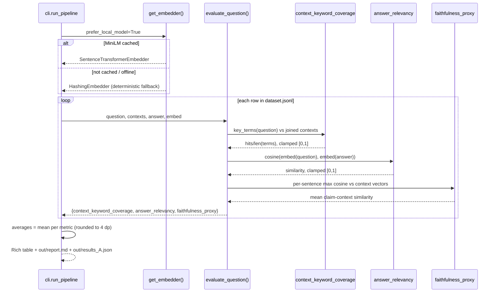
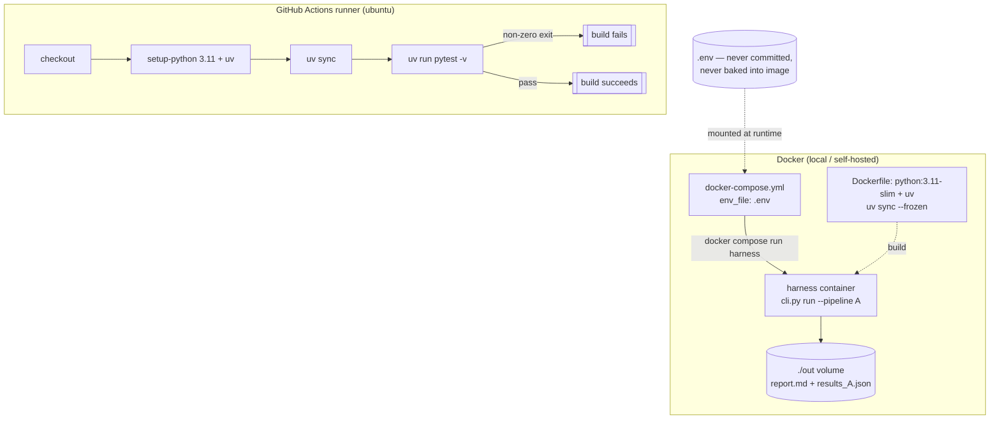
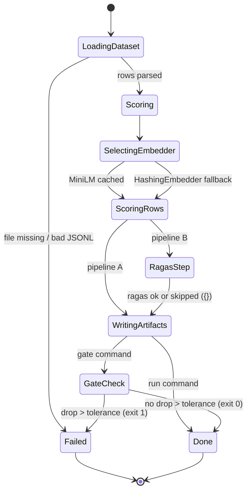

# DESIGN — RAG Evaluation & MLOps Harness

This document describes the architecture **as implemented** in this repository.
The harness is a batch CLI (not a service): it reads a golden dataset of
pre-retrieved `(question, contexts, answer)` rows, scores each row with
deterministic offline metrics (plus optional LLM-judged RAGAS metrics), and can
gate CI on metric regressions.

## 1. System Context

The harness sits between the RAG pipeline under test (upstream) and CI /
humans (downstream). It has no runtime dependencies on a vector store or an LLM
server; cloud LLMs are optional and only used for pipeline B.

## 2. Component Diagram

Two modules plus the CLI entrypoint. `harness/config.py` owns all external
integration (LLM factories, embedder factory); `harness/metrics.py` owns pure
scoring logic and depends on `config` only for `cosine`.

## 3. Retrieval / Data-Flow Sequence (one dataset row, pipeline A)

Retrieval itself happens upstream; the sequence below shows what the harness
does per row: embed once per text, score three metrics, accumulate.

Pipeline B inserts one extra step per row after `evaluate_question`:
`ragas_scores(question, reference_answer, contexts, answer, llm)` →
`{ragas_faithfulness, ragas_answer_relevancy}` or `{}` when unavailable, plus a
`ragas_available` flag on the row.

## 4. Deployment Topology

The harness deploys as a **batch job**, not a long-running service. There are
no exposed ports. In Docker it runs once, writes artifacts to a mounted volume,
and exits; in GitHub Actions it runs directly via `uv`.

Ports: **none**. The container exposes nothing; results are consumed from the
`./out` bind mount (or `docker compose logs`).

## 5. Failure Modes & State Diagram

Every external dependency has a defined degradation path so that pipeline A
never crashes. The state diagram tracks one evaluation run through its
possible states.

Failure-mode table:

| Failure | Detection | Behavior |
|---------|-----------|----------|
| No `.env` / no keys | `os.getenv` empty | `get_llm()` → `None`; pipeline B degrades to A's metrics with `ragas_available=false` |
| MiniLM not cached / download blocked | `SentenceTransformer(...)` raises | `get_embedder` catches → `HashingEmbedder` |
| `ragas`/`datasets` import fails | ImportError in wrapper | `ragas_scores` returns `{}` |
| RAGAS call fails at runtime (rate limit, schema drift) | Exception in wrapper | `ragas_scores` returns `{}` — run continues |
| Empty dataset | `load_dataset` returns `[]` | `cmd_run` prints error, returns 1 |
| Baseline missing a metric key | `k in base_avg` check | That metric is simply not gated |
| Windows console encoding | `sys.platform == "win32"` | stdout/stderr reconfigured to UTF-8 up front |
| Any unhandled exception in a command | top-level try/except in `main()` | Printed via Rich, exit 1 |

## 6. Key Decisions

| # | Decision | Rationale |
|---|----------|-----------|
| D1 | Batch CLI instead of a service | The job is "score a dataset and exit"; a server would add ports, lifecycle, and health concerns with zero benefit |
| D2 | Custom deterministic metrics as the primary gate signal | Reproducible across machines/runs → safe as a CI gate; LLM judges are too noisy/costly for every commit |
| D3 | Two-tier LLM selection (OpenAI → Yolo-Auto → None) | One code path (`ChatOpenAI`) serves both providers since Yolo-Auto is OpenAI-compatible; `None` keeps everything runnable keyless |
| D4 | Ollama deliberately excluded | Target machine is a low-power laptop without a local LLM server; a heuristic/offline mode covers the no-key case |
| D5 | `HashingEmbedder` as guaranteed fallback | Pure Python, zero deps, deterministic — the harness must *always* run, even with no model cache and no network |
| D6 | RAGAS wrapped in a never-raises adapter | Optional dependency must not be able to break the core path; contract is "dict or empty dict" |
| D7 | Baseline = plain JSON committed beside the dataset | Versioned with the code, diffable in review, regenerable from any known-good `results_A.json` |
| D8 | Metrics clamped to [0, 1] and rounded to 4 dp | Uniform scale makes tolerance-based gating meaningful; rounding stabilizes JSON diffs |

## 7. Trade-off Tables

### Embedding strategy

| Option | Quality | Offline guarantee | Speed | Chosen? |
|--------|---------|-------------------|-------|---------|
| Cached MiniLM (`all-MiniLM-L6-v2`) | Good semantic similarity | Only when cached (~90 MB) | Fast (CPU) | Yes — preferred |
| `HashingEmbedder` (BoW hashing, dim 256) | Weak (lexical overlap only) | Always | Instant | Yes — fallback |
| Cloud embedding API | Best | No (needs key + network) | Network-bound | No — violates offline-first goal |

### Metric tiering

| Tier | Cost per run | Determinism | What it catches | Used by |
|------|--------------|-------------|-----------------|---------|
| Custom offline (3 metrics) | ~0 | Exact | Lexical coverage, gross relevance/grounding drops | Pipeline A, CI gate |
| RAGAS (LLM-judged) | API cost | Stochastic | Subtle faithfulness/relevancy issues | Pipeline B, manual review |

### Packaging

| Option | Pros | Cons | Chosen? |
|--------|------|------|---------|
| GitHub Actions + `uv` | Free, reproducible lockfile, no image build | Runner-only | Yes (ci.yml) |
| Docker one-shot job | Portable to any host, pinned base image | Image build time; artifacts need a volume | Yes (Dockerfile + compose) |
| Long-running containerized service | Persistent logs/UI | No consumer exists; over-engineered | No |
